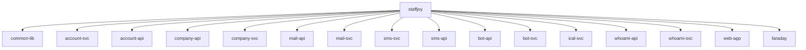

# 基础信息

|      |      |
|------|------|
| 名称 | staffjoy |
| 编码语言 | .java |
| 代码路径 | staffjoy |
| 包名 | staffjoy.docs |
| 概述说明 | Staffjoy Common Lib: Java基础库，提供环境管理、安全认证、异常处理等通用功能。  
Account Svc: 账户微服务，管理用户账户生命周期、认证及集成外部服务。  
Company Svc: 公司服务，处理组织架构、班次调度和人员权限管理。  
Mail/SMS Svc: 邮件/短信服务，基于阿里云API实现异步消息发送。  
Bot Svc: 机器人服务，处理员工入职提醒和班次变更通知。  
ICal Svc: 生成iCalendar格式排班数据。  
Whoami Svc: 用户身份识别及Intercom集成。  
Web App: Web应用，处理用户认证、账户管理及页面展示。  
Faraday: HTTP反向代理服务，提供请求转发、负载均衡和安全控制。 |

# 说明

# Staffjoy 微服务系统总结

## 概述

Staffjoy 是一个基于微服务架构的企业级人力资源管理系统，主要提供账户管理、公司组织、排班调度、消息通知等功能。系统采用Spring Boot和Spring Cloud技术栈构建，包含多个独立部署的微服务模块，通过Feign客户端进行服务间通信。整体架构遵循分层设计原则，各模块职责明确，具备良好的扩展性和可维护性。

系统主要特点包括：
- 模块化设计，服务边界清晰
- 统一的认证授权机制
- 标准化的API响应格式
- 完善的异常处理和监控
- 支持多环境配置
- 异步处理提升系统吞吐量

## 主要业务场景

### 1. 用户账户管理
- **账户全生命周期**：注册、激活、信息维护、密码重置、账户删除
- **认证与安全**：基于JWT的身份验证，密码哈希存储，敏感信息隔离
- **权限控制**：通过角色和字段实现细粒度权限管理
- **第三方集成**：支持Intercom用户数据同步

### 2. 公司组织架构
- **公司基础管理**：创建、查询、更新及状态管理
- **团队管理**：团队创建与时区配置
- **职位管理**：岗位设置与分类
- **人员管理**：员工入职、团队分配、权限控制

### 3. 排班调度系统
- **班次管理**：创建、发布、更新、删除班次
- **批量操作**：支持班次的批量发布和修改
- **日历集成**：生成iCalendar格式排班数据
- **提醒通知**：班次变更自动触发提醒

### 4. 消息通知服务
- **邮件通知**：账户激活、密码重置、入职欢迎等邮件模板
- **短信通知**：验证码、班次提醒等短信发送
- **机器人服务**：自动化处理入职流程、班次变更提醒
- **异步处理**：通过线程池提高通知发送效率

### 5. 系统基础设施
- **API网关**：Faraday服务提供请求转发、负载均衡和安全控制
- **统一认证**：whoami服务处理用户身份识别
- **监控告警**：集成Sentry实现错误监控和上报
- **配置管理**：通过Common Lib提供多环境支持

### 6. 前端交互
- **Web应用**：提供用户注册、登录、密码重置等界面
- **静态页面**：关于页、错误页等静态内容展示
- **动态页面**：基于工厂模式构建业务页面
- **资源管理**：图像加载和Base64编码转换

### 7. 服务间通信
- **Feign客户端**：标准化服务调用接口
- **DTO传输**：统一的数据传输对象定义
- **服务发现**：通过常量维护服务名称映射
- **异常处理**：统一的业务异常和错误码

该系统通过模块化设计和标准化接口，为企业提供了完整的账户管理、组织架构和排班调度解决方案，同时具备良好的扩展性和可靠性。各微服务既可独立部署又可协同工作，满足不同规模企业的需求。

### 包内部结构视图

该流程图展示了Staffjoy项目的微服务架构关系，根节点staffjoy下包含15个子模块，包括common-lib公共库、6对API/SVC服务（account/company/mail/sms/bot/whoami）、ical日历服务、web-app前端应用以及faraday网关。所有服务均以独立节点形式直接隶属于主项目，呈现典型的现代化微服务项目组织结构。

# 文件列表 File List

| 名称   | 类型  | 说明 |
|-------|------|-------------|
| [company-svc](company-svc/src/main/java/xyz/_module.md) | module | 公司管理服务模块，包含实体类、控制器、服务、配置、仓库接口和启动类，支持组织架构、人员权限、班次调度等核心功能，采用Java、JPA、Lombok等技术实现。 |
| [sms-api](sms-api/src/main/java/xyz/_module.md) | module | Spring Cloud Feign客户端接口，用于短信服务调用，包含请求类、常量配置和发送方法。 |
| [faraday](faraday/src/main/java/xyz/_module.md) | module | Spring控制器处理全局错误，生成错误页面并记录异常。模块包含错误页面生成、资源加载和异常处理。反向代理服务支持请求转发、负载均衡和安全控制。 |
| [web-app](web-app/src/main/java/xyz/_module.md) | module | Spring框架Web应用控制器模块，处理用户认证、账户管理、公司管理、静态页面展示和错误处理等功能。 |
| [whoami-svc](whoami-svc/src/main/java/xyz/_module.md) | module | Spring框架的REST控制器WhoAmIController，含两个需认证的GET端点。AppProps类存储Intercom配置。WhoAmIService处理用户信息和设置。WhoAmIApplication是启动类。WhoAmIConstant定义服务名常量。 |
| [whoami-api](whoami-api/src/main/java/xyz/_module.md) | module | Spring Cloud Feign客户端接口，定义WhoAmI服务的两个GET方法，需认证头。包含用户身份和Intercom设置的DTO类，使用Lombok简化代码。常量类定义服务名。 |
| [ical-svc](ical-svc/src/main/java/xyz/_module.md) | module | 
Java类生成iCalendar数据，包含控制器处理请求，服务获取信息，Spring Boot应用入口和常量定义。 |
| [bot-svc](bot-svc/src/main/java/xyz/_module.md) | module | Spring Boot机器人服务模块，含告警、入职、短信三个控制器，统一路径/v1，支持参数校验和标准化响应。 |
| [bot-api](bot-api/src/main/java/xyz/_module.md) | module | BotClient接口用于与Bot服务通信，包含7个POST方法处理短信、入职和班次提醒等功能。DTO类简化请求数据封装，涉及班次、入职和问候场景。BotConstant类管理服务配置和消息模板。 |
| [sms-svc](sms-svc/src/main/java/xyz/_module.md) | module | Spring Boot短信服务应用，含主启动类、短信发送控制器、阿里云配置属性和异步发送服务，支持白名单验证和日志记录。 |
| [mail-svc](mail-svc/src/main/java/xyz/_module.md) | module | MailController处理邮件发送请求，AppProps存储阿里云密钥，MailSendService异步发送邮件并记录日志，AppConfig配置异步任务和阿里云客户端，MailApplication是Spring Boot入口。 |
| [mail-api](mail-api/src/main/java/xyz/_module.md) | module | Spring Cloud Feign邮件客户端接口，定义发送邮件POST方法，使用EmailRequest封装请求数据，MailConstant管理服务配置。 |
| [company-api](company-api/src/main/java/xyz/_module.md) | module | Feign客户端CompanyClient定义公司服务API，含七类管理接口，需授权头。DTO模块处理公司相关数据传输，含多种数据结构。常量类存服务名。 |
| [account-api](account-api/src/main/java/xyz/_module.md) | module | AccountConstant类定义账户服务常量及邮件模板。AccountClient是Feign客户端接口，提供账户管理API。DTO模块处理账户数据请求与响应，支持创建、验证、密码管理和邮件操作。 |
| [account-svc](account-svc/src/main/java/xyz/_module.md) | module | Spring Boot账户服务，含Feign客户端、JPA实体、REST控制器及安全配置。 |
| [common-lib](common-lib/src/main/java/xyz/_module.md) | module | 代码模块管理应用运行环境配置，区分开发、测试、生产环境并提供相应参数。包含EnvConstant和EnvConfig类。 |

