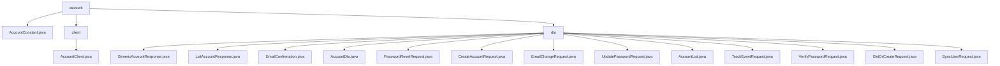

# 基础信息

|      |      |
|------|------|
| 名称 | staffjoy |
| 编码语言 | .java |
| 代码路径 | staffjoy/account-api/src/main/java/xyz/staffjoy |
| 包名 | staffjoy.docs.account-api.src.main.java.xyz.staffjoy |
| 概述说明 | AccountConstant类定义账户服务常量及邮件模板。AccountClient是Feign客户端接口，提供账户管理API。DTO模块处理账户数据请求与响应，支持创建、验证、密码管理和邮件操作。 |

# 说明

# 账户管理API模块总结

## 概述

该代码模块是一个完整的账户管理API系统，主要提供账户服务相关的功能实现。模块由三部分组成：

1. **常量定义**：包含账户服务相关的常量字符串和邮件模板
2. **客户端接口**：提供与账户服务交互的Feign客户端
3. **数据传输对象**：处理账户相关的请求和响应数据结构

模块采用了Lombok简化代码，通过注解自动生成常用方法，并结合校验注解确保数据的有效性。整体设计支持多种账户操作场景，为账户管理提供了清晰、可扩展的接口。

## 主要业务场景

### 1. 账户服务基础功能
- 定义账户服务名称常量
- 提供三种标准邮件模板：
  - 重置密码模板（包含重置链接）
  - 激活账户模板（包含欢迎语和激活链接）
  - 确认邮箱模板（包含确认链接）

### 2. 账户管理操作
- **账户创建**：支持创建新账户或获取已有账户
- **账户查询**：支持获取单个账户详情、分页列表账户、通过电话号码查询
- **账户更新**：支持更新账户基本信息、密码等
- **账户验证**：支持密码验证、邮箱验证等操作

### 3. 密码管理
- 密码重置请求处理
- 密码更新功能
- 密码验证功能

### 4. 邮箱相关操作
- 邮箱确认功能
- 邮箱变更请求处理
- 邮箱变更确认

### 5. 辅助功能
- 用户同步功能
- 事件跟踪记录
- 分页查询支持

该模块通过标准化的接口设计和校验逻辑，为系统提供了完整的账户管理功能，适用于用户注册、登录、密码管理、邮箱验证等多种业务场景。

### 包内部结构视图

该流程图展示了account模块的目录结构，顶层为account目录，包含AccountConstant.java文件、client子目录和dto子目录。client目录下包含AccountClient.java文件，dto目录下包含多个DTO类文件，用于处理账户相关的各种请求和响应数据。整个结构清晰地反映了账户API的代码组织方式。

# 文件列表 File List

| 名称   | 类型  | 说明 |
|-------|------|-------------|
| [account](account/_module.md) | package | AccountConstant类定义账户服务常量及邮件模板。AccountClient是Feign客户端接口，提供账户管理API。DTO模块处理账户数据请求与响应，支持创建、验证、密码管理和邮件操作。 |

