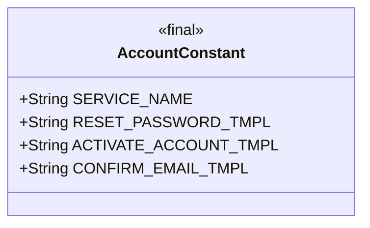
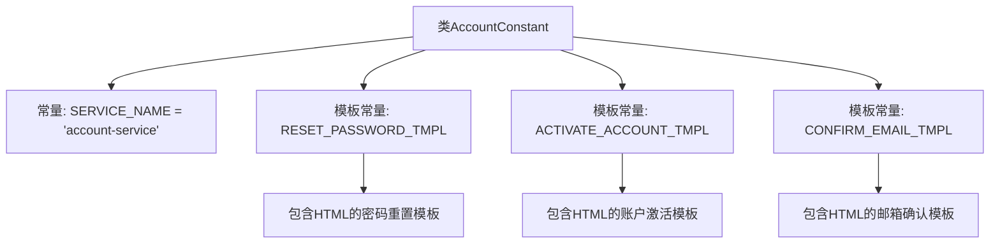

# 基础信息

|      |      |
|------|------|
| 名称 | AccountConstant |
| 编码语言 | .java |
| 代码路径 | staffjoy/account-api/src/main/java/xyz/staffjoy/account/AccountConstant.java |
| 包名 | xyz.staffjoy.account |
| 依赖项 | [] |
| 概述说明 | 账户服务常量类，含密码重置、激活账户和确认邮件模板。 |

# 说明

该内容定义了一个名为AccountConstant的Java类，包含账户服务相关的常量字符串。主要定义了服务名称和三种邮件模板：重置密码模板包含重置链接；激活账户模板包含欢迎语和激活链接；确认邮箱模板包含确认链接。每个模板都提供了HTML格式的文本和可点击链接，并附上备用文本链接说明。这些模板用于账户相关的邮件通知场景。

# 类列表 Class Summary

| 名称   | 类型  | 说明 |
|-------|------|-------------|
| AccountConstant | class | 账户服务常量类，包含重置密码、激活账户和确认邮件的HTML模板。 |

## 类 AccountConstant

|      |      |
|------|------|
| 访问范围 | public |
| 类型 | class |
| 名称 | AccountConstant |
| 说明 | 账户服务常量类，包含重置密码、激活账户和确认邮件的HTML模板。 |

### UML类图

这段代码定义了一个名为AccountConstant的常量类，包含四个公共静态常量字符串：SERVICE_NAME表示服务名称，RESET_PASSWORD_TMPL是重置密码的HTML模板，ACTIVATE_ACCOUNT_TMPL是激活账户的HTML模板，CONFIRM_EMAIL_TMPL是确认邮箱的HTML模板。这些常量用于统一管理账户服务中的字符串模板和配置，避免硬编码，提高代码可维护性。类被标记为final防止继承，所有成员都是public static final，确保全局唯一性和不可变性。

### 内部方法调用关系图

这段代码定义了一个AccountConstant类，包含服务名称常量和三个HTML邮件模板常量。RESET_PASSWORD_TMPL用于密码重置邮件，包含动态链接占位符；ACTIVATE_ACCOUNT_TMPL用于账户激活邮件，包含用户名和链接占位符；CONFIRM_EMAIL_TMPL用于邮箱确认邮件，同样包含用户名和链接占位符。所有模板都采用HTML格式，并考虑了用户无法点击链接时的备用方案。这些常量被设计为静态final，确保全局唯一且不可修改。

### 字段列表 Field List

| 名称  | 类型  | 说明 |
|-------|-------|------|
| RESET_PASSWORD_TMPL = "
We received a request to reset the password on your account. To do so, click the below link. If you did not request this change, no action is needed.   <a href=\"%s\">%s</a>
" | String | 密码重置邮件模板：包含重置链接及说明。 |
| SERVICE_NAME = "account-service" | String | 服务名称为account-service。 |
| ACTIVATE_ACCOUNT_TMPL = "

Hi %s, and welcome to Staffjoy!
<a href=\"%s\">Please click here to finish setting up your account.</a>

  
If you have trouble clicking on the link, please copy and paste this link into your browser:  <a href=\"%s\">%s</a>
" | String | 激活账户邮件模板，含欢迎语和设置链接，提供点击和手动复制两种方式。 |
| CONFIRM_EMAIL_TMPL = "
Hi %s!
To confirm your new email address, <a href=\"%s\">please click here</a>.
  
If you have trouble clicking on the link, please copy and paste this link into your browser:  <a href=\"%s\">%s</a>
" | String | 静态常量字符串，用于生成确认新邮箱地址的HTML邮件模板，包含用户名占位和链接。 |

### 方法列表 Method List

| 名称  | 类型  | 说明 |
|-------|-------|------|

