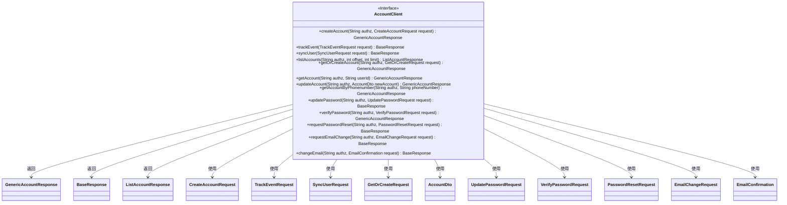

# 基础信息

|      |      |
|------|------|
| 名称 | AccountClient |
| 编码语言 | .java |
| 代码路径 | staffjoy/account-api/src/main/java/xyz/staffjoy/account/client/AccountClient.java |
| 包名 | xyz.staffjoy.account.client |
| 依赖项 | ['org.springframework.cloud.openfeign.FeignClient', 'org.springframework.validation.annotation.Validated', 'org.springframework.web.bind.annotation', 'xyz.staffjoy.account.AccountConstant', 'xyz.staffjoy.account.dto', 'xyz.staffjoy.common.api.BaseResponse', 'xyz.staffjoy.common.auth.AuthConstant', 'xyz.staffjoy.common.validation.Group1', 'xyz.staffjoy.common.validation.PhoneNumber', 'javax.validation.Valid', 'javax.validation.constraints.Min', 'javax.validation.constraints.NotBlank'] |
| 概述说明 | Feign客户端接口，提供账户管理相关API，包括创建、查询、更新、密码重置等功能。 |

# 说明

AccountClient是一个Feign客户端接口，用于与账户服务进行交互。它定义了多个HTTP端点，包括创建账户、跟踪事件、同步用户、列出账户、获取或创建账户、获取账户详情、更新账户信息、通过电话号码查询账户、更新密码、验证密码、请求密码重置、请求邮箱变更以及确认邮箱变更等操作。所有请求都需要授权头信息，部分请求参数和请求体进行了验证注解。该接口主要用于内部API调用，支持账户管理相关功能。

# 类列表 Class Summary

| 名称   | 类型  | 说明 |
|-------|------|-------------|
| AccountClient | interface | AccountClient接口定义账户服务API，包含创建、查询、更新账户及密码管理功能。 |

## 类 AccountClient

|      |      |
|------|------|
| 访问范围 | @FeignClient(name = AccountConstant.SERVICE_NAME, path = "/v1/account", url = "${staffjoy.account-service-endpoint}");// TODO Client side validation can be enabled as needed;// @Validated;public |
| 类型 | interface |
| 名称 | AccountClient |
| 说明 | AccountClient接口定义账户服务API，包含创建、查询、更新账户及密码管理功能。 |

### UML类图

该图展示了一个Feign客户端接口`AccountClient`及其相关请求和响应类的结构。`AccountClient`是一个标注了`@FeignClient`的接口，定义了14个远程调用方法，每个方法都使用特定的请求对象并返回不同类型的响应对象。图中清晰地展示了接口与各个请求/响应类之间的依赖关系，所有方法都遵循RESTful风格并通过HTTP协议与远程账户服务交互。接口方法涉及账户创建、查询、更新、密码管理以及邮件变更等业务功能。

### 内部方法调用关系图

```mermaid
graph TD
    A["FeignClient接口: AccountClient"]
    B["服务名称: AccountConstant.SERVICE_NAME"]
    C["基础路径: '/v1/account'"]
    D["端点配置: '${staffjoy.account-service-endpoint}'"]
    E["方法1: createAccount"]
    F["方法2: trackEvent"]
    G["方法3: syncUser"]
    H["方法4: listAccounts"]
    I["方法5: getOrCreateAccount"]
    J["方法6: getAccount"]
    K["方法7: updateAccount"]
    L["方法8: getAccountByPhonenumber"]
    M["方法9: updatePassword"]
    N["方法10: verifyPassword"]
    O["方法11: requestPasswordReset"]
    P["方法12: requestEmailChange"]
    Q["方法13: changeEmail"]

    A --> B
    A --> C
    A --> D
    A --> E
    A --> F
    A --> G
    A --> H
    A --> I
    A --> J
    A --> K
    A --> L
    A --> M
    A --> N
    A --> O
    A --> P
    A --> Q
```

这段代码定义了一个基于Spring Cloud Feign的REST客户端接口，用于与账户微服务进行交互。该接口包含13个方法，涵盖账户创建、查询、更新、密码管理、邮箱变更等核心功能，每个方法都通过HTTP注解（如@PostMapping、@GetMapping）明确定义了请求类型和路径。所有方法均支持请求头验证，部分方法包含参数校验注解（如@Valid、@NotBlank）。接口通过@FeignClient注解配置了服务名称、基础路径和动态端点URL，为分布式系统提供声明式的服务调用能力。

### 字段列表 Field List

| 名称  | 类型  | 说明 |
|-------|-------|------|

### 方法列表 Method List

| 名称  | 类型  | 说明 |
|-------|-------|------|
| getOrCreateAccount | GenericAccountResponse | 后端接口：认证头校验，请求体验证，获取或创建账户。 |
| getAccountByPhonenumber | GenericAccountResponse | 通过手机号查询账户信息的GET接口，需验证请求头。 |
| getAccount | GenericAccountResponse | 获取账户信息的GET接口，需授权头和用户ID参数。 |
| syncUser | BaseResponse | 同步用户接口，接收有效请求体并返回基础响应。 |
| updateAccount | GenericAccountResponse | 更新账户接口，需授权头和有效账户数据。 |
| updatePassword | BaseResponse | 更新密码接口，需授权头和有效请求体。 |
| listAccounts | ListAccountResponse | 获取账户列表接口，需认证头，分页参数offset和limit。 |
| trackEvent | BaseResponse | 接口定义：POST请求/track_event，接收TrackEventRequest参数，返回BaseResponse。 |
| createAccount | GenericAccountResponse | 创建账户接口，需授权头及有效请求体。 |
| verifyPassword | GenericAccountResponse | 验证密码接口：接收授权头和密码请求，返回账户响应。 |
| requestPasswordReset | BaseResponse | 请求密码重置接口，需认证头和有效请求体。 |
| requestEmailChange | BaseResponse | 后端接口：POST请求路径/request_email_change，需认证头和有效请求体。 |
| changeEmail | BaseResponse | 接口路径/change_email，通过请求头验证授权，接收邮箱确认请求体。 |

