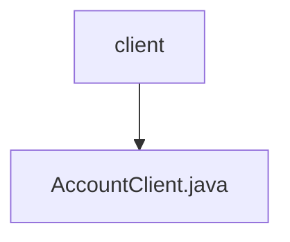

# 基础信息

|      |      |
|------|------|
| 名称 | client |
| 编码语言 | .java |
| 代码路径 | staffjoy/account-api/src/main/java/xyz/staffjoy/account/client |
| 包名 | staffjoy.docs.account-api.src.main.java.xyz.staffjoy.account.client |
| 概述说明 | Feign客户端接口，提供账户管理相关API，包括创建、查询、更新、密码重置等功能。 |

# 说明

AccountClient是一个Feign客户端接口，用于与账户服务进行交互。它定义了多个HTTP端点，包括创建账户、跟踪事件、同步用户、列出账户、获取或创建账户、获取账户详情、更新账户信息、通过电话号码查询账户、更新密码、验证密码、请求密码重置、请求邮箱变更以及确认邮箱变更等操作。所有请求都需要授权头信息，部分请求参数和请求体进行了验证注解。该接口主要用于内部API调用，支持账户管理相关功能。

### 包内部结构视图

该流程图展示了account-api项目中client目录的层级结构，其中client目录包含一个AccountClient.java文件。这是一个简单的单层结构，表示客户端代码的组织方式，符合典型Java项目的资源文件布局规范。

# 文件列表 File List

| 名称   | 类型  | 说明 |
|-------|------|-------------|
| [AccountClient.java](AccountClient.md) | file | Feign客户端接口，提供账户管理相关API，包括创建、查询、更新、密码重置等功能。 |

