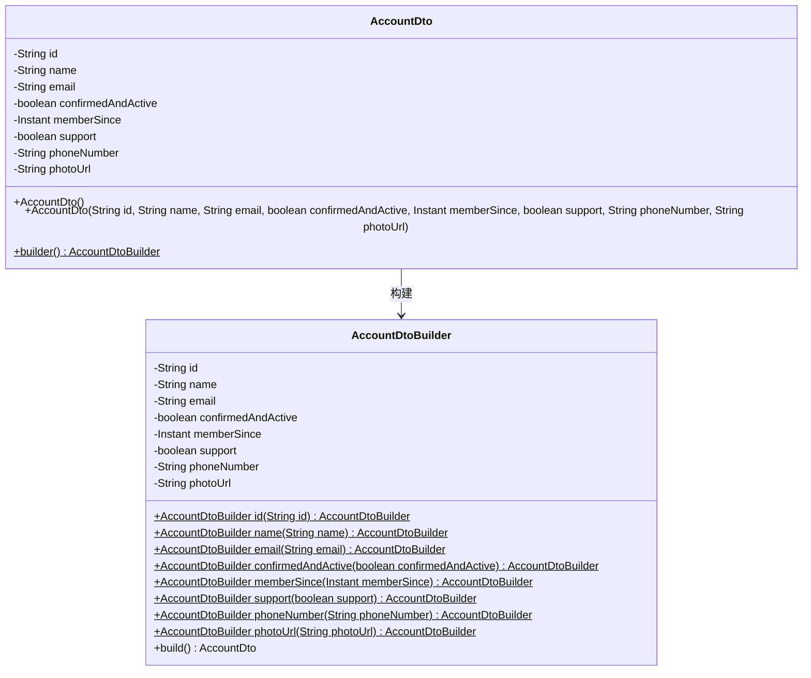

# 基础信息

|      |      |
|------|------|
| 名称 | AccountDto |
| 编码语言 | .java |
| 代码路径 | staffjoy/account-api/src/main/java/xyz/staffjoy/account/dto/AccountDto.java |
| 包名 | xyz.staffjoy.account.dto |
| 依赖项 | ['lombok.AllArgsConstructor', 'lombok.Builder', 'lombok.Data', 'lombok.NoArgsConstructor', 'xyz.staffjoy.common.validation.PhoneNumber', 'javax.validation.constraints.Email', 'javax.validation.constraints.NotBlank', 'javax.validation.constraints.NotEmpty', 'javax.validation.constraints.NotNull', 'java.time.Instant'] |
| 概述说明 | 账户数据传输对象，包含ID、姓名、邮箱、状态、注册时间、支持标识、电话和照片链接。 |

# 说明

这是一个名为AccountDto的Java类，用于表示账户数据传输对象。类中包含多个字段：必填的字符串id、可选的name、带有邮箱格式验证的email、布尔类型confirmedAndActive、非空的memberSince时间戳、布尔类型support、带有电话号码验证的phoneNumber以及非空的photoUrl。类使用了Lombok注解自动生成构造器和建造者模式，并包含数据校验注解。

# 类列表 Class Summary

| 名称   | 类型  | 说明 |
|-------|------|-------------|
| AccountDto | class | 账户数据传输对象，包含ID、姓名、邮箱、状态、注册时间、支持标识、电话和照片链接。 |

## 类 AccountDto

|      |      |
|------|------|
| 访问范围 | @Data;@AllArgsConstructor;@NoArgsConstructor;@Builder;public |
| 类型 | class |
| 名称 | AccountDto |
| 说明 | 账户数据传输对象，包含ID、姓名、邮箱、状态、注册时间、支持标识、电话和照片链接。 |

### UML类图

该代码定义了一个AccountDto类，使用Lombok注解自动生成构造函数、getter/setter、builder等方法。类包含8个字段，其中id、email、memberSince和photoUrl有验证注解。通过内部建造者模式（AccountDtoBuilder）提供链式构造能力，支持灵活的对象创建方式。类图展示了核心字段、构造逻辑及与建造者的关系，体现了DTO（数据传输对象）的典型结构。

### 内部方法调用关系图

```mermaid
graph TD
    A["类AccountDto"]
    B["属性: @NotBlank String id"]
    C["属性: String name"]
    D["属性: @Email String email"]
    E["属性: boolean confirmedAndActive"]
    F["属性: @NotNull Instant memberSince"]
    G["属性: boolean support"]
    H["属性: @PhoneNumber String phoneNumber"]
    I["属性: @NotEmpty String photoUrl"]
    J["Lombok注解: @Data"]
    K["Lombok注解: @AllArgsConstructor"]
    L["Lombok注解: @NoArgsConstructor"]
    M["Lombok注解: @Builder"]

    A --> B
    A --> C
    A --> D
    A --> E
    A --> F
    A --> G
    A --> H
    A --> I
    A -.-> J
    A -.-> K
    A -.-> L
    A -.-> M
```

该流程图展示了AccountDto类的完整结构，包含8个属性字段和4个Lombok注解。每个属性都标注了相应的验证注解（如@NotBlank、@Email等），类级别使用了@Data自动生成getter/setter，@Builder提供建造者模式，以及全参/无参构造器注解。所有属性与注解通过清晰层级关系连接，完整呈现了这个数据传输对象的校验规则和Lombok增强功能。

### 字段列表 Field List

| 名称  | 类型  | 说明 |
|-------|-------|------|
| id | String | 非空字符串ID |
| name | String | 私有字符串变量name |
| memberSince | Instant | 非空成员注册时间戳 |
| confirmedAndActive | boolean | 私有布尔变量，表示确认并激活状态。 |
| email | String | 无效邮箱字段注解 |
| support | boolean | 私有布尔变量support |
| phoneNumber | String | 私有字符串类型电话号码变量。 |
| photoUrl | String | 非空字符串字段photoUrl，存储照片URL。 |

### 方法列表 Method List

| 名称  | 类型  | 说明 |
|-------|-------|------|

