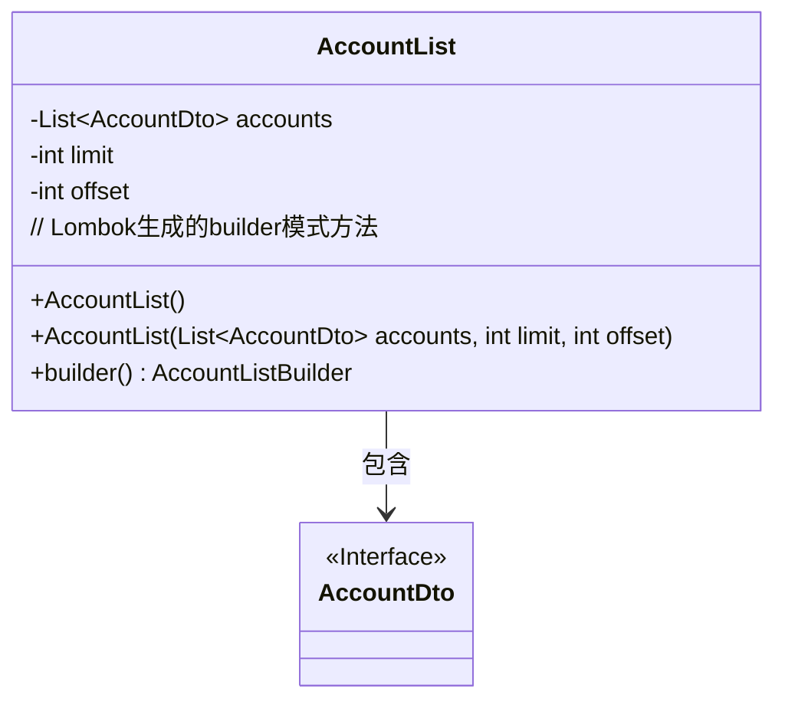
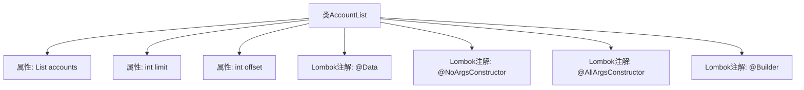

# 基础信息

|      |      |
|------|------|
| 名称 | AccountList |
| 编码语言 | .java |
| 代码路径 | staffjoy/account-api/src/main/java/xyz/staffjoy/account/dto/AccountList.java |
| 包名 | xyz.staffjoy.account.dto |
| 依赖项 | ['lombok.AllArgsConstructor', 'lombok.Builder', 'lombok.Data', 'lombok.NoArgsConstructor', 'java.util.List'] |
| 概述说明 | 账户列表类，含账户集合、限制和偏移量。 |

# 说明

这是一个名为AccountList的Java类，使用了Lombok库的注解来简化代码。类中包含三个字段：accounts是一个AccountDto类型的列表，limit和offset是两个整型变量。通过@NoArgsConstructor生成无参构造函数，@AllArgsConstructor生成全参构造函数，@Builder提供建造者模式支持。该类主要用于封装分页查询的账户列表数据，包含账户列表、每页限制数量和偏移量信息。

# 类列表 Class Summary

| 名称   | 类型  | 说明 |
|-------|------|-------------|
| AccountList | class | 账户列表类，含账户集合、分页限制和偏移量。 |

## 类 AccountList

|      |      |
|------|------|
| 访问范围 | @Data;@NoArgsConstructor;@AllArgsConstructor;@Builder;public |
| 类型 | class |
| 名称 | AccountList |
| 说明 | 账户列表类，含账户集合、分页限制和偏移量。 |

### UML类图

这段类图描述了一个使用Lombok注解的AccountList类，该类包含一个AccountDto接口类型的列表accounts以及分页参数limit和offset。通过@NoArgsConstructor和@AllArgsConstructor注解自动生成无参和全参构造函数，@Builder注解提供builder模式支持。AccountList与AccountDto之间存在组合关系，表示AccountList聚合了多个AccountDto对象。类结构简洁，符合DTO（数据传输对象）的设计模式，适用于分页查询场景。

### 内部方法调用关系图

这段代码定义了一个名为AccountList的类，使用Lombok注解简化了开发。该类包含三个属性：accounts（AccountDto类型的列表）、limit（整型）和offset（整型）。通过@Data注解自动生成getter/setter等方法，@NoArgsConstructor生成无参构造器，@AllArgsConstructor生成全参构造器，@Builder提供建造者模式支持。该设计适用于分页查询场景，能高效处理账户列表数据。

### 字段列表 Field List

| 名称  | 类型  | 说明 |
|-------|-------|------|
| accounts | List<AccountDto> | 私有账户列表变量accounts。 |
| limit | int | 私有整型变量limit |
| offset | int | 私有整型变量offset |

### 方法列表 Method List

| 名称  | 类型  | 说明 |
|-------|-------|------|

