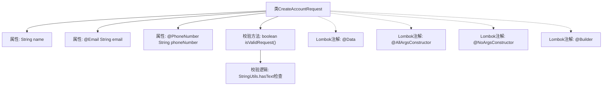

# 基础信息

|      |      |
|------|------|
| 名称 | CreateAccountRequest |
| 编码语言 | .java |
| 代码路径 | staffjoy/account-api/src/main/java/xyz/staffjoy/account/dto/CreateAccountRequest.java |
| 包名 | xyz.staffjoy.account.dto |
| 依赖项 | ['lombok.AllArgsConstructor', 'lombok.Builder', 'lombok.Data', 'lombok.NoArgsConstructor', 'org.springframework.util.StringUtils', 'xyz.staffjoy.common.validation.PhoneNumber', 'javax.validation.constraints.AssertTrue', 'javax.validation.constraints.Email'] |
| 概述说明 | 创建账户请求类，含姓名、邮箱、电话字段及非空校验方法。 |

# 说明

这是一个名为CreateAccountRequest的Java类，用于创建账户请求。类中包含三个字段：name（名称）、email（邮箱，带有邮箱格式验证）和phoneNumber（电话号码，带有电话号码验证）。类提供了全参构造器、无参构造器和Builder模式支持。包含一个校验方法isValidRequest，确保请求至少包含一个非空字段（名称、邮箱或电话号码），否则会提示"Empty request"。整个类结构简洁，涵盖了账户创建所需的基本信息及验证逻辑。

# 类列表 Class Summary

| 名称   | 类型  | 说明 |
|-------|------|-------------|
| CreateAccountRequest | class | 创建账户请求类，含姓名、邮箱、电话字段及非空校验方法。 |


## 类 CreateAccountRequest

|      |      |
|------|------|
| 访问范围 | @Data;@AllArgsConstructor;@NoArgsConstructor;@Builder;public |
| 类型 | class |
| 名称 | CreateAccountRequest |
| 说明 | 创建账户请求类，含姓名、邮箱、电话字段及非空校验方法。 |


### UML类图

```mermaid
classDiagram
    class CreateAccountRequest {
        -String name
        -String email
        -String phoneNumber
        +CreateAccountRequest()
        +CreateAccountRequest(String name, String email, String phoneNumber)
        -boolean isValidRequest()
    }
    // 类注解说明：@Data生成getter/setter，@Builder提供建造者模式
    // @Email和@PhoneNumber是参数校验注解
    // @AssertTrue标记的私有方法用于验证请求有效性
```

该类图展示了一个账户创建请求对象，包含姓名、邮箱和电话号码三个核心字段，通过Lombok注解自动生成构造器和构建器。类中定义了私有验证方法isValidRequest()，确保请求至少包含一个非空字段。注解@Email和@PhoneNumber分别对邮箱格式和电话号码进行校验，体现了数据验证逻辑与业务对象的紧密结合。整体设计符合DTO模式规范，通过组合校验注解和自定义验证逻辑保障数据完整性。


### 内部方法调用关系图



这段代码展示了一个使用Lombok注解的账户创建请求类，包含姓名、邮箱和电话号码三个字段，其中邮箱和电话号码有格式校验注解。类中还定义了一个私有校验方法isValidRequest，用于检查请求是否包含至少一个非空字段。流程图清晰地展示了类结构、属性、校验方法以及Lombok生成的相关构造器和构建器之间的关系，体现了数据校验和对象构建的核心逻辑。

### 字段列表 Field List

| 名称  | 类型  | 说明 |
|-------|-------|------|
| email | String | 无效邮箱字段注解 |
| name | String | 私有字符串变量name |
| phoneNumber | String | 私有字符串类型电话号码变量。 |

### 方法列表 Method List

| 名称  | 类型  | 说明 |
|-------|-------|------|
| isValidRequest | boolean | 校验请求参数非空：name、email或phoneNumber至少一项不为空。 |


