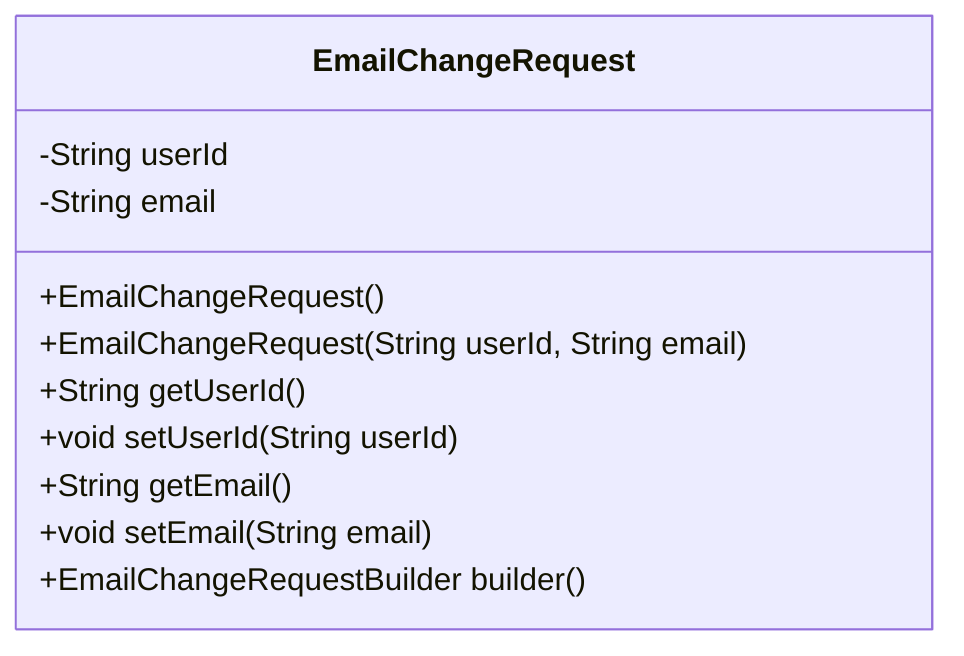
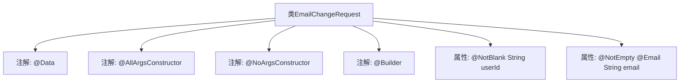

# 基础信息

|      |      |
|------|------|
| 名称 | EmailChangeRequest |
| 编码语言 | .java |
| 代码路径 | staffjoy/account-api/src/main/java/xyz/staffjoy/account/dto/EmailChangeRequest.java |
| 包名 | xyz.staffjoy.account.dto |
| 依赖项 | ['lombok.AllArgsConstructor', 'lombok.Builder', 'lombok.Data', 'lombok.NoArgsConstructor', 'javax.validation.constraints.Email', 'javax.validation.constraints.NotBlank', 'javax.validation.constraints.NotEmpty'] |
| 概述说明 | Java类EmailChangeRequest，含userId和email字段，支持全参无参构造和Builder模式，字段有非空和邮箱格式校验。 |

# 说明

这是一个名为EmailChangeRequest的Java类，用于处理电子邮件变更请求。该类使用Lombok注解自动生成全参数构造函数、无参构造函数和建造者模式。包含两个字段：userId是必填字符串，email是必填且需符合电子邮件格式的字符串。类注解表明这是一个数据模型类。

# 类列表 Class Summary

| 名称   | 类型  | 说明 |
|-------|------|-------------|
| EmailChangeRequest | class | Java类EmailChangeRequest，含userId和email字段，支持全参无参构造和建造者模式，字段有非空和邮箱格式校验。 |

## 类 EmailChangeRequest

|      |      |
|------|------|
| 访问范围 | @Data;@AllArgsConstructor;@NoArgsConstructor;@Builder;public |
| 类型 | class |
| 名称 | EmailChangeRequest |
| 说明 | Java类EmailChangeRequest，含userId和email字段，支持全参无参构造和建造者模式，字段有非空和邮箱格式校验。 |

### UML类图

这段类图展示了EmailChangeRequest类的结构，它是一个使用Lombok注解的数据类。该类包含两个私有字段：userId（非空字符串）和email（非空且需符合邮箱格式），通过Lombok自动生成了无参构造器、全参构造器、getter/setter方法以及建造者模式相关方法。类设计主要用于处理邮箱变更请求，通过注解实现了数据校验和简洁的构造方式。

### 内部方法调用关系图

该流程图展示了EmailChangeRequest类的结构，包含Lombok注解生成的构造器/建造者模式能力，以及字段级验证约束。通过@Data注解自动生成getter/setter，@AllArgsConstructor/@NoArgsConstructor提供全参和无参构造，@Builder支持链式创建，同时@NotBlank和@NotEmpty/@Email确保字段符合业务规则。整个设计简洁但完整覆盖了DTO对象的核心需求。

### 字段列表 Field List

| 名称  | 类型  | 说明 |
|-------|-------|------|
| email | String | 邮箱字段，非空且需符合邮箱格式。 |
| userId | String | 私有字符串变量userId，非空。 |

### 方法列表 Method List

| 名称  | 类型  | 说明 |
|-------|-------|------|

