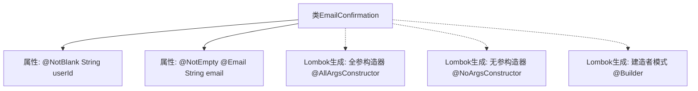

# 基础信息

|      |      |
|------|------|
| 名称 | EmailConfirmation |
| 编码语言 | .java |
| 代码路径 | staffjoy/account-api/src/main/java/xyz/staffjoy/account/dto/EmailConfirmation.java |
| 包名 | xyz.staffjoy.account.dto |
| 依赖项 | ['lombok.AllArgsConstructor', 'lombok.Builder', 'lombok.Data', 'lombok.NoArgsConstructor', 'javax.validation.constraints.Email', 'javax.validation.constraints.NotBlank', 'javax.validation.constraints.NotEmpty'] |
| 概述说明 | EmailConfirmation类：含userId和email字段，支持全参无参构造和建造者模式，字段校验非空及邮箱格式。 |

# 说明

这是一个名为EmailConfirmation的Java类，用于处理电子邮件确认相关数据。该类使用了Lombok库的注解来简化代码：@Data自动生成getter、setter等方法；@AllArgsConstructor和@NoArgsConstructor分别生成全参数和无参构造函数；@Builder提供建造者模式支持。类包含两个字段：userId是字符串类型且不能为空，用@NotBlank注解校验；email也是字符串类型，要求非空且符合电子邮件格式，通过@NotEmpty和@Email注解进行验证。整个类设计简洁，通过注解实现了基本的数据验证和对象构建功能。

# 类列表 Class Summary

| 名称   | 类型  | 说明 |
|-------|------|-------------|
| EmailConfirmation | class | EmailConfirmation类，含userId和email字段，支持全参无参构造和建造者模式，字段有校验。 |


## 类 EmailConfirmation

|      |      |
|------|------|
| 访问范围 | @Data;@AllArgsConstructor;@NoArgsConstructor;@Builder;public |
| 类型 | class |
| 名称 | EmailConfirmation |
| 说明 | EmailConfirmation类，含userId和email字段，支持全参无参构造和建造者模式，字段有校验。 |


### UML类图

```mermaid
classDiagram
    class EmailConfirmation {
        -String userId
        -String email
        +EmailConfirmation()
        +EmailConfirmation(String userId, String email)
        +String getUserId()
        +void setUserId(String userId)
        +String getEmail()
        +void setEmail(String email)
        +EmailConfirmationBuilder builder()
    }

    // 注解生成的构建器类
    class EmailConfirmationBuilder {
        -String userId
        -String email
        +EmailConfirmationBuilder userId(String userId)
        +EmailConfirmationBuilder email(String email)
        +EmailConfirmation build()
    }

    EmailConfirmation --> EmailConfirmationBuilder : 使用
```

这段类图展示了一个使用Lombok注解的邮件确认实体类结构。EmailConfirmation类包含userId和email两个私有字段，通过@Data自动生成getter/setter，@AllArgsConstructor/@NoArgsConstructor生成构造方法，@Builder生成建造者模式相关代码。建造者模式通过内部Builder类实现链式调用和对象构建，类图中明确标注了建造者与主类的依赖关系。字段上的@NotBlank和@Email注解表明了对数据验证的要求。


### 内部方法调用关系图



这段代码展示了一个使用Lombok注解的Java类EmailConfirmation，主要用于处理电子邮件确认场景。类中包含两个核心属性：经过@NotBlank验证的userId和带有@NotEmpty/@Email双重验证的email字段。通过Lombok的@AllArgsConstructor、@NoArgsConstructor和@Builder注解，自动生成了全参构造器、无参构造器和建造者模式实现，显著减少了样板代码。流程图清晰呈现了类结构与Lombok生成元素的关联关系，体现了现代Java开发中注解驱动的便捷性。

### 字段列表 Field List

| 名称  | 类型  | 说明 |
|-------|-------|------|
| email | String | 非空邮箱字段 |
| userId | String | 私有字符串类型用户ID |

### 方法列表 Method List

| 名称  | 类型  | 说明 |
|-------|-------|------|


