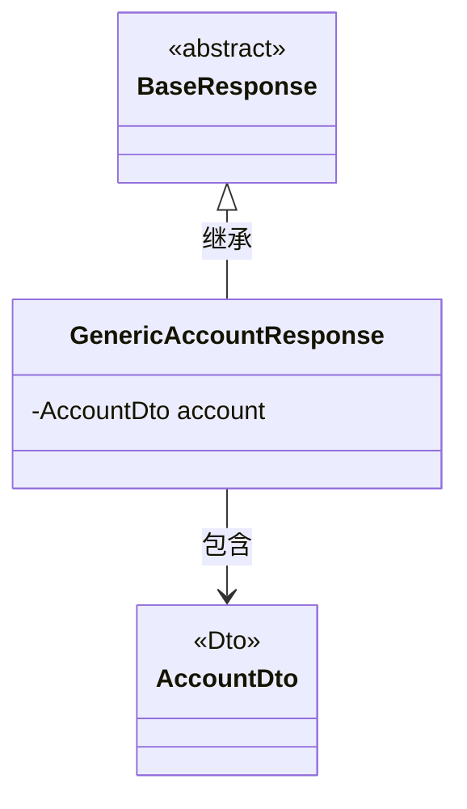
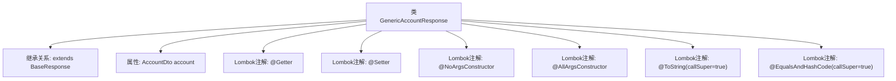

# 基础信息

|      |      |
|------|------|
| 名称 | GenericAccountResponse |
| 编码语言 | .java |
| 代码路径 | staffjoy/account-api/src/main/java/xyz/staffjoy/account/dto/GenericAccountResponse.java |
| 包名 | xyz.staffjoy.account.dto |
| 依赖项 | [None, 'xyz.staffjoy.common.api.BaseResponse'] |
| 概述说明 | Java类GenericAccountResponse继承BaseResponse，包含AccountDto字段及常用注解。 |

# 说明

这段代码定义了一个名为GenericAccountResponse的Java类，继承自BaseResponse。类使用了Lombok库的注解自动生成getter、setter方法，包含无参构造器和全参构造器。通过@ToString和@EqualsAndHashCode注解实现了包含父类属性的toString、equals和hashCode方法。类中包含一个AccountDto类型的私有字段account。

# 类列表 Class Summary

| 名称   | 类型  | 说明 |
|-------|------|-------------|
| GenericAccountResponse | class | Java类GenericAccountResponse继承BaseResponse，包含AccountDto字段及常用注解。 |

## 类 GenericAccountResponse

|      |      |
|------|------|
| 访问范围 | @Getter;@Setter;@NoArgsConstructor;@AllArgsConstructor;@ToString(callSuper = true);@EqualsAndHashCode(callSuper = true);public |
| 类型 | class |
| 名称 | GenericAccountResponse |
| 说明 | Java类GenericAccountResponse继承BaseResponse，包含AccountDto字段及常用注解。 |

### UML类图

这段类图展示了GenericAccountResponse继承自BaseResponse，并包含一个AccountDto类型的私有成员account。BaseResponse被标记为抽象类，AccountDto被标记为数据传输对象(DTO)。GenericAccountResponse通过继承获得了BaseResponse的所有特性，同时通过组合方式持有一个AccountDto实例，形成了清晰的层级结构和依赖关系。图中使用了Lombok注解简化后的类结构，体现了Java中常见的DTO模式实现方式。

### 内部方法调用关系图

该流程图展示了GenericAccountResponse类的完整结构，这是一个继承自BaseResponse的DTO类，使用Lombok注解自动生成getter/setter、全参/无参构造方法，以及覆写了toString()和equals()/hashCode()方法。类中包含一个AccountDto类型的属性account，所有方法都通过Lombok注解自动实现，callSuper=true参数确保在生成方法时会考虑父类的字段。

### 字段列表 Field List

| 名称  | 类型  | 说明 |
|-------|-------|------|
| account | AccountDto | 私有账户数据对象 |

### 方法列表 Method List

| 名称  | 类型  | 说明 |
|-------|-------|------|

