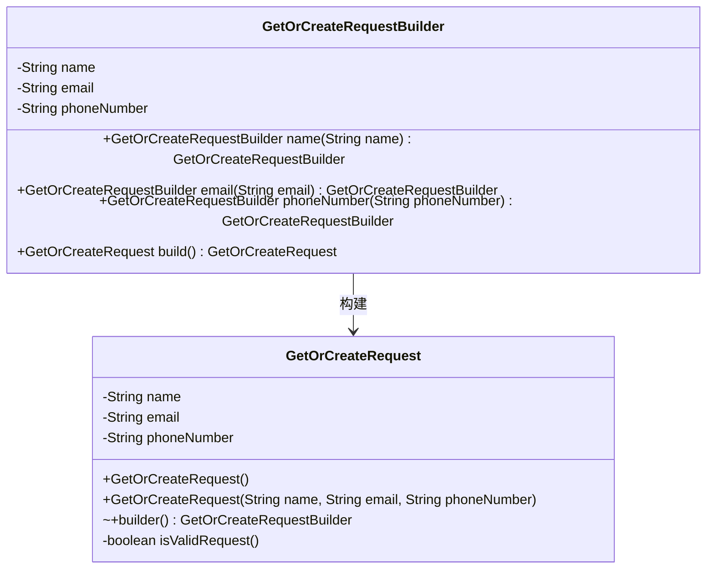
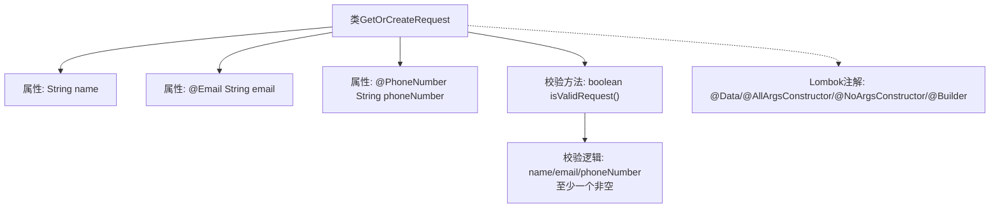

# 基础信息

|      |      |
|------|------|
| 名称 | GetOrCreateRequest |
| 编码语言 | .java |
| 代码路径 | staffjoy/account-api/src/main/java/xyz/staffjoy/account/dto/GetOrCreateRequest.java |
| 包名 | xyz.staffjoy.account.dto |
| 依赖项 | ['lombok.AllArgsConstructor', 'lombok.Builder', 'lombok.Data', 'lombok.NoArgsConstructor', 'org.springframework.util.StringUtils', 'xyz.staffjoy.common.validation.PhoneNumber', 'javax.validation.constraints.AssertTrue', 'javax.validation.constraints.Email'] |
| 概述说明 | Java类GetOrCreateRequest，含name、email、phoneNumber字段及非空校验方法。 |

# 说明

这是一个名为GetOrCreateRequest的Java类，使用了Lombok注解@Data、@AllArgsConstructor、@NoArgsConstructor和@Builder来自动生成常用方法。类包含三个字段：name字符串、带有@Email验证注解的email字符串、带有@PhoneNumber注解的phoneNumber字符串。类中还定义了一个isValidRequest方法，使用@AssertTrue注解验证请求是否有效，要求至少name、email或phoneNumber有一个非空值，否则返回"Empty request"错误信息。

# 类列表 Class Summary

| 名称   | 类型  | 说明 |
|-------|------|-------------|
| GetOrCreateRequest | class | Java类GetOrCreateRequest，含name、email、phoneNumber字段及验证方法。 |

## 类 GetOrCreateRequest

|      |      |
|------|------|
| 访问范围 | @Data;@AllArgsConstructor;@NoArgsConstructor;@Builder;public |
| 类型 | class |
| 名称 | GetOrCreateRequest |
| 说明 | Java类GetOrCreateRequest，含name、email、phoneNumber字段及验证方法。 |

### UML类图

这段类图展示了使用Lombok注解的`GetOrCreateRequest`类及其构建器模式的结构。主类包含三个私有字段（name、email、phoneNumber）和验证方法isValidRequest()，通过`@Builder`生成嵌套的GetOrCreateRequestBuilder类用于链式构造对象。注解驱动的功能（如`@Email`校验）未在图中显式体现，但通过方法约束确保了字段有效性。构建器通过多步骤方法最终生成目标类实例，体现了现代Java中简洁的对象创建模式。

### 内部方法调用关系图

该流程图展示了GetOrCreateRequest类的核心结构，包含三个主要属性（name、email、phoneNumber）和一个校验方法isValidRequest()。通过Lombok注解自动生成构造器、Builder等样板代码，其中email和phoneNumber带有格式校验注解。校验方法通过StringUtils检查三个字段是否至少有一个非空值，确保请求有效性。整体设计符合DTO模式，兼顾数据封装和输入验证。

### 字段列表 Field List

| 名称  | 类型  | 说明 |
|-------|-------|------|
| email | String | 无效邮箱字段注解 |
| name | String | 私有字符串变量name |
| phoneNumber | String | 私有字符串类型电话号码变量。 |

### 方法列表 Method List

| 名称  | 类型  | 说明 |
|-------|-------|------|
| isValidRequest | boolean | 验证请求非空：需至少填写姓名、邮箱或电话。 |

