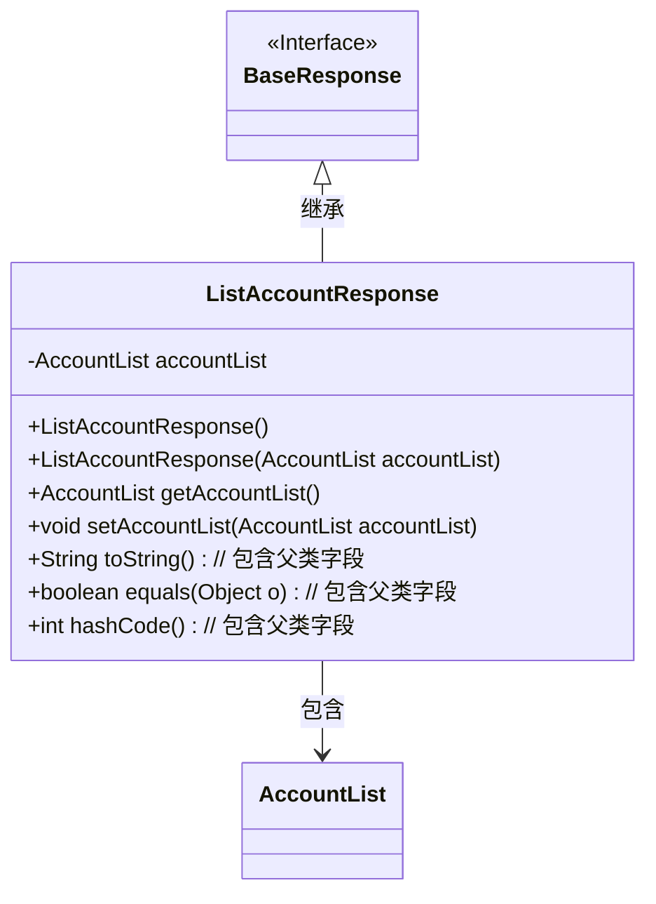
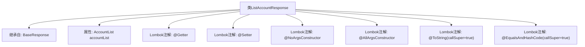

# 基础信息

|      |      |
|------|------|
| 名称 | ListAccountResponse |
| 编码语言 | .java |
| 代码路径 | staffjoy/account-api/src/main/java/xyz/staffjoy/account/dto/ListAccountResponse.java |
| 包名 | xyz.staffjoy.account.dto |
| 依赖项 | [None, 'xyz.staffjoy.common.api.BaseResponse'] |
| 概述说明 | Java类ListAccountResponse继承BaseResponse，包含AccountList属性，使用Lombok注解生成方法。 |

# 说明

这段内容描述了一个名为ListAccountResponse的Java类，该类继承自BaseResponse。类中使用了多个注解：@Getter和@Setter用于自动生成getter和setter方法，@NoArgsConstructor和@AllArgsConstructor分别生成无参和全参构造函数，@ToString和@EqualsAndHashCode用于生成toString和equals/hashCode方法，并设置callSuper=true以包含父类属性。类中包含一个AccountList类型的私有成员变量accountList。

# 类列表 Class Summary

| 名称   | 类型  | 说明 |
|-------|------|-------------|
| ListAccountResponse | class | Java类ListAccountResponse继承BaseResponse，包含AccountList属性，使用Lombok注解生成getter、setter、构造方法、toString和equals/hashCode。 |

## 类 ListAccountResponse

|      |      |
|------|------|
| 访问范围 | @Getter;@Setter;@NoArgsConstructor;@AllArgsConstructor;@ToString(callSuper = true);@EqualsAndHashCode(callSuper = true);public |
| 类型 | class |
| 名称 | ListAccountResponse |
| 说明 | Java类ListAccountResponse继承BaseResponse，包含AccountList属性，使用Lombok注解生成getter、setter、构造方法、toString和equals/hashCode。 |

### UML类图

这段类图展示了`ListAccountResponse`继承自`BaseResponse`接口，并包含一个`AccountList`私有成员。类通过Lombok注解自动生成构造方法、getter/setter、toString及equals/hashCode方法（均包含父类字段）。继承关系用实线箭头表示，组合关系用虚线箭头标注，清晰体现了类间的层级和依赖关系。

### 内部方法调用关系图

该流程图展示了ListAccountResponse类的结构，这是一个继承BaseResponse的实体类，包含AccountList类型属性和多个Lombok注解。通过@Getter/@Setter自动生成访问方法，@NoArgsConstructor/@AllArgsConstructor提供构造方法，@ToString和@EqualsAndHashCode实现了带父类属性的toString()和哈希比较功能。整个设计体现了Lombok简化POJO开发的典型用法。

### 字段列表 Field List

| 名称  | 类型  | 说明 |
|-------|-------|------|
| accountList | AccountList | 私有账户列表对象。 |

### 方法列表 Method List

| 名称  | 类型  | 说明 |
|-------|-------|------|

