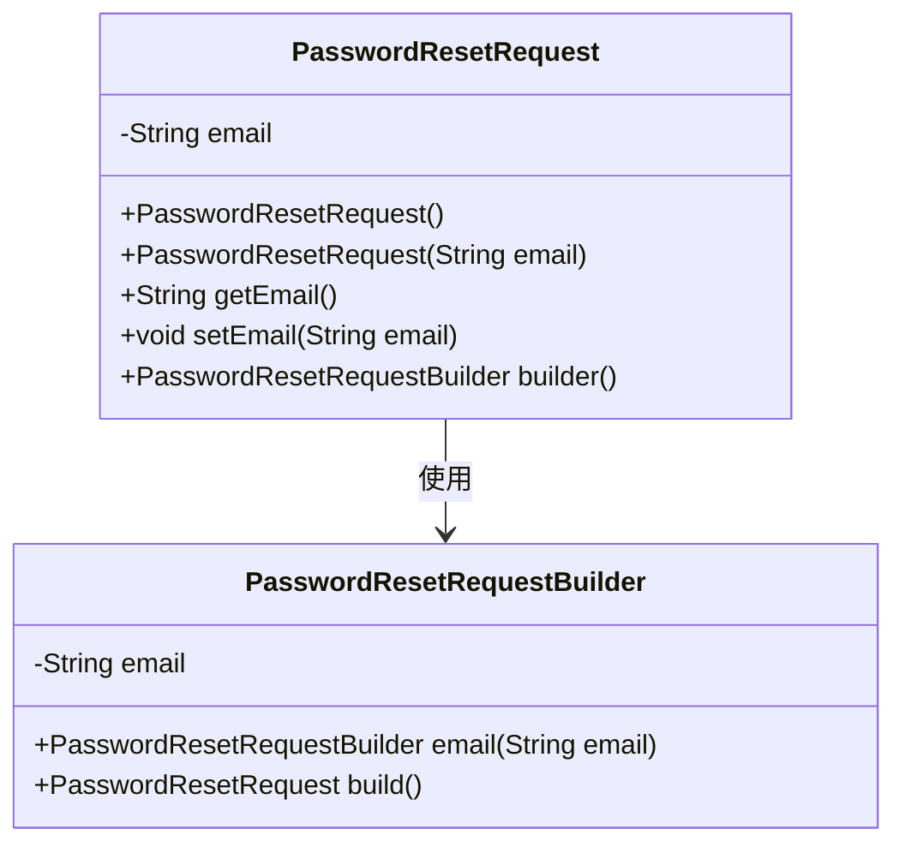
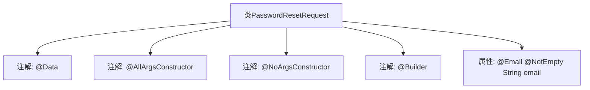

# 基础信息

|      |      |
|------|------|
| 名称 | PasswordResetRequest |
| 编码语言 | .java |
| 代码路径 | staffjoy/account-api/src/main/java/xyz/staffjoy/account/dto/PasswordResetRequest.java |
| 包名 | xyz.staffjoy.account.dto |
| 依赖项 | ['lombok.AllArgsConstructor', 'lombok.Builder', 'lombok.Data', 'lombok.NoArgsConstructor', 'javax.validation.constraints.Email', 'javax.validation.constraints.NotEmpty'] |
| 概述说明 | Java类定义密码重置请求，含邮箱字段验证。 |

# 说明

这是一个名为PasswordResetRequest的Java类，用于处理密码重置请求。该类使用Lombok注解自动生成全参数构造函数、无参构造函数和建造者模式。包含一个email字段，使用校验注解确保非空且符合邮箱格式。整个类设计简洁，专注于密码重置功能的核心数据。

# 类列表 Class Summary

| 名称   | 类型  | 说明 |
|-------|------|-------------|
| PasswordResetRequest | class | 密码重置请求类，含邮箱字段，带验证注解和构造方法。 |

## 类 PasswordResetRequest

|      |      |
|------|------|
| 访问范围 | @Data;@AllArgsConstructor;@NoArgsConstructor;@Builder;public |
| 类型 | class |
| 名称 | PasswordResetRequest |
| 说明 | 密码重置请求类，含邮箱字段，带验证注解和构造方法。 |

### UML类图

这段代码定义了一个名为PasswordResetRequest的类，用于处理密码重置请求。该类使用了Lombok注解自动生成构造器、getter/setter和builder模式实现。核心字段email使用@Email和@NotEmpty注解进行验证。类图展示了主类与内部Builder类的关系，Builder模式允许通过链式调用创建对象实例。该设计简化了对象创建过程，同时确保了email字段的格式验证。

### 内部方法调用关系图

该流程图展示了PasswordResetRequest类的结构，这是一个使用Lombok注解的POJO类。类顶部标注了@Data（自动生成getter/setter）、@AllArgsConstructor（全参构造）、@NoArgsConstructor（无参构造）和@Builder（建造者模式）四个关键注解。核心属性email被@Email（格式校验）和@NotEmpty（非空校验）双重注解修饰，表明这是一个用于密码重置请求的邮箱字段。整个设计通过注解简化了样板代码，专注于业务数据定义。

### 字段列表 Field List

| 名称  | 类型  | 说明 |
|-------|-------|------|
| email | String | 非空邮箱字段 |

### 方法列表 Method List

| 名称  | 类型  | 说明 |
|-------|-------|------|

