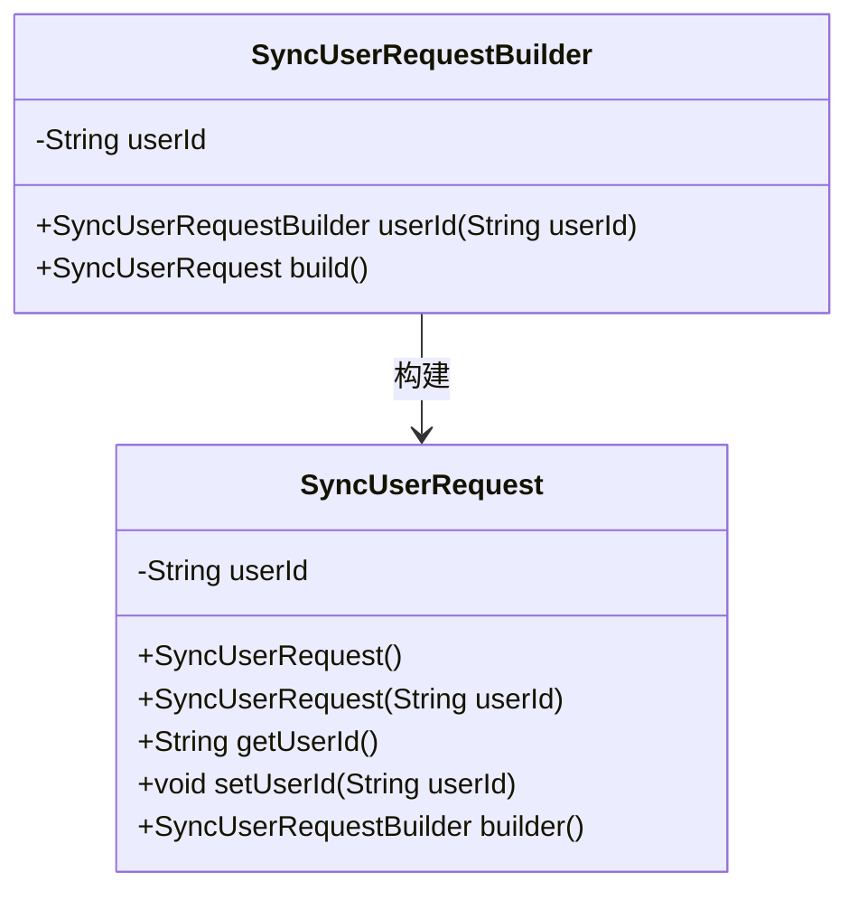
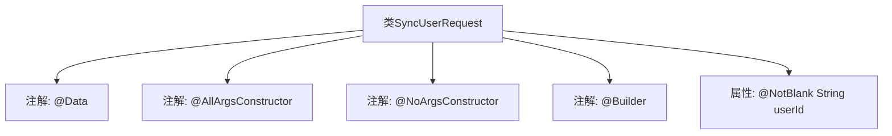

# 基础信息

|      |      |
|------|------|
| 名称 | SyncUserRequest |
| 编码语言 | .java |
| 代码路径 | staffjoy/account-api/src/main/java/xyz/staffjoy/account/dto/SyncUserRequest.java |
| 包名 | xyz.staffjoy.account.dto |
| 依赖项 | ['lombok.AllArgsConstructor', 'lombok.Builder', 'lombok.Data', 'lombok.NoArgsConstructor', 'javax.validation.constraints.NotBlank'] |
| 概述说明 | Java类SyncUserRequest，含userId字段，使用Lombok注解生成构造器和建造器。 |

# 说明

这是一个名为SyncUserRequest的Java类定义，使用了Lombok库的注解来简化代码。类中包含一个非空字符串类型的userId字段。@Data注解自动生成getter、setter等方法；@AllArgsConstructor和@NoArgsConstructor分别生成全参和无参构造函数；@Builder提供了建造者模式支持。@NotBlank确保userId字段不能为空或仅包含空格。整个类设计用于用户同步请求场景。

# 类列表 Class Summary

| 名称   | 类型  | 说明 |
|-------|------|-------------|
| SyncUserRequest | class | 同步用户请求类，包含用户ID字段，支持全参、无参构造和建造器模式。 |

## 类 SyncUserRequest

|      |      |
|------|------|
| 访问范围 | @Data;@AllArgsConstructor;@NoArgsConstructor;@Builder;public |
| 类型 | class |
| 名称 | SyncUserRequest |
| 说明 | 同步用户请求类，包含用户ID字段，支持全参、无参构造和建造器模式。 |

### UML类图

这段类图展示了SyncUserRequest类及其构建器模式的结构。SyncUserRequest是一个简单的数据传输对象，包含一个非空的userId字段，通过Lombok注解自动生成了无参构造器、全参构造器、getter/setter以及builder()方法。SyncUserRequestBuilder是Lombok生成的内部构建器类，用于链式设置属性并最终构建SyncUserRequest实例。类图清晰地反映了构建器模式的使用方式以及两个类之间的构建关系。

### 内部方法调用关系图

这段流程图展示了SyncUserRequest类的结构，它是一个使用Lombok注解的POJO类。@Data注解自动生成getter/setter方法，@AllArgsConstructor和@NoArgsConstructor分别生成全参和无参构造方法，@Builder提供建造者模式支持。核心属性userId被@NotBlank注解标记，表示不能为空字符串。整个设计简洁地实现了用户同步请求的数据封装需求。

### 字段列表 Field List

| 名称  | 类型  | 说明 |
|-------|-------|------|
| userId | String | 私有字符串类型变量userId，非空。 |

### 方法列表 Method List

| 名称  | 类型  | 说明 |
|-------|-------|------|

