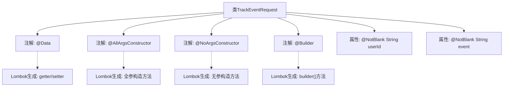

# 基础信息

|      |      |
|------|------|
| 名称 | TrackEventRequest |
| 编码语言 | .java |
| 代码路径 | staffjoy/account-api/src/main/java/xyz/staffjoy/account/dto/TrackEventRequest.java |
| 包名 | xyz.staffjoy.account.dto |
| 依赖项 | ['lombok.AllArgsConstructor', 'lombok.Builder', 'lombok.Data', 'lombok.NoArgsConstructor', 'javax.validation.constraints.NotBlank'] |
| 概述说明 | Java类TrackEventRequest，含userId和event字段，使用Lombok注解简化代码。 |

# 说明

这是一个名为TrackEventRequest的Java类定义，用于表示跟踪事件的请求数据。该类使用了Lombok库的注解来简化代码：@Data自动生成getter/setter等方法，@AllArgsConstructor和@NoArgsConstructor分别生成全参数和无参构造函数，@Builder提供了建造者模式支持。类中包含两个必填字段：userId表示用户ID，event表示事件名称，这两个字段都使用了@NotBlank注解确保不能为空字符串。整个类设计简洁，主要用于封装事件跟踪请求的基本信息。

# 类列表 Class Summary

| 名称   | 类型  | 说明 |
|-------|------|-------------|
| TrackEventRequest | class | Java类TrackEventRequest，含userId和event字段，使用Lombok注解生成构造器和建造器。 |


## 类 TrackEventRequest

|      |      |
|------|------|
| 访问范围 | @Data;@AllArgsConstructor;@NoArgsConstructor;@Builder;public |
| 类型 | class |
| 名称 | TrackEventRequest |
| 说明 | Java类TrackEventRequest，含userId和event字段，使用Lombok注解生成构造器和建造器。 |


### UML类图

```mermaid
classDiagram
    class TrackEventRequest {
        -String userId
        -String event
        +TrackEventRequest()
        +TrackEventRequest(String userId, String event)
        +String getUserId()
        +void setUserId(String userId)
        +String getEvent()
        +void setEvent(String event)
        +TrackEventRequestBuilder builder()
    }

    // Lombok注解生成的构建器类
    class TrackEventRequestBuilder {
        -String userId
        -String event
        +TrackEventRequestBuilder userId(String userId)
        +TrackEventRequestBuilder event(String event)
        +TrackEventRequest build()
    }

    TrackEventRequest --> TrackEventRequestBuilder : 使用
```

这段类图展示了一个使用Lombok注解的TrackEventRequest类及其构建器模式实现。该类包含userId和event两个私有字段，通过@Data自动生成getter/setter，@AllArgsConstructor和@NoArgsConstructor分别生成全参和无参构造器，@Builder生成流畅的构建器模式。构建器类TrackEventRequestBuilder提供了链式调用方法，最终通过build()方法创建TrackEventRequest实例。这种设计简化了对象创建过程，同时保证了字段的非空约束（通过@NotBlank注解）。


### 内部方法调用关系图



这段流程图展示了使用Lombok注解的TrackEventRequest类结构。类通过@Data自动生成getter/setter，@AllArgsConstructor/@NoArgsConstructor分别创建全参和无参构造方法，@Builder提供建造者模式支持。核心属性userId和event都带有@NotBlank验证注解。整个设计通过Lombok简化了样板代码，同时保持了数据完整性和构建灵活性。

### 字段列表 Field List

| 名称  | 类型  | 说明 |
|-------|-------|------|
| event | String | 私有字符串类型变量event，不能为空。 |
| userId | String | 非空用户ID字符串字段 |

### 方法列表 Method List

| 名称  | 类型  | 说明 |
|-------|-------|------|


