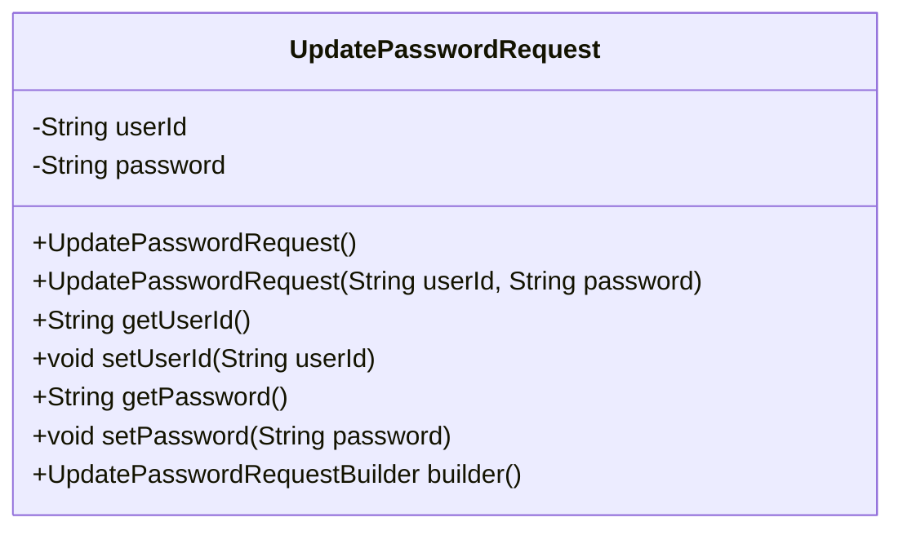
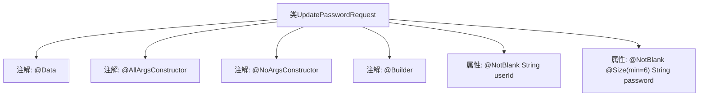

# 基础信息

|      |      |
|------|------|
| 名称 | UpdatePasswordRequest |
| 编码语言 | .java |
| 代码路径 | staffjoy/account-api/src/main/java/xyz/staffjoy/account/dto/UpdatePasswordRequest.java |
| 包名 | xyz.staffjoy.account.dto |
| 依赖项 | ['lombok.AllArgsConstructor', 'lombok.Builder', 'lombok.Data', 'lombok.NoArgsConstructor', 'javax.validation.constraints.NotBlank', 'javax.validation.constraints.Size'] |
| 概述说明 | Java类定义更新密码请求，含用户ID和至少6位密码字段。 |

# 说明

这是一个Java类定义，名为UpdatePasswordRequest，用于封装更新密码的请求数据。类使用了Lombok注解自动生成全参构造函数、无参构造函数和建造者模式。包含两个字段：userId和password，均标注了@NotBlank表示不能为空。password字段额外添加了@Size(min=6)验证，要求密码长度至少6个字符。整个类结构简洁，专注于密码更新请求的数据验证和对象构建。

# 类列表 Class Summary

| 名称   | 类型  | 说明 |
|-------|------|-------------|
| UpdatePasswordRequest | class | Java类定义：用户密码更新请求，含用户ID和密码字段，密码最小长度6位。 |

## 类 UpdatePasswordRequest

|      |      |
|------|------|
| 访问范围 | @Data;@AllArgsConstructor;@NoArgsConstructor;@Builder;public |
| 类型 | class |
| 名称 | UpdatePasswordRequest |
| 说明 | Java类定义：用户密码更新请求，含用户ID和密码字段，密码最小长度6位。 |

### UML类图

这段类图描述了一个用于密码更新请求的POJO类UpdatePasswordRequest。该类包含两个私有字段：userId和password，其中password字段通过@Size注解设置了最小长度为6的验证约束。类提供了全参和无参构造函数，通过Lombok注解自动生成了getter/setter方法以及builder模式支持。该类主要用于接收前端传入的密码修改请求数据，并进行基础数据验证。

### 内部方法调用关系图

该流程图展示了UpdatePasswordRequest类的结构，这是一个使用Lombok注解的Java类。类通过@Data自动生成getter/setter方法，@AllArgsConstructor和@NoArgsConstructor分别提供全参和无参构造方法，@Builder支持建造者模式。包含两个关键属性：userId必须非空，password需满足非空且最小长度6位的验证规则。整个设计用于封装密码更新请求的数据校验需求。

### 字段列表 Field List

| 名称  | 类型  | 说明 |
|-------|-------|------|
| password | String | 密码字段，非空且长度至少6字符。 |
| userId | String | 私有字符串变量userId，不可为空。 |

### 方法列表 Method List

| 名称  | 类型  | 说明 |
|-------|-------|------|

