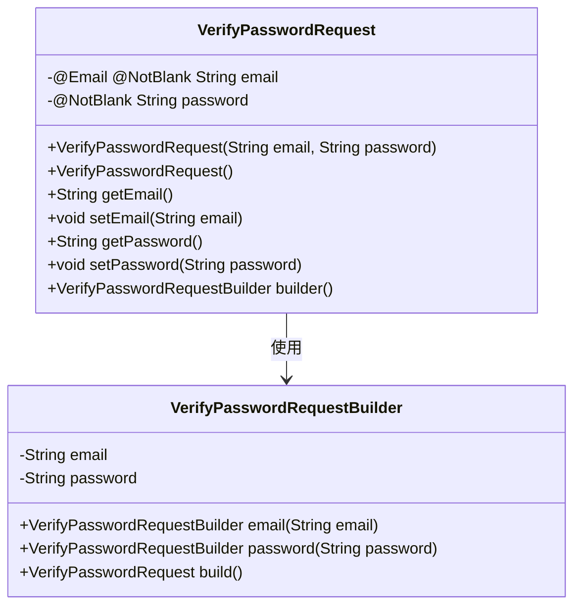
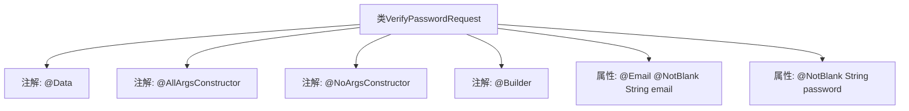

# 基础信息

|      |      |
|------|------|
| 名称 | VerifyPasswordRequest |
| 编码语言 | .java |
| 代码路径 | staffjoy/account-api/src/main/java/xyz/staffjoy/account/dto/VerifyPasswordRequest.java |
| 包名 | xyz.staffjoy.account.dto |
| 依赖项 | ['lombok.AllArgsConstructor', 'lombok.Builder', 'lombok.Data', 'lombok.NoArgsConstructor', 'javax.validation.constraints.Email', 'javax.validation.constraints.NotBlank', 'javax.validation.constraints.NotEmpty'] |
| 概述说明 | 验证密码请求类，含邮箱和密码字段，带构造和构建注解。 |

# 说明

这是一个名为VerifyPasswordRequest的Java类定义，用于验证密码请求。类中包含两个必填字段：email字段使用@Email和@NotBlank注解确保输入为有效非空邮箱；password字段使用@NotBlank注解确保密码非空。类使用了Lombok库的@Data、@AllArgsConstructor、@NoArgsConstructor和@Builder注解，自动生成getter/setter、全参构造函数、无参构造函数以及建造者模式支持。

# 类列表 Class Summary

| 名称   | 类型  | 说明 |
|-------|------|-------------|
| VerifyPasswordRequest | class | 验证密码请求类，含邮箱和密码字段，带构造器和建造器注解。 |

## 类 VerifyPasswordRequest

|      |      |
|------|------|
| 访问范围 | @Data;@AllArgsConstructor;@NoArgsConstructor;@Builder;public |
| 类型 | class |
| 名称 | VerifyPasswordRequest |
| 说明 | 验证密码请求类，含邮箱和密码字段，带构造器和建造器注解。 |

### UML类图

这段类图展示了带有Lombok注解的密码验证请求类结构。VerifyPasswordRequest类包含email和password两个私有字段，通过@Data注解自动生成getter/setter，@AllArgsConstructor和@NoArgsConstructor分别生成全参和无参构造器，@Builder注解则创建了嵌套的VerifyPasswordRequestBuilder建造者类。该类主要用于封装用户密码验证时所需的邮箱和密码信息，并通过建造者模式提供灵活的实例化方式。

### 内部方法调用关系图

该流程图展示了VerifyPasswordRequest类的结构，这是一个使用Lombok注解的Java Bean类。类通过@Data自动生成getter/setter，@AllArgsConstructor和@NoArgsConstructor分别提供全参和无参构造方法，@Builder支持建造者模式。包含两个核心属性：email字段带有@Email和@NotBlank验证注解，password字段有@NotBlank注解。整个设计用于密码验证请求的数据封装，符合JSR-303验证规范。

### 字段列表 Field List

| 名称  | 类型  | 说明 |
|-------|-------|------|
| password | String | 私有密码字符串字段 |
| email | String | 非空字符串类型邮箱字段 |

### 方法列表 Method List

| 名称  | 类型  | 说明 |
|-------|-------|------|

