# 基础信息

|      |      |
|------|------|
| 名称 | dto |
| 编码语言 | .java |
| 代码路径 | staffjoy/account-api/src/main/java/xyz/staffjoy/account/dto |
| 包名 | staffjoy.docs.account-api.src.main.java.xyz.staffjoy.account.dto |
| 概述说明 | Java类集合：包含账户管理、密码重置、邮件确认等功能的DTO类，使用Lombok简化代码。 |

# 说明

## 概述  
该代码模块是一个账户管理相关的API模块，主要包含了一系列数据传输对象（DTO）类，用于处理账户相关的请求和响应。这些DTO类主要用于封装账户数据、验证输入、构建请求和响应结构，并支持多种账户操作，如账户创建、密码重置、电子邮件确认、密码验证等。模块使用了Lombok库简化代码，通过注解自动生成常用方法（如getter/setter、构造器、建造者模式等），同时结合校验注解确保数据的有效性。

## 主要业务场景  
1. **账户信息管理**  
   - `AccountDto`：表示账户的核心数据，包括ID、名称、邮箱、电话号码、注册时间等字段。  
   - `GenericAccountResponse` 和 `ListAccountResponse`：分别用于封装单个账户和分页账户列表的响应数据。  
   - `AccountList`：支持分页查询，包含账户列表、每页限制数量和偏移量信息。  

2. **账户创建与验证**  
   - `CreateAccountRequest` 和 `GetOrCreateRequest`：用于创建账户或获取已有账户，支持名称、邮箱、电话号码的输入验证，确保请求至少包含一个有效字段。  
   - `VerifyPasswordRequest`：验证用户密码，确保邮箱和密码非空且格式正确。  

3. **密码管理**  
   - `PasswordResetRequest`：封装密码重置请求，验证邮箱格式。  
   - `UpdatePasswordRequest`：处理密码更新请求，确保用户ID和新密码非空，且密码长度符合要求。  

4. **电子邮件相关操作**  
   - `EmailConfirmation`：处理电子邮件确认，验证用户ID和邮箱格式。  
   - `EmailChangeRequest`：支持用户邮箱变更，验证用户ID和新邮箱格式。  

5. **用户同步与事件跟踪**  
   - `SyncUserRequest`：用于用户同步场景，确保用户ID非空。  
   - `TrackEventRequest`：封装事件跟踪请求，记录用户ID和事件名称。  

该模块通过标准化的DTO类和校验逻辑，为账户管理提供了清晰、可扩展的接口设计，适用于多种账户操作场景。

### 包内部结构视图

```mermaid
graph TD
    dto --> GenericAccountResponse.java
    dto --> ListAccountResponse.java
    dto --> EmailConfirmation.java
    dto --> AccountDto.java
    dto --> PasswordResetRequest.java
    dto --> CreateAccountRequest.java
    dto --> EmailChangeRequest.java
    dto --> UpdatePasswordRequest.java
    dto --> AccountList.java
    dto --> TrackEventRequest.java
    dto --> VerifyPasswordRequest.java
    dto --> GetOrCreateRequest.java
    dto --> SyncUserRequest.java
```

该流程图展示了account-api项目中dto目录下的所有文件层级关系。根节点为dto文件夹，包含14个不同类型的请求/响应类文件，涵盖账户创建、密码重置、邮件确认、用户同步等功能模块的数据传输对象。所有文件均直接隶属于dto目录，无嵌套子目录结构。

# 文件列表 File List

| 名称   | 类型  | 说明 |
|-------|------|-------------|
| [PasswordResetRequest.java](PasswordResetRequest.md) | file | Java类定义密码重置请求，含邮箱字段验证。 |
| [AccountDto.java](AccountDto.md) | file | 账户数据传输对象，包含ID、姓名、邮箱、状态、注册时间、支持标识、电话和照片链接。 |
| [ListAccountResponse.java](ListAccountResponse.md) | file | Java类ListAccountResponse继承BaseResponse，包含AccountList属性，使用Lombok注解生成方法。 |
| [GenericAccountResponse.java](GenericAccountResponse.md) | file | Java类GenericAccountResponse继承BaseResponse，包含AccountDto字段及常用注解。 |
| [AccountList.java](AccountList.md) | file | 账户列表类，含账户集合、限制和偏移量。 |
| [UpdatePasswordRequest.java](UpdatePasswordRequest.md) | file | Java类定义更新密码请求，含用户ID和至少6位密码字段。 |
| [EmailChangeRequest.java](EmailChangeRequest.md) | file | Java类EmailChangeRequest，含userId和email字段，支持全参无参构造和Builder模式，字段有非空和邮箱格式校验。 |
| [VerifyPasswordRequest.java](VerifyPasswordRequest.md) | file | 验证密码请求类，含邮箱和密码字段，带构造和构建注解。 |
| [TrackEventRequest.java](TrackEventRequest.md) | file | Java类TrackEventRequest，含userId和event字段，使用Lombok注解简化代码。 |
| [SyncUserRequest.java](SyncUserRequest.md) | file | Java类SyncUserRequest，含userId字段，使用Lombok注解生成构造器和建造器。 |
| [GetOrCreateRequest.java](GetOrCreateRequest.md) | file | Java类GetOrCreateRequest，含name、email、phoneNumber字段及非空校验方法。 |
| [CreateAccountRequest.java](CreateAccountRequest.md) | file | 创建账户请求类，含姓名、邮箱、电话字段及非空校验方法。 |
| [EmailConfirmation.java](EmailConfirmation.md) | file | EmailConfirmation类：含userId和email字段，支持全参无参构造和建造者模式，字段校验非空及邮箱格式。 |

