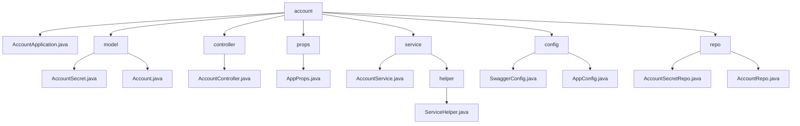

# 基础信息

|      |      |
|------|------|
| 名称 | staffjoy |
| 编码语言 | .java |
| 代码路径 | staffjoy/account-svc/src/main/java/xyz/staffjoy |
| 包名 | staffjoy.docs.account-svc.src.main.java.xyz.staffjoy |
| 概述说明 | Spring Boot账户服务，含Feign客户端、JPA实体、REST控制器及安全配置。 |

# 说明

# 代码模块总结

## 概述

该模块是一个基于Spring Boot和Spring Cloud的账户微服务系统，属于Staffjoy项目的一部分。作为微服务架构中的核心服务之一，主要负责用户账户管理和认证相关功能。系统采用分层架构设计，包含以下主要组件：

1. **核心实体层**：包含`Account`和`AccountSecret`两个JPA实体类，分别处理账户基本信息和敏感数据
2. **数据访问层**：通过`AccountRepo`和`AccountSecretRepo`提供数据库操作接口
3. **业务服务层**：`AccountService`和`ServiceHelper`实现核心业务逻辑
4. **API接口层**：`AccountController`暴露RESTful API
5. **配置层**：包含Swagger配置、应用属性配置等基础设施

系统通过Feign客户端与邮件服务(mail)、机器人服务(bot)和公司服务(company)进行通信，并集成了Intercom、Sentry等第三方服务。

## 主要业务场景

### 1. 账户全生命周期管理
- **账户创建**：支持通过邮箱或手机号自动创建账户
- **信息维护**：提供账户基本信息的增删改查功能
- **状态管理**：处理账户激活/禁用状态变更
- **账户删除**：提供安全的账户删除机制

### 2. 认证与安全
- **密码管理**：包括密码哈希存储、验证、修改和重置
- **权限控制**：基于`support`字段实现角色区分
- **敏感信息隔离**：通过`AccountSecret`单独存储密码等敏感数据
- **安全审计**：记录关键操作日志

### 3. 集成与通信
- **内部服务通信**：通过Feign与邮件、机器人和公司服务交互
- **外部服务集成**：
  - 与Intercom平台进行用户数据同步
  - 通过Sentry实现错误监控
  - 支持短信和邮件通知

### 4. 辅助功能
- **API文档**：通过Swagger自动生成接口文档
- **异步处理**：使用线程池处理非关键路径任务
- **调试支持**：提供开发环境特殊处理逻辑
- **事件跟踪**：记录用户行为事件用于分析

### 5. 基础设施
- **数据库访问**：基于Spring Data JPA实现高效数据操作
- **配置管理**：通过`AppProps`集中管理应用配置
- **异常处理**：统一的错误处理机制
- **性能优化**：包含查询优化和事务管理

### 包内部结构视图

该流程图展示了account模块的完整目录结构，包含7个主要子目录和对应的Java文件。其中service目录下嵌套了helper子目录，model、controller等目录直接包含业务类文件，config目录存放配置类，repo目录包含数据访问层组件。整个结构清晰地反映了Spring Boot应用的典型分层架构。

# 文件列表 File List

| 名称   | 类型  | 说明 |
|-------|------|-------------|
| [account](account/_module.md) | package | Spring Boot账户服务，含Feign客户端、JPA实体、REST控制器及安全配置。 |

