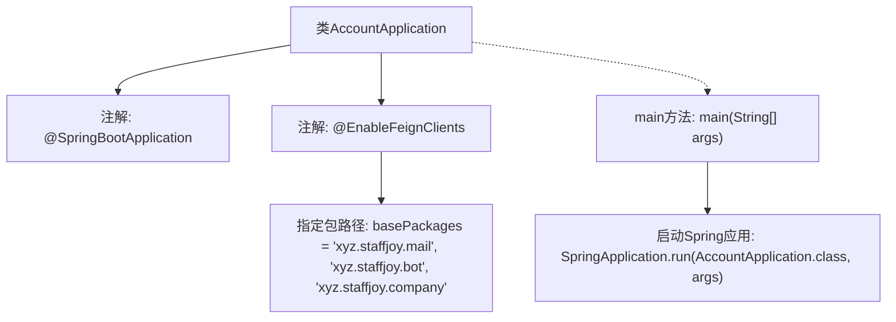

# 基础信息

|      |      |
|------|------|
| 名称 | AccountApplication |
| 编码语言 | .java |
| 代码路径 | staffjoy/account-svc/src/main/java/xyz/staffjoy/account/AccountApplication.java |
| 包名 | xyz.staffjoy.account |
| 依赖项 | ['org.springframework.boot.SpringApplication', 'org.springframework.boot.autoconfigure.SpringBootApplication', 'org.springframework.cloud.openfeign.EnableFeignClients'] |
| 概述说明 | SpringBoot应用启用FeignClients，扫描指定包。 |

# 说明

这是一个Spring Boot应用程序的入口类，使用@SpringBootApplication注解标记为主配置类。通过@EnableFeignClients注解启用了Feign客户端功能，并指定了三个基础包路径（xyz.staffjoy.mail、xyz.staffjoy.bot、xyz.staffjoy.company）用于扫描Feign客户端接口。主方法通过SpringApplication.run启动整个应用。该配置表明这是一个微服务架构中的账户服务，需要与其他三个服务（邮件、机器人和公司服务）进行HTTP通信。

# 类列表 Class Summary

| 名称   | 类型  | 说明 |
|-------|------|-------------|
| AccountApplication | class | SpringBoot应用启用Feign客户端，扫描指定包。 |


## 类 AccountApplication

|      |      |
|------|------|
| 访问范围 | @SpringBootApplication;@EnableFeignClients(basePackages = {"xyz.staffjoy.mail", "xyz.staffjoy.bot", "xyz.staffjoy.company"});public |
| 类型 | class |
| 名称 | AccountApplication |
| 说明 | SpringBoot应用启用Feign客户端，扫描指定包。 |


### UML类图

```mermaid
classDiagram
    class AccountApplication {
        <<SpringBootApplication>>
        <<EnableFeignClients>>
        +main(String[] args) void
    }
    // AccountApplication 是Spring Boot应用的主启动类
    // 通过@SpringBootApplication标记为Spring Boot应用
    // 通过@EnableFeignClients启用Feign客户端功能，扫描指定包下的Feign客户端接口
```

这段类图描述了一个Spring Boot应用的主启动类AccountApplication，该类通过@SpringBootApplication注解标记为Spring Boot应用，同时使用@EnableFeignClients注解启用了Feign客户端功能，并指定了需要扫描的包路径（xyz.staffjoy.mail、xyz.staffjoy.bot和xyz.staffjoy.company）。该类包含一个静态main方法作为应用的启动入口，通过SpringApplication.run()方法启动整个应用。这个类是整个微服务应用的配置和启动核心，负责初始化Spring容器和加载相关配置。


### 内部方法调用关系图



该流程图展示了AccountApplication类的结构及其关键组件。类被标记为SpringBoot应用，并通过@EnableFeignClients注解启用了对三个指定包下Feign客户端的支持。main方法作为入口点，调用SpringApplication.run启动整个Spring Boot应用。该设计体现了微服务架构中集中式配置和客户端代理的典型模式。

### 字段列表 Field List

| 名称  | 类型  | 说明 |
|-------|-------|------|

### 方法列表 Method List

| 名称  | 类型  | 说明 |
|-------|-------|------|
| main | void | Java启动Spring应用的main方法。 |


