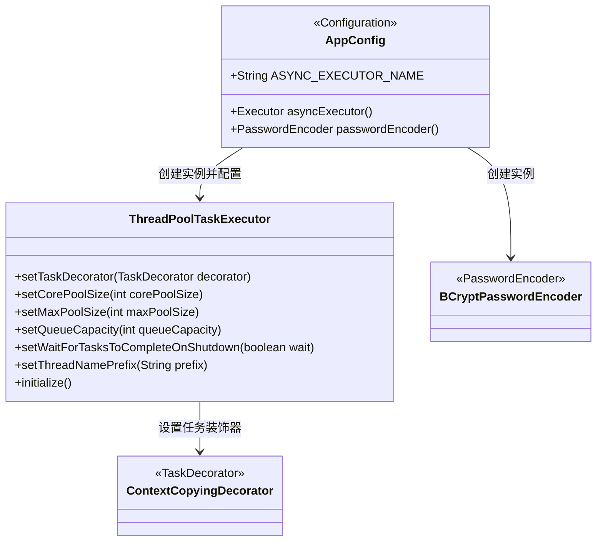
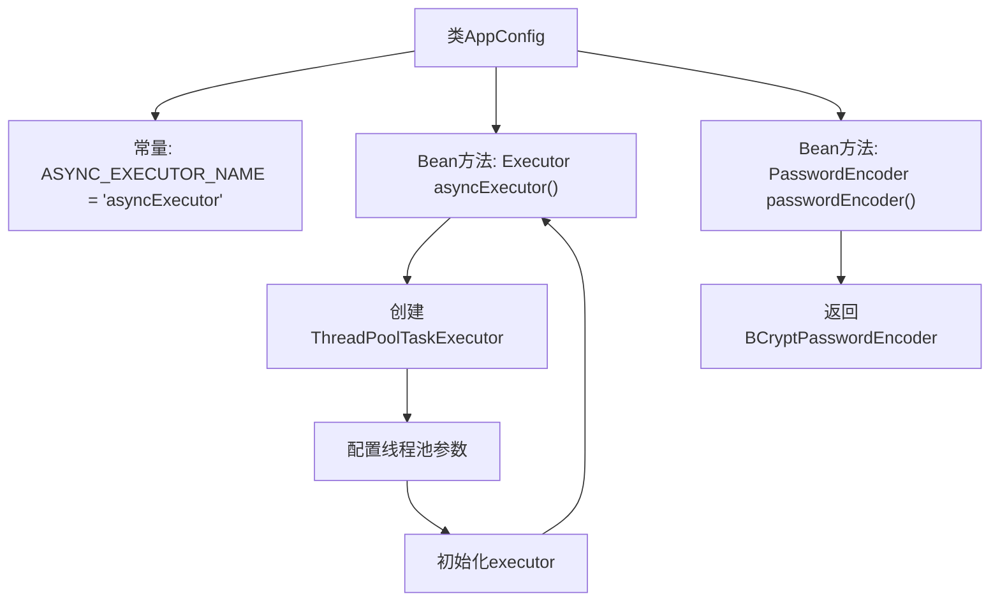

# 基础信息

|      |      |
|------|------|
| 名称 | AppConfig |
| 编码语言 | .java |
| 代码路径 | staffjoy/account-svc/src/main/java/xyz/staffjoy/account/config/AppConfig.java |
| 包名 | xyz.staffjoy.account.config |
| 依赖项 | ['org.springframework.context.annotation.Bean', 'org.springframework.context.annotation.Configuration', 'org.springframework.context.annotation.Import', 'org.springframework.scheduling.annotation.EnableAsync', 'org.springframework.scheduling.concurrent.ThreadPoolTaskExecutor', 'org.springframework.security.crypto.bcrypt.BCryptPasswordEncoder', 'org.springframework.security.crypto.password.PasswordEncoder', 'xyz.staffjoy.common.async.ContextCopyingDecorator', 'xyz.staffjoy.common.config.StaffjoyRestConfig', 'java.util.concurrent.Executor'] |
| 概述说明 | Java配置类，启用异步并导入其他配置，定义线程池执行器和密码加密器。 |

# 说明

这是一个名为AppConfig的Java配置类，用于定义应用程序的配置和Bean。该类启用了异步支持并导入了StaffjoyRestConfig配置。主要定义了两个Bean：一个是名为asyncExecutor的线程池任务执行器，配置了核心线程数3、最大线程数5、队列容量100，并设置了任务装饰器、关闭等待和线程名前缀；另一个是密码编码器Bean，使用BCrypt算法进行密码加密。整个配置类标记了抑制重复代码警告。

# 类列表 Class Summary

| 名称   | 类型  | 说明 |
|-------|------|-------------|
| AppConfig | class | Java配置类，启用异步并导入其他配置，定义线程池和密码编码器。 |

## 类 AppConfig

|      |      |
|------|------|
| 访问范围 | @Configuration;@EnableAsync;@Import(value = {StaffjoyRestConfig.class});@SuppressWarnings(value = "Duplicates");public |
| 类型 | class |
| 名称 | AppConfig |
| 说明 | Java配置类，启用异步并导入其他配置，定义线程池和密码编码器。 |

### UML类图

这段类图展示了Spring配置类AppConfig的核心结构，它通过@Bean方法创建了两个关键组件：异步线程池执行器（使用ThreadPoolTaskExecutor实现）和密码编码器（BCryptPasswordEncoder实现）。ThreadPoolTaskExecutor配置了自定义的ContextCopyingDecorator用于上下文传递，并设置了线程池大小、队列容量等参数。类图中清晰体现了配置类与具体实现类之间的依赖关系，以及ThreadPoolTaskExecutor与任务装饰器的关联。所有组件都遵循Spring的依赖注入模式，通过方法返回接口类型实现松耦合。

### 内部方法调用关系图

这段代码是Spring Boot的配置类AppConfig，主要完成两个核心功能：1. 配置异步线程池，通过@Bean注解创建名为asyncExecutor的线程池实例，设置核心线程数、最大线程数、队列容量等参数，并添加上下文复制装饰器；2. 配置密码加密器，返回BCryptPasswordEncoder实例用于密码加密。类通过@EnableAsync启用异步支持，并导入StaffjoyRestConfig配置。流程图清晰展示了配置项的初始化流程和依赖关系。

### 字段列表 Field List

| 名称  | 类型  | 说明 |
|-------|-------|------|
| ASYNC_EXECUTOR_NAME = "asyncExecutor" | String | 异步执行器名称常量定义。 |

### 方法列表 Method List

| 名称  | 类型  | 说明 |
|-------|-------|------|
| asyncExecutor | Executor | 创建异步线程池，核心3最大5，队列100，支持上下文复制和优雅关闭。 |
| passwordEncoder | PasswordEncoder | 定义Bean方法返回BCrypt加密器。 |

