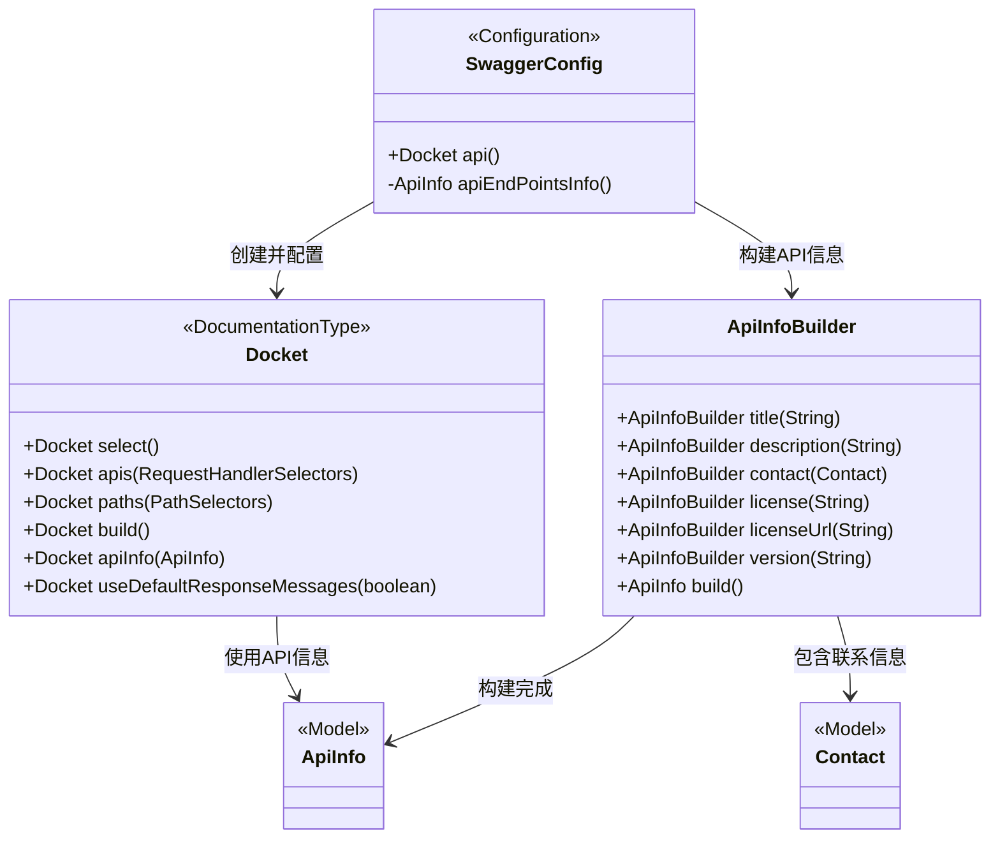
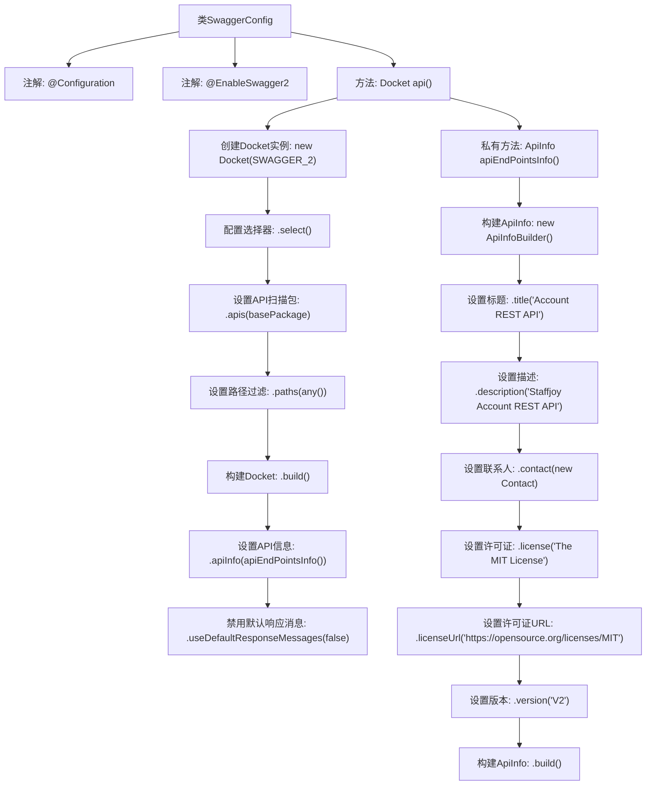

# 基础信息

|      |      |
|------|------|
| 名称 | SwaggerConfig |
| 编码语言 | .java |
| 代码路径 | staffjoy/account-svc/src/main/java/xyz/staffjoy/account/config/SwaggerConfig.java |
| 包名 | xyz.staffjoy.account.config |
| 依赖项 | ['org.springframework.context.annotation.Bean', 'org.springframework.context.annotation.Configuration', 'springfox.documentation.builders.ApiInfoBuilder', 'springfox.documentation.builders.PathSelectors', 'springfox.documentation.builders.RequestHandlerSelectors', 'springfox.documentation.service.ApiInfo', 'springfox.documentation.service.Contact', 'springfox.documentation.spi.DocumentationType', 'springfox.documentation.spring.web.plugins.Docket', 'springfox.documentation.swagger2.annotations.EnableSwagger2'] |
| 概述说明 | Swagger配置类，定义API文档信息及扫描路径。 |

# 说明

这是一个Swagger配置类，用于生成Account服务的REST API文档。配置启用了Swagger2，指定了API的基本信息，包括标题为Account REST API，描述为Staffjoy Account REST API，联系人为bobo及其GitHub链接和邮箱，使用MIT许可证并附上链接，版本为V2。API扫描范围限定在xyz.staffjoy.account.controller包下的所有路径，并禁用了默认响应消息。

# 类列表 Class Summary

| 名称   | 类型  | 说明 |
|-------|------|-------------|
| SwaggerConfig | class | Swagger配置类，定义API文档信息及扫描路径。 |

## 类 SwaggerConfig

|      |      |
|------|------|
| 访问范围 | @Configuration;@EnableSwagger2;public |
| 类型 | class |
| 名称 | SwaggerConfig |
| 说明 | Swagger配置类，定义API文档信息及扫描路径。 |

### UML类图

这段代码是一个Spring Boot的Swagger配置类，用于自动生成API文档。SwaggerConfig类通过@EnableSwagger2注解启用Swagger支持，并定义了一个Docket bean来配置API的基本信息。其中api()方法设置了API的扫描路径、基本信息(通过apiEndPointsInfo()方法构建)以及禁用默认响应消息。ApiInfoBuilder用于构建包含标题、描述、联系人、许可证等详细信息的ApiInfo对象。整个配置过程展示了Spring Boot与Swagger的集成方式，为RESTful API提供可视化文档支持。

### 内部方法调用关系图

这段代码是Spring Boot中配置Swagger的示例，通过@Configuration和@EnableSwagger2注解启用Swagger支持。核心方法api()创建并配置Docket对象，指定扫描的API包路径和全局过滤规则，同时通过apiEndPointsInfo()方法设置API文档的元数据信息（如标题、描述、联系人、许可证等）。最终生成一个禁用默认响应消息的Swagger配置实例，用于自动生成RESTful API文档。

### 字段列表 Field List

| 名称  | 类型  | 说明 |
|-------|-------|------|

### 方法列表 Method List

| 名称  | 类型  | 说明 |
|-------|-------|------|
| api | Docket | 创建Swagger API文档配置，扫描account.controller包下所有路径，禁用默认响应消息。 |
| apiEndPointsInfo | ApiInfo | 账户REST API，MIT许可，版本V2，联系bobo。 |

