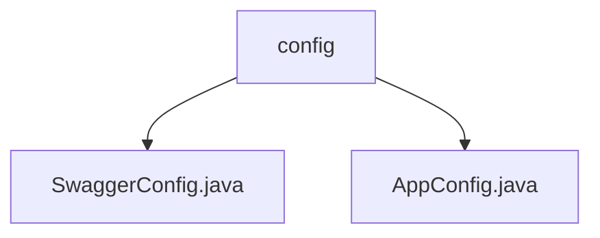

# 基础信息

|      |      |
|------|------|
| 名称 | config |
| 编码语言 | .java |
| 代码路径 | staffjoy/account-svc/src/main/java/xyz/staffjoy/account/config |
| 包名 | staffjoy.docs.account-svc.src.main.java.xyz.staffjoy.account.config |
| 概述说明 | Swagger配置类生成Account服务API文档，含标题描述联系人和版本。AppConfig类定义线程池和密码编码器Bean。 |

# 说明

# 代码模块总结

## 概述
该代码模块是一个基于Spring框架的Account服务实现，主要提供账户相关的REST API功能。模块包含以下核心配置：
1. Swagger配置 - 用于自动生成和展示API文档
2. 应用基础配置 - 包括异步任务处理和密码加密等基础设施配置

## 主要业务场景
1. **API文档生成与展示**：
   - 通过Swagger2自动生成REST API文档
   - 提供完整的API描述信息，包括标题、版本、联系人等元数据
   - 限定API扫描范围为账户控制器相关路径

2. **应用基础功能配置**：
   - 异步任务处理支持，配置了定制化的线程池
   - 密码加密功能，使用BCrypt算法保障账户安全
   - 集成基础REST配置(通过StaffjoyRestConfig)

3. **账户服务核心功能**：
   - 提供账户相关的RESTful接口(通过account.controller包下的实现)
   - 支持账户的创建、管理、认证等操作(由Swagger配置中扫描的控制器实现)

该模块通过合理的配置分离，既提供了完善的API文档支持，又确保了核心业务功能的基础设施需求，为账户服务提供了完整的实现基础。

### 包内部结构视图

该流程图展示了account-svc项目中config目录下的文件结构关系。根节点为config文件夹，包含两个Java配置文件：SwaggerConfig.java用于Swagger API文档配置，AppConfig.java为应用基础配置。结构清晰体现了Spring Boot项目中典型的配置类组织方式。

# 文件列表 File List

| 名称   | 类型  | 说明 |
|-------|------|-------------|
| [AppConfig.java](AppConfig.md) | file | Java配置类，启用异步并导入其他配置，定义线程池执行器和密码加密器。 |
| [SwaggerConfig.java](SwaggerConfig.md) | file | Swagger配置类，定义API文档信息及扫描路径。 |

