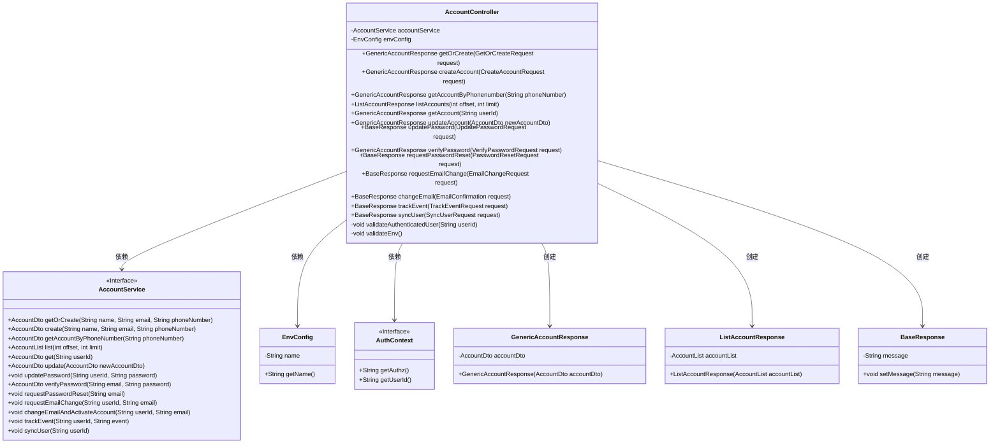

# 基础信息

|      |      |
|------|------|
| 名称 | AccountController |
| 编码语言 | .java |
| 代码路径 | staffjoy/account-svc/src/main/java/xyz/staffjoy/account/controller/AccountController.java |
| 包名 | xyz.staffjoy.account.controller |
| 依赖项 | ['com.github.structlog4j.ILogger', 'com.github.structlog4j.SLoggerFactory', 'org.springframework.beans.factory.annotation.Autowired', 'org.springframework.util.StringUtils', 'org.springframework.validation.annotation.Validated', 'org.springframework.web.bind.annotation', 'xyz.staffjoy.account.dto', 'xyz.staffjoy.account.service.AccountService', 'xyz.staffjoy.common.api.BaseResponse', 'xyz.staffjoy.common.auth.AuthConstant', 'xyz.staffjoy.common.auth.AuthContext', 'xyz.staffjoy.common.auth.Authorize', 'xyz.staffjoy.common.auth.PermissionDeniedException', 'xyz.staffjoy.common.env.EnvConfig', 'xyz.staffjoy.common.env.EnvConstant', 'xyz.staffjoy.common.error.ServiceException', 'xyz.staffjoy.common.validation.PhoneNumber', 'javax.validation.Valid', 'javax.validation.constraints.Min', 'javax.validation.constraints.NotBlank'] |
| 概述说明 | 账户管理API，提供创建、查询、更新、密码重置等功能，支持多种授权角色。 |

# 说明

AccountController是一个基于Spring框架的REST控制器，负责处理账户相关操作。它包含多个端点，支持创建、查询、更新账户信息，以及密码管理和事件跟踪等功能。所有端点都通过@Authorize注解进行权限控制，仅允许特定服务或用户访问。主要功能包括：通过电话或邮箱获取或创建账户、创建新账户、查询账户列表、更新账户信息、修改密码、验证密码、请求密码重置、请求邮箱变更、变更邮箱、跟踪事件和同步用户数据。控制器还包含两个私有方法，用于验证当前用户权限和环境配置。所有请求和响应都经过验证，确保数据有效性。

# 类列表 Class Summary

| 名称   | 类型  | 说明 |
|-------|------|-------------|
| AccountController | class | 账户管理API，提供创建、查询、更新及密码重置等功能。 |

## 类 AccountController

|      |      |
|------|------|
| 访问范围 | @RestController;@RequestMapping("/v1/account");@Validated;public |
| 类型 | class |
| 名称 | AccountController |
| 说明 | 账户管理API，提供创建、查询、更新及密码重置等功能。 |

### UML类图

该类图展示了AccountController作为REST控制器，通过AccountService接口处理账户相关操作，依赖EnvConfig进行环境配置检查，并使用AuthContext进行授权验证。控制器创建多种响应对象如GenericAccountResponse、ListAccountResponse和BaseResponse，与前端交互。AccountService接口定义了核心业务逻辑方法，由具体实现类完成功能。整体结构清晰体现了分层架构和依赖关系。

### 内部方法调用关系图

```mermaid
graph TD
    A["AccountController类"]
    B["属性: ILogger logger"]
    C["属性: AccountService accountService"]
    D["属性: EnvConfig envConfig"]
    E["方法: getOrCreate"]
    F["方法: createAccount"]
    G["方法: getAccountByPhonenumber"]
    H["方法: listAccounts"]
    I["方法: getAccount"]
    J["方法: updateAccount"]
    K["方法: updatePassword"]
    L["方法: verifyPassword"]
    M["方法: requestPasswordReset"]
    N["方法: requestEmailChange"]
    O["方法: changeEmail"]
    P["方法: trackEvent"]
    Q["方法: syncUser"]
    R["私有方法: validateAuthenticatedUser"]
    S["私有方法: validateEnv"]

    A --> B
    A --> C
    A --> D
    A --> E
    A --> F
    A --> G
    A --> H
    A --> I
    A --> J
    A --> K
    A --> L
    A --> M
    A --> N
    A --> O
    A --> P
    A --> Q
    A -.-> R
    A -.-> S
    I --> R
    I --> S
    J --> R
    J --> S
    K --> R
    N --> R
```

这段代码展示了一个Spring Boot的AccountController类，主要用于处理账户相关的各种HTTP请求。控制器包含多个端点方法，如创建账户、获取账户信息、更新密码等，每个方法都有特定的权限控制注解。类中还包含两个私有方法用于验证认证用户和环境配置。所有公共方法都返回标准化的响应对象，并通过AccountService处理业务逻辑。权限控制通过@Authorize注解实现，支持多种服务类型的访问授权。

### 字段列表 Field List

| 名称  | 类型  | 说明 |
|-------|-------|------|
| envConfig | EnvConfig | 自动注入EnvConfig配置实例 |
| logger = SLoggerFactory.getLogger(AccountController.class) | ILogger | 静态日志记录器实例，用于AccountController类。 |
| accountService | AccountService | 自动注入AccountService实例。 |

### 方法列表 Method List

| 名称  | 类型  | 说明 |
|-------|-------|------|
| getOrCreate | GenericAccountResponse | 创建或获取账户的授权接口，返回账户信息。 |
| requestEmailChange | BaseResponse | 处理邮箱变更请求的API，需认证用户或支持人员权限。 |
| getAccountByPhonenumber | GenericAccountResponse | 通过电话号码获取账户信息，支持多种授权角色。 |
| requestPasswordReset | BaseResponse | 后端接口：授权用户请求重置密码，返回操作结果。 |
| listAccounts | ListAccountResponse | 获取账户列表接口，需授权，支持分页查询。 |
| createAccount | GenericAccountResponse | 创建账户接口，需授权，返回账户信息。 |
| changeEmail | BaseResponse | 后端接口：修改邮箱，需授权，调用服务处理并返回请求结果。 |
| verifyPassword | GenericAccountResponse | 验证密码接口，需授权，返回账户信息。 |
| getAccount | GenericAccountResponse | 获取账户信息的API，需授权，验证用户和环境后返回账户数据。 |
| updateAccount | GenericAccountResponse | 更新账户接口，需授权，验证用户和环境，返回更新结果。 |
| updatePassword | BaseResponse | 更新密码接口，需授权，验证用户后修改密码并返回成功消息。 |
| trackEvent | BaseResponse | 后端接口，接收事件请求并记录，返回成功消息。 |
| syncUser | BaseResponse | 后端接口：同步用户信息，返回操作结果。 |
| validateAuthenticatedUser | void | 验证用户身份，检查当前用户ID是否匹配，否则抛出异常。 |
| validateEnv | void | 开发环境服务验证，非开发环境连接时抛出权限异常。 |

