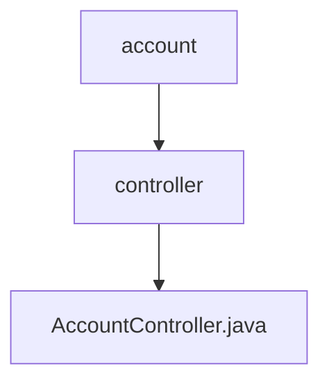

# 基础信息

|      |      |
|------|------|
| 名称 | controller |
| 编码语言 | .java |
| 代码路径 | staffjoy/account-svc/src/main/java/xyz/staffjoy/account/controller |
| 包名 | staffjoy.docs.account-svc.src.main.java.xyz.staffjoy.account.controller |
| 概述说明 | 账户管理API，提供创建、查询、更新、密码重置等功能，支持多种授权角色。 |

# 说明

AccountController是一个基于Spring框架的REST控制器，负责处理账户相关操作。它包含多个端点，支持创建、查询、更新账户信息，以及密码管理和事件跟踪等功能。所有端点都通过@Authorize注解进行权限控制，仅允许特定服务或用户访问。主要功能包括：通过电话或邮箱获取或创建账户、创建新账户、查询账户列表、更新账户信息、修改密码、验证密码、请求密码重置、请求邮箱变更、变更邮箱、跟踪事件和同步用户数据。控制器还包含两个私有方法，用于验证当前用户权限和环境配置。所有请求和响应都经过验证，确保数据有效性。

### 包内部结构视图

该流程图展示了account模块下的controller目录结构，其中controller目录包含AccountController.java文件。这是一个典型的两层级Java项目结构，顶层为account模块，第二层为controller包，最底层是具体的控制器实现文件。结构清晰体现了MVC模式中控制器的组织方式。

# 文件列表 File List

| 名称   | 类型  | 说明 |
|-------|------|-------------|
| [AccountController.java](AccountController.md) | file | 账户管理API，提供创建、查询、更新、密码重置等功能，支持多种授权角色。 |

