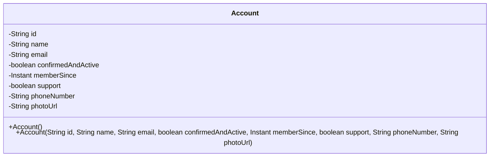
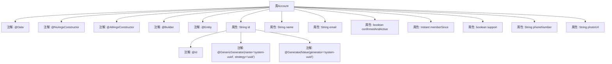

# 基础信息

|      |      |
|------|------|
| 名称 | Account |
| 编码语言 | .java |
| 代码路径 | staffjoy/account-svc/src/main/java/xyz/staffjoy/account/model/Account.java |
| 包名 | xyz.staffjoy.account.model |
| 依赖项 | ['lombok.AllArgsConstructor', 'lombok.Builder', 'lombok.Data', 'lombok.NoArgsConstructor', 'org.hibernate.annotations.GenericGenerator', 'javax.persistence.Entity', 'javax.persistence.GeneratedValue', 'javax.persistence.Id', 'java.time.Instant'] |
| 概述说明 | Account实体类，包含ID、名称、邮箱、状态、注册时间、支持标识、电话和照片URL。 |

# 说明

这是一个名为Account的Java类，使用Lombok注解简化代码，包含无参构造器、全参构造器和建造者模式。类标记为JPA实体，使用UUID作为主键生成策略。属性包括字符串类型的id、name、email、phoneNumber和photoUrl，布尔类型的confirmedAndActive和support，以及Instant类型的memberSince。

# 类列表 Class Summary

| 名称   | 类型  | 说明 |
|-------|------|-------------|
| Account | class | Account实体类，包含ID、姓名、邮箱、状态、注册时间、支持标识、电话和照片URL字段。 |

## 类 Account

|      |      |
|------|------|
| 访问范围 | @Data;@NoArgsConstructor;@AllArgsConstructor;@Builder;@Entity;public |
| 类型 | class |
| 名称 | Account |
| 说明 | Account实体类，包含ID、姓名、邮箱、状态、注册时间、支持标识、电话和照片URL字段。 |

### UML类图

该代码定义了一个名为Account的实体类，使用Lombok注解简化了构造方法和getter/setter生成。类中包含8个私有字段，包括主键id（使用UUID策略自动生成）、用户基本信息（name、email、phoneNumber）、状态标志（confirmedAndActive、support）、注册时间memberSince以及头像URL photoUrl。通过@Builder支持建造者模式，@Entity表明这是一个JPA持久化实体，整体设计用于管理系统中的用户账户信息。

### 内部方法调用关系图

该流程图展示了Account类的完整结构，包括类级别的Lombok注解（如@Data生成getter/setter）、JPA实体注解（@Entity）和字段级配置。特别突出了id字段的UUID生成策略，通过@GenericGenerator和@GeneratedValue实现自动ID生成。其他属性如name、email等基本字段和布尔标志位也清晰呈现，完整描述了该JPA实体的数据结构和元数据配置。

### 字段列表 Field List

| 名称  | 类型  | 说明 |
|-------|-------|------|
| confirmedAndActive | boolean | 私有布尔型变量，表示确认并激活状态。 |
| name | String | 私有字符串变量name |
| email | String | 私有字符串类型变量email |
| memberSince | Instant | 私有成员变量，记录加入时间。 |
| id | String | 使用UUID策略生成系统唯一ID。 |
| support | boolean | 私有布尔类型变量support |
| phoneNumber | String | 私有电话号码变量。 |
| photoUrl | String | 私有字符串变量photoUrl，存储照片链接。 |

### 方法列表 Method List

| 名称  | 类型  | 说明 |
|-------|-------|------|

