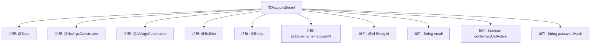

# 基础信息

|      |      |
|------|------|
| 名称 | AccountSecret |
| 编码语言 | .java |
| 代码路径 | staffjoy/account-svc/src/main/java/xyz/staffjoy/account/model/AccountSecret.java |
| 包名 | xyz.staffjoy.account.model |
| 依赖项 | ['lombok.AllArgsConstructor', 'lombok.Builder', 'lombok.Data', 'lombok.NoArgsConstructor', 'javax.persistence.Entity', 'javax.persistence.Id', 'javax.persistence.Table'] |
| 概述说明 | 账户实体类，包含ID、邮箱、激活状态和密码哈希字段。 |

# 说明

这是一个名为AccountSecret的Java类，使用Lombok注解简化代码，并标记为JPA实体。类中包含五个字段：id作为主键，email存储账户邮箱，confirmedAndActive表示账户是否确认并激活，passwordHash存储密码哈希值。类使用了无参构造器、全参构造器和建造者模式，对应数据库中的account表。

# 类列表 Class Summary

| 名称   | 类型  | 说明 |
|-------|------|-------------|
| AccountSecret | class | 账户实体类，包含ID、邮箱、激活状态和密码哈希字段。 |


## 类 AccountSecret

|      |      |
|------|------|
| 访问范围 | @Data;@NoArgsConstructor;@AllArgsConstructor;@Builder;@Entity;@Table(name="account");public |
| 类型 | class |
| 名称 | AccountSecret |
| 说明 | 账户实体类，包含ID、邮箱、激活状态和密码哈希字段。 |


### UML类图

```mermaid
classDiagram
    class AccountSecret {
        -String id
        -String email
        -boolean confirmedAndActive
        -String passwordHash
        +AccountSecret()
        +AccountSecret(String id, String email, boolean confirmedAndActive, String passwordHash)
    }
    // AccountSecret类映射到数据库表"account"
    // 使用Lombok注解自动生成构造器、Builder模式等
    // 主键字段通过@Id标注
```

这段类图描述了一个名为AccountSecret的JPA实体类，对应数据库中的"account"表。该类包含四个私有字段：id（主键）、email、confirmedAndActive（布尔状态标志）和passwordHash（密码哈希值），同时通过Lombok注解自动生成了无参构造器、全参构造器以及Builder模式支持。该实体类主要用于存储账户的敏感信息，其中passwordHash字段应特别注意安全保护。


### 内部方法调用关系图



这段流程图描述了AccountSecret类的结构，它是一个使用Lombok和JPA注解的实体类。@Data注解自动生成getter/setter等方法，@NoArgsConstructor和@AllArgsConstructor分别生成无参和全参构造器，@Builder提供建造者模式支持。作为JPA实体（@Entity），它映射到数据库表"account"，包含id（主键）、email、confirmedAndActive状态和passwordHash四个字段。该设计简洁地实现了账户机密信息的ORM映射和对象操作功能。

### 字段列表 Field List

| 名称  | 类型  | 说明 |
|-------|-------|------|
| email | String | 私有字符串变量email |
| id | String | 私有字符串类型ID字段。 |
| confirmedAndActive | boolean | 私有布尔变量，表示确认激活状态。 |
| passwordHash | String | 私有密码哈希字段 |

### 方法列表 Method List

| 名称  | 类型  | 说明 |
|-------|-------|------|


