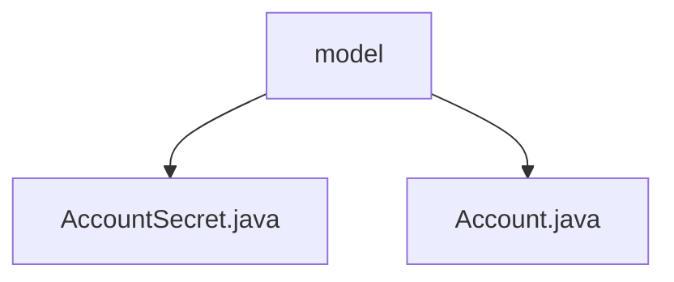

# 基础信息

|      |      |
|------|------|
| 名称 | model |
| 编码语言 | .java |
| 代码路径 | staffjoy/account-svc/src/main/java/xyz/staffjoy/account/model |
| 包名 | staffjoy.docs.account-svc.src.main.java.xyz.staffjoy.account.model |
| 概述说明 | AccountSecret类含id、email等字段，标记为JPA实体。Account类使用UUID主键，含name、email等属性，支持建造者模式。 |

# 说明

## 概述  
该代码模块属于账户服务（Account Service），主要包含两个核心实体类：`Account` 和 `AccountSecret`。这两个类均使用JPA（Java Persistence API）进行数据库映射，并通过Lombok注解简化代码，支持无参构造器、全参构造器和建造者模式。  

1. **`Account`类**  
   - 表示用户账户的基本信息，使用UUID作为主键生成策略。  
   - 包含字段：`id`（主键）、`name`（用户名）、`email`（邮箱）、`phoneNumber`（电话号码）、`photoUrl`（头像URL）、`confirmedAndActive`（账户是否确认并激活）、`support`（是否支持人员）、`memberSince`（注册时间）。  

2. **`AccountSecret`类**  
   - 专门存储账户的敏感信息（如密码哈希），与`Account`类关联。  
   - 包含字段：`id`（主键）、`email`（账户邮箱）、`confirmedAndActive`（账户状态）、`passwordHash`（密码哈希值）。  
   - 对应数据库中的`account`表。  

## 主要业务场景  
1. **账户管理**  
   - 创建、更新和查询用户账户信息（如用户名、邮箱、电话号码等）。  
   - 管理账户状态（如激活、禁用）。  

2. **账户安全**  
   - 存储和验证密码哈希值（通过`AccountSecret`类）。  
   - 确保敏感信息（如密码）与其他账户信息分离存储。  

3. **权限控制**  
   - 通过`support`字段区分普通用户和支持人员，实现基于角色的访问控制。  

4. **注册与激活**  
   - 记录用户注册时间（`memberSince`），并通过`confirmedAndActive`字段跟踪账户激活状态。  

该模块为账户服务的核心数据模型，支撑用户认证、权限管理和账户信息维护等功能。

### 包内部结构视图

该流程图展示了account-svc项目中model目录下的文件结构。顶层节点为model文件夹，包含两个Java类文件：AccountSecret.java和Account.java。这两个文件都直接隶属于model目录，没有更深层次的嵌套关系，形成了简单的两层树形结构。

# 文件列表 File List

| 名称   | 类型  | 说明 |
|-------|------|-------------|
| [Account.java](Account.md) | file | Account实体类，包含ID、名称、邮箱、状态、注册时间、支持标识、电话和照片URL。 |
| [AccountSecret.java](AccountSecret.md) | file | 账户实体类，包含ID、邮箱、激活状态和密码哈希字段。 |

