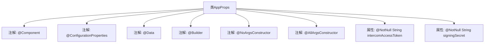

# 基础信息

|      |      |
|------|------|
| 名称 | AppProps |
| 编码语言 | .java |
| 代码路径 | staffjoy/account-svc/src/main/java/xyz/staffjoy/account/props/AppProps.java |
| 包名 | xyz.staffjoy.account.props |
| 依赖项 | ['lombok.AllArgsConstructor', 'lombok.Builder', 'lombok.Data', 'lombok.NoArgsConstructor', 'org.springframework.boot.context.properties.ConfigurationProperties', 'org.springframework.stereotype.Component', 'javax.validation.constraints.NotNull'] |
| 概述说明 | Java配置类AppProps，含intercomAccessToken和signingSecret字段，使用Lombok注解简化代码。 |

# 说明

这是一个名为AppProps的Java类，使用了Lombok注解简化代码，包含两个非空字符串属性：intercomAccessToken和signingSecret。类上标注了@ConfigurationProperties注解，前缀为staffjoy，表明这是一个配置属性类，用于绑定外部配置。同时使用了@Builder、@NoArgsConstructor和@AllArgsConstructor注解，提供了建造者模式和完整构造函数支持。

# 类列表 Class Summary

| 名称   | 类型  | 说明 |
|-------|------|-------------|
| AppProps | class | Java配置类AppProps，含intercomAccessToken和signingSecret字段，使用Lombok注解简化代码。 |


## 类 AppProps

|      |      |
|------|------|
| 访问范围 | @Component;@ConfigurationProperties(prefix="staffjoy");@Data;@Builder;@NoArgsConstructor;@AllArgsConstructor;public |
| 类型 | class |
| 名称 | AppProps |
| 说明 | Java配置类AppProps，含intercomAccessToken和signingSecret字段，使用Lombok注解简化代码。 |


### UML类图

```mermaid
classDiagram
    class AppProps {
        -@NotNull String intercomAccessToken
        -@NotNull String signingSecret
        +AppProps()
        +AppProps(String intercomAccessToken, String signingSecret)
        +String getIntercomAccessToken()
        +void setIntercomAccessToken(String intercomAccessToken)
        +String getSigningSecret()
        +void setSigningSecret(String signingSecret)
    }
    // 类标注了@Component表示这是一个Spring组件
    // @ConfigurationProperties表示绑定配置文件前缀为staffjoy的属性
    // @Data/@Builder/@NoArgsConstructor/@AllArgsConstructor是Lombok注解
```

这段代码展示了一个Spring Boot配置属性类AppProps，使用Lombok简化了getter/setter和构造函数的编写。该类通过@ConfigurationProperties绑定配置文件前缀为"staffjoy"的属性，包含两个非空字段intercomAccessToken和signingSecret。作为@Component，它可以被Spring容器管理并注入到其他组件中，主要用于集中管理应用配置参数，确保配置值的类型安全和验证。


### 内部方法调用关系图



这段代码定义了一个名为AppProps的Spring配置类，使用了Lombok和Spring Boot的注解来简化开发。该类包含两个非空字符串属性intercomAccessToken和signingSecret，分别用于存储Intercom访问令牌和签名密钥。通过@ConfigurationProperties注解绑定staffjoy前缀的配置，同时利用Lombok的@Data、@Builder等注解自动生成getter/setter、构造方法等样板代码，使得配置管理更加简洁高效。

### 字段列表 Field List

| 名称  | 类型  | 说明 |
|-------|-------|------|
| signingSecret | String | 非空字符串签名密钥 |
| intercomAccessToken | String | 非空字符串intercomAccessToken |

### 方法列表 Method List

| 名称  | 类型  | 说明 |
|-------|-------|------|


