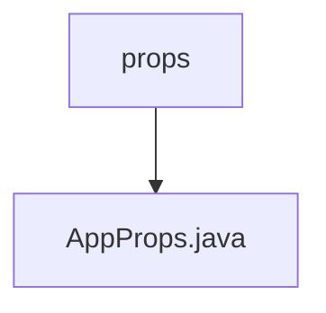

# 基础信息

|      |      |
|------|------|
| 名称 | props |
| 编码语言 | .java |
| 代码路径 | staffjoy/account-svc/src/main/java/xyz/staffjoy/account/props |
| 包名 | staffjoy.docs.account-svc.src.main.java.xyz.staffjoy.account.props |
| 概述说明 | Java配置类AppProps，含intercomAccessToken和signingSecret字段，使用Lombok注解简化代码。 |

# 说明

这是一个名为AppProps的Java类，使用了Lombok注解简化代码，包含两个非空字符串属性：intercomAccessToken和signingSecret。类上标注了@ConfigurationProperties注解，前缀为staffjoy，表明这是一个配置属性类，用于绑定外部配置。同时使用了@Builder、@NoArgsConstructor和@AllArgsConstructor注解，提供了建造者模式和完整构造函数支持。

### 包内部结构视图

该流程图展示了account-svc项目中props目录与AppProps.java文件的层级关系。props作为父目录包含唯一的子节点AppProps.java，这是一个典型的Java配置文件结构，用于存储应用程序的配置属性。这种单层结构表明该目录可能专门用于存放应用程序的配置相关文件。

# 文件列表 File List

| 名称   | 类型  | 说明 |
|-------|------|-------------|
| [AppProps.java](AppProps.md) | file | Java配置类AppProps，含intercomAccessToken和signingSecret字段，使用Lombok注解简化代码。 |

