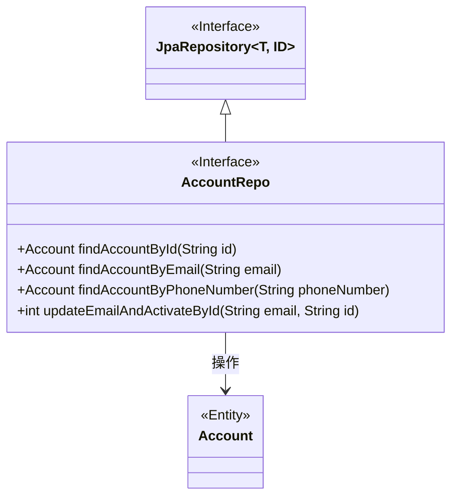
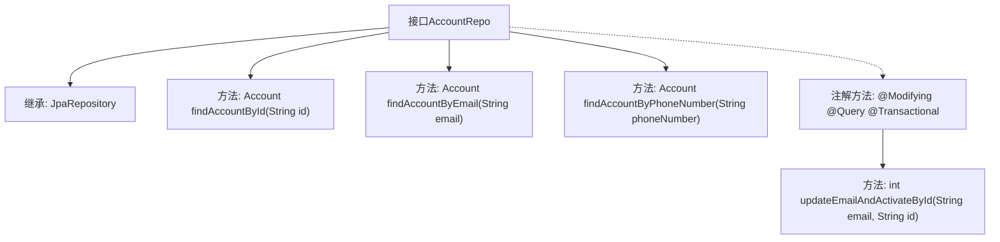

# 基础信息

|      |      |
|------|------|
| 名称 | AccountRepo |
| 编码语言 | .java |
| 代码路径 | staffjoy/account-svc/src/main/java/xyz/staffjoy/account/repo/AccountRepo.java |
| 包名 | xyz.staffjoy.account.repo |
| 依赖项 | ['org.springframework.data.jpa.repository.JpaRepository', 'org.springframework.data.jpa.repository.Modifying', 'org.springframework.data.jpa.repository.Query', 'org.springframework.data.repository.query.Param', 'org.springframework.stereotype.Repository', 'org.springframework.transaction.annotation.Transactional', 'xyz.staffjoy.account.model.Account'] |
| 概述说明 | 账户仓库接口，含ID、邮箱、手机号查询及更新邮箱激活方法。 |

# 说明

这是一个名为AccountRepo的Spring Data JPA仓库接口，继承自JpaRepository，用于管理Account实体类，主键类型为String。接口定义了四个方法：通过id、email或电话号码查询单个账户，以及一个更新操作。更新方法会修改指定id账户的email字段并激活账户，使用了@Modifying注解自动清除缓存，@Query注解定义JPQL更新语句，@Transactional确保事务性，@Param绑定参数。

# 类列表 Class Summary

| 名称   | 类型  | 说明 |
|-------|------|-------------|
| AccountRepo | interface | 账户仓库接口，含ID、邮箱、手机号查询及更新邮箱并激活功能。 |

## 类 AccountRepo

|      |      |
|------|------|
| 访问范围 | @Repository;public |
| 类型 | interface |
| 名称 | AccountRepo |
| 说明 | 账户仓库接口，含ID、邮箱、手机号查询及更新邮箱并激活功能。 |

### UML类图

这段代码展示了一个Spring Data JPA仓库接口AccountRepo，它继承自JpaRepository并提供了对Account实体的数据访问操作。该接口包含四个方法：三个查询方法（通过ID、邮箱和电话号码查找账户）和一个更新方法（更新邮箱并激活账户）。类图清晰地展示了AccountRepo作为JpaRepository的子接口，以及它与Account实体类之间的关系。该设计遵循了Spring Data JPA的规范，通过方法命名约定和@Query注解实现了复杂查询操作。

### 内部方法调用关系图

该流程图展示了AccountRepo接口的结构和功能。作为Spring Data JPA仓库接口，它继承了JpaRepository提供的基础CRUD操作，并定义了三个查询方法：通过ID、邮箱和电话号码查找账户。特别值得注意的是带有@Modifying注解的updateEmailAndActivateById方法，该方法执行JPQL更新操作，同时修改邮箱和激活状态，且具有事务性和自动清除缓存特性。所有方法都遵循Spring Data JPA的命名约定，实现了声明式数据库操作。

### 字段列表 Field List

| 名称  | 类型  | 说明 |
|-------|-------|------|

### 方法列表 Method List

| 名称  | 类型  | 说明 |
|-------|-------|------|
| findAccountByEmail | Account | 通过邮箱查找账户 |
| findAccountById | Account | 通过ID查找账户。 |
| findAccountByPhoneNumber | Account | 通过手机号查找账户信息。 |
| updateEmailAndActivateById | int | 更新账户邮箱并激活，根据ID和邮箱参数。 |

