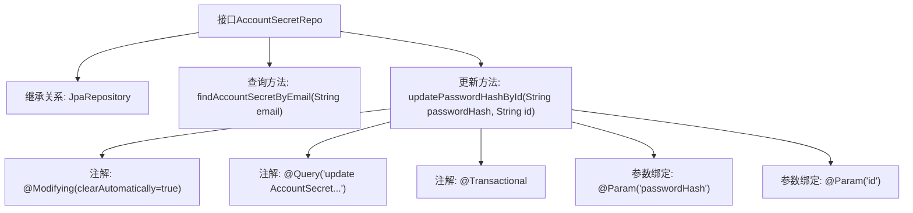

# 基础信息

|      |      |
|------|------|
| 名称 | AccountSecretRepo |
| 编码语言 | .java |
| 代码路径 | staffjoy/account-svc/src/main/java/xyz/staffjoy/account/repo/AccountSecretRepo.java |
| 包名 | xyz.staffjoy.account.repo |
| 依赖项 | ['org.springframework.data.jpa.repository.JpaRepository', 'org.springframework.data.jpa.repository.Modifying', 'org.springframework.data.jpa.repository.Query', 'org.springframework.data.repository.query.Param', 'org.springframework.stereotype.Repository', 'org.springframework.transaction.annotation.Transactional', 'xyz.staffjoy.account.model.AccountSecret'] |
| 概述说明 | 账户密码仓库接口，含按邮箱查询和按ID更新密码功能。 |

# 说明

这是一个名为AccountSecretRepo的Spring Data JPA仓库接口，继承自JpaRepository，用于管理AccountSecret实体。接口定义了两个操作：通过邮箱查找账户密码信息的findAccountSecretByEmail方法，以及通过ID更新密码哈希值的updatePasswordHashById方法。更新操作使用了@Modifying和@Transactional注解确保事务性，并自动清除持久化上下文。

# 类列表 Class Summary

| 名称   | 类型  | 说明 |
|-------|------|-------------|
| AccountSecretRepo | interface | 账户密码仓库接口，含按邮箱查询和按ID更新密码方法。 |


## 类 AccountSecretRepo

|      |      |
|------|------|
| 访问范围 | @Repository;public |
| 类型 | interface |
| 名称 | AccountSecretRepo |
| 说明 | 账户密码仓库接口，含按邮箱查询和按ID更新密码方法。 |


### UML类图

```mermaid
classDiagram
    class AccountSecretRepo {
        <<Interface>>
        +findAccountSecretByEmail(String email) AccountSecret
        +updatePasswordHashById(String passwordHash, String id) int
    }
    class JpaRepository~T,ID~ {
        <<Interface>>
    }
    AccountSecretRepo --|> JpaRepository : 继承
    // AccountSecretRepo接口扩展了JpaRepository，提供按email查询和按id更新密码哈希的功能
```

这段类图展示了AccountSecretRepo接口的结构及其与JpaRepository的继承关系。AccountSecretRepo作为Spring Data JPA仓库接口，提供了两个核心方法：通过电子邮件查找账户密码记录（findAccountSecretByEmail）和根据ID更新密码哈希值（updatePasswordHashById）。后者使用@Modifying和@Query注解实现自定义更新操作，并具有事务特性。接口继承了JpaRepository的标准CRUD操作方法，泛型参数指定了实体类型AccountSecret和主键类型String。整个设计体现了Spring Data JPA的规范化和便捷性特点。


### 内部方法调用关系图



这段代码定义了一个Spring Data JPA仓库接口AccountSecretRepo，主要用于账户密码信息的持久化操作。流程图展示了该接口继承JpaRepository的基础功能，包含两个核心方法：通过邮箱查询账户密码记录的查询方法，以及通过ID更新密码哈希的修改方法。更新方法使用了@Modifying和@Transactional注解确保操作的事务性，并通过@Query定义了自定义JPQL更新语句，同时使用@Param进行参数绑定。整个设计体现了Spring Data JPA的声明式Repository模式特点。

### 字段列表 Field List

| 名称  | 类型  | 说明 |
|-------|-------|------|

### 方法列表 Method List

| 名称  | 类型  | 说明 |
|-------|-------|------|
| findAccountSecretByEmail | AccountSecret | 通过邮箱查找账户密钥信息 |
| updatePasswordHashById | int | 更新账户密码哈希值，根据ID修改指定记录。 |


