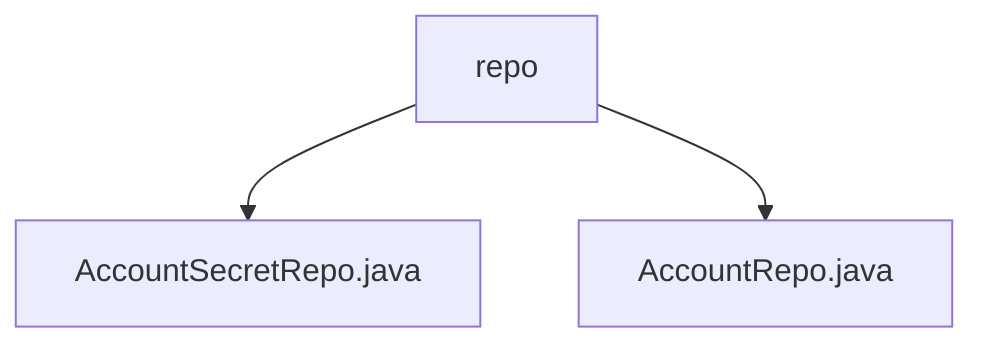

# 基础信息

|      |      |
|------|------|
| 名称 | repo |
| 编码语言 | .java |
| 代码路径 | staffjoy/account-svc/src/main/java/xyz/staffjoy/account/repo |
| 包名 | staffjoy.docs.account-svc.src.main.java.xyz.staffjoy.account.repo |
| 概述说明 | AccountSecretRepo管理密码，含邮箱查询和ID更新密码方法。AccountRepo管理账户，含ID、邮箱、电话查询及更新方法。 |

# 说明

# 账户服务数据访问层模块总结

## 概述

该模块是账户服务的核心数据访问层组件，基于Spring Data JPA实现，主要包含两个仓库接口：
1. `AccountSecretRepo` - 负责账户敏感信息(如密码哈希)的存储与查询
2. `AccountRepo` - 负责基础账户信息的CRUD操作

两个仓库接口都继承自Spring Data JPA的`JpaRepository`，提供了标准JPA操作和自定义查询方法，并使用了事务管理、查询优化等特性。

## 主要业务场景

1. **账户认证相关操作**：
   - 通过邮箱查询账户密码哈希(`findAccountSecretByEmail`)
   - 更新指定账户的密码(`updatePasswordHashById`)

2. **账户基本信息管理**：
   - 通过ID、邮箱或电话号码查询单个账户信息
   - 更新账户邮箱并激活账户状态(复合更新操作)

3. **事务性保证**：
   - 所有更新操作都使用`@Modifying`和`@Transactional`注解
   - 自动清除持久化上下文保证数据一致性

4. **多种查询方式支持**：
   - 方法命名约定查询(如`findById`)
   - 自定义JPQL查询(`@Query`注解)
   - 参数绑定(`@Param`注解)

### 包内部结构视图

该流程图展示了account-svc项目中repo目录下的两个Java文件：AccountSecretRepo.java和AccountRepo.java。这两个文件都直接位于repo目录下，属于同级关系。AccountSecretRepo.java可能包含账户密钥相关的数据访问逻辑，而AccountRepo.java则处理普通账户信息的数据操作。这种结构是典型的数据访问层设计，符合领域驱动设计中的仓储模式。

# 文件列表 File List

| 名称   | 类型  | 说明 |
|-------|------|-------------|
| [AccountRepo.java](AccountRepo.md) | file | 账户仓库接口，含ID、邮箱、手机号查询及更新邮箱激活方法。 |
| [AccountSecretRepo.java](AccountSecretRepo.md) | file | 账户密码仓库接口，含按邮箱查询和按ID更新密码功能。 |

