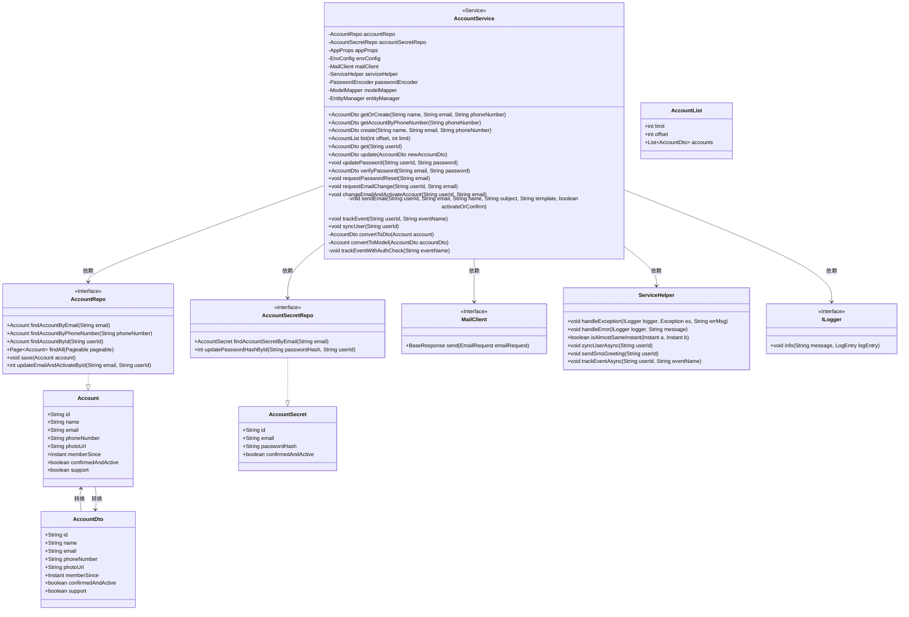

# 基础信息

|      |      |
|------|------|
| 名称 | AccountService |
| 编码语言 | .java |
| 代码路径 | staffjoy/account-svc/src/main/java/xyz/staffjoy/account/service/AccountService.java |
| 包名 | xyz.staffjoy.account.service |
| 依赖项 | ['com.github.structlog4j.ILogger', 'com.github.structlog4j.SLoggerFactory', 'lombok.RequiredArgsConstructor', 'org.modelmapper.ModelMapper', 'org.springframework.data.domain.Page', 'org.springframework.data.domain.PageRequest', 'org.springframework.data.domain.Pageable', 'org.springframework.security.crypto.password.PasswordEncoder', 'org.springframework.stereotype.Service', 'org.springframework.util.StringUtils', 'xyz.staffjoy.account.AccountConstant', 'xyz.staffjoy.account.dto.AccountDto', 'xyz.staffjoy.account.model.Account', 'xyz.staffjoy.account.model.AccountSecret', 'xyz.staffjoy.account.props.AppProps', 'xyz.staffjoy.account.dto.AccountList', 'xyz.staffjoy.account.repo.AccountRepo', 'xyz.staffjoy.account.repo.AccountSecretRepo', 'xyz.staffjoy.account.service.helper.ServiceHelper', 'xyz.staffjoy.common.api.BaseResponse', 'xyz.staffjoy.common.api.ResultCode', 'xyz.staffjoy.common.auditlog.LogEntry', 'xyz.staffjoy.common.auth.AuthConstant', 'xyz.staffjoy.common.auth.AuthContext', 'xyz.staffjoy.common.crypto.Sign', 'xyz.staffjoy.common.env.EnvConfig', 'xyz.staffjoy.common.error.ServiceException', 'xyz.staffjoy.common.utils.Helper', 'xyz.staffjoy.mail.client.MailClient', 'xyz.staffjoy.mail.dto.EmailRequest', 'javax.persistence.EntityManager', 'javax.persistence.PersistenceContext', 'java.net.URI', 'java.net.URISyntaxException', 'java.time.Instant', 'java.time.temporal.ChronoUnit', 'java.util.List', 'java.util.stream.Collectors.toList'] |
| 概述说明 | AccountService提供用户账户管理功能，包括创建、查询、更新、密码重置和邮件验证等操作。 |

# 说明

AccountService是一个Spring服务类，负责处理用户账户相关操作。它依赖多个组件如AccountRepo、MailClient和PasswordEncoder等。主要功能包括：通过邮箱或手机号查找或创建账户（getOrCreate）、获取账户信息（getAccountByPhoneNumber、get）、创建账户（create）、更新账户信息（update）、密码管理（updatePassword、verifyPassword、requestPasswordReset）、邮箱验证（requestEmailChange、changeEmailAndActivateAccount）以及发送验证邮件（sendEmail）。所有操作均包含权限检查、数据验证和审计日志记录，确保安全性和可追溯性。

# 类列表 Class Summary

| 名称   | 类型  | 说明 |
|-------|------|-------------|
| AccountService | class | AccountService提供用户账户管理功能，包括创建、查询、更新、密码重置和邮件验证等操作。 |

## 类 AccountService

|      |      |
|------|------|
| 访问范围 | @Service;@RequiredArgsConstructor;public |
| 类型 | class |
| 名称 | AccountService |
| 说明 | AccountService提供用户账户管理功能，包括创建、查询、更新、密码重置和邮件验证等操作。 |

### UML类图

这段类图展示了AccountService的核心结构和依赖关系。AccountService是一个Spring服务类，负责处理用户账户相关的业务逻辑，包括账户创建、查询、更新、密码管理等功能。它依赖多个仓储接口(AccountRepo、AccountSecretRepo)进行数据持久化，通过MailClient发送邮件，使用ServiceHelper处理通用逻辑。类图中清晰地展示了实体类(Account、AccountSecret)与DTO(AccountDto)之间的转换关系，以及服务类与各组件之间的协作方式。整个设计体现了分层架构思想，服务层负责协调领域对象和基础设施层的交互。

### 内部方法调用关系图

```mermaid
graph TD
    A["类AccountService"]
    B["属性: AccountRepo accountRepo"]
    C["属性: AccountSecretRepo accountSecretRepo"]
    D["属性: AppProps appProps"]
    E["属性: EnvConfig envConfig"]
    F["属性: MailClient mailClient"]
    G["属性: ServiceHelper serviceHelper"]
    H["属性: PasswordEncoder passwordEncoder"]
    I["属性: ModelMapper modelMapper"]
    J["属性: EntityManager entityManager"]
    K["方法: getOrCreate"]
    L["方法: getAccountByPhoneNumber"]
    M["方法: create"]
    N["方法: list"]
    O["方法: get"]
    P["方法: update"]
    Q["方法: updatePassword"]
    R["方法: verifyPassword"]
    S["方法: requestPasswordReset"]
    T["方法: requestEmailChange"]
    U["方法: changeEmailAndActivateAccount"]
    V["方法: sendEmail"]
    W["方法: trackEvent"]
    X["方法: syncUser"]
    Y["方法: convertToDto"]
    Z["方法: convertToModel"]
    AA["方法: trackEventWithAuthCheck"]

    A --> B
    A --> C
    A --> D
    A --> E
    A --> F
    A --> G
    A --> H
    A --> I
    A --> J
    A --> K
    A --> L
    A --> M
    A --> N
    A --> O
    A --> P
    A --> Q
    A --> R
    A --> S
    A --> T
    A --> U
    A --> V
    A --> W
    A --> X
    A --> Y
    A --> Z
    A --> AA
```

这段代码定义了一个AccountService类，它是一个Spring服务类，负责处理与用户账户相关的各种操作。该类包含多个属性，如AccountRepo、AccountSecretRepo等，用于数据访问和辅助功能。主要方法包括getOrCreate（获取或创建账户）、create（创建新账户）、update（更新账户信息）、verifyPassword（验证密码）等。这些方法提供了完整的账户管理功能，包括创建、查询、更新、密码管理和电子邮件验证等。服务类还集成了日志记录、异常处理和异步操作等功能，确保账户管理的安全性和可靠性。

### 字段列表 Field List

| 名称  | 类型  | 说明 |
|-------|-------|------|
| envConfig | EnvConfig | 私有环境配置对象 |
| modelMapper | ModelMapper | 私有ModelMapper实例。 |
| logger = SLoggerFactory.getLogger(AccountService.class) | ILogger | 静态日志记录器实例，用于AccountService类。 |
| appProps | AppProps | 私有应用属性实例。 |
| passwordEncoder | PasswordEncoder | 私有密码编码器成员变量 |
| serviceHelper | ServiceHelper | 私有ServiceHelper实例。 |
| accountSecretRepo | AccountSecretRepo | 私有账户密钥仓库变量accountSecretRepo。 |
| accountRepo | AccountRepo | 私有账户仓库对象。 |
| entityManager | EntityManager | 注入JPA实体管理器 |
| mailClient | MailClient | 私有邮件客户端实例 |

### 方法列表 Method List

| 名称  | 类型  | 说明 |
|-------|-------|------|
| requestPasswordReset | void | 请求密码重置或激活账户，检查邮箱是否存在，发送相应邮件。 |
| syncUser | void | 异步同步用户数据，参数userId。 |
| verifyPassword | AccountDto | 验证密码并返回账户信息，处理未找到、未激活、未设置密码或密码错误情况。 |
| get | AccountDto | 根据用户ID查询账户信息，不存在则抛出异常，存在则转为DTO返回。 |
| trackEvent | void | 异步记录用户事件 |
| trackEventWithAuthCheck | void | 检查用户身份后追踪事件，无用户ID则忽略。 |
| updatePassword | void | 更新用户密码并记录日志，失败时抛出异常。 |
| create | AccountDto | 创建账户方法：检查邮箱和手机号是否已存在，处理空值，生成头像和注册时间，保存账户并发送激活邮件，记录日志后返回账户DTO。 |
| changeEmailAndActivateAccount | void | 方法更新用户邮箱并激活账户，检查影响行数，异步同步用户数据，记录审计日志和事件。 |
| getAccountByPhoneNumber | AccountDto | 通过手机号查询账户，不存在则抛出异常，存在则转为DTO返回。 |
| convertToModel | Account | 私有方法将AccountDto转换为Account类。 |
| list | AccountList | 分页查询账户列表，默认每页10条，返回DTO列表及分页信息。 |
| requestEmailChange | void | 请求修改用户邮箱，验证用户存在后发送确认邮件。 |
| sendEmail | void | 生成邮件链接并发送，处理激活或重置请求，捕获异常。 |
| update | AccountDto | 更新账户信息，验证数据唯一性，处理异常，记录日志并返回结果。 |
| convertToDto | AccountDto | 私有方法将Account对象转换为AccountDto对象。 |
| getOrCreate | AccountDto | 获取或创建账户：先查邮箱或手机号是否存在，存在则返回，否则新建。 |

