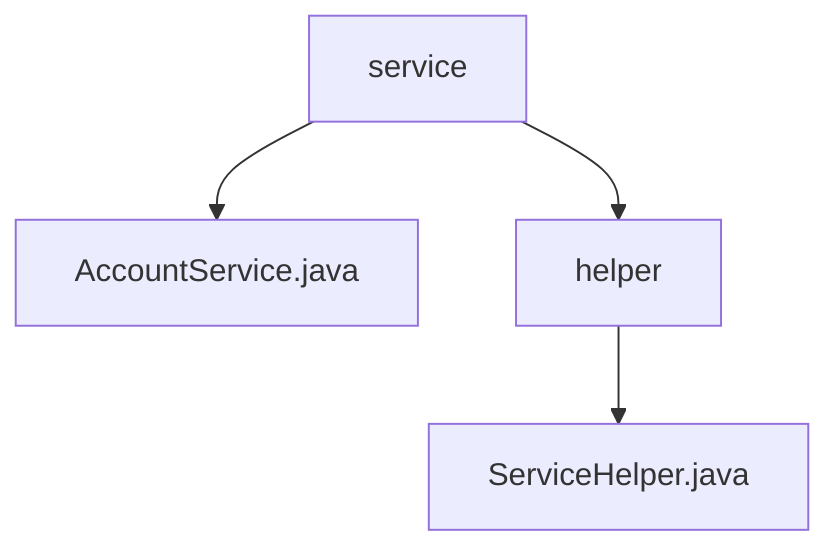

# 基础信息

|      |      |
|------|------|
| 名称 | service |
| 编码语言 | .java |
| 代码路径 | staffjoy/account-svc/src/main/java/xyz/staffjoy/account/service |
| 包名 | staffjoy.docs.account-svc.src.main.java.xyz.staffjoy.account.service |
| 概述说明 | AccountService处理用户账户操作，依赖多组件，功能全面。ServiceHelper负责数据同步和事件跟踪。 |

# 说明

## 概述  
该代码模块是一个基于Spring框架的用户账户管理服务，主要提供账户相关的核心业务功能及辅助操作。模块包含两个核心类：  
1. **AccountService**：作为主服务类，负责处理用户账户的CRUD操作、密码管理、邮箱验证等核心功能，并集成权限检查、数据验证和审计日志记录。  
2. **ServiceHelper**：作为辅助组件，专注于用户数据的外部同步（如Intercom平台）、事件跟踪、短信通知等非核心但必要的业务逻辑，支持异步执行和调试模式适配。  

模块通过依赖注入（如`AccountRepo`、`MailClient`、`CompanyClient`等）实现松耦合，同时结合Sentry错误监控和SMS服务，确保系统的可靠性和可扩展性。  

## 主要业务场景  
1. **账户生命周期管理**  
   - 创建/查询账户：支持通过邮箱或手机号查找或自动创建账户（`getOrCreate`），提供基础信息获取（`getAccountByPhoneNumber`）。  
   - 信息更新：更新账户资料（`update`）、修改密码（`updatePassword`）及验证密码（`verifyPassword`）。  
   - 安全操作：密码重置请求（`requestPasswordReset`）、邮箱变更与激活（`changeEmailAndActivateAccount`）。  

2. **安全与审计**  
   - 所有操作均内置权限检查，防止未授权访问。  
   - 关键操作（如密码修改、邮箱变更）触发审计日志记录，确保操作可追溯。  

3. **外部集成与通信**  
   - **数据同步**：将用户信息（包括公司关联数据）异步同步至Intercom平台（`syncUserAsync`），支持生产环境差异化处理。  
   - **事件跟踪**：通过`trackEventAsync`记录用户行为事件，用于分析和监控。  
   - **消息通知**：发送验证邮件（`sendEmail`）或短信问候（`sendSmsGreeting`），增强用户交互。  

4. **调试与错误处理**  
   - 调试模式下跳过外部服务调用（如Intercom同步），提升开发效率。  
   - 通过Sentry集中上报运行时异常，辅助问题排查。

### 包内部结构视图

该流程图展示了account-svc项目中service模块的层级结构。顶层是service目录，包含AccountService.java文件和helper子目录。helper子目录下又包含ServiceHelper.java文件。这是一个典型的三层Java服务项目结构，体现了服务层与辅助工具类的组织方式，总节点数严格匹配输入路径数量。

# 文件列表 File List

| 名称   | 类型  | 说明 |
|-------|------|-------------|
| [AccountService.java](AccountService.md) | file | AccountService提供用户账户管理功能，包括创建、查询、更新、密码重置和邮件验证等操作。 |
| [helper](helper/_module.md) | package | ServiceHelper类包含用户同步、事件跟踪和短信问候功能，处理异常和错误。 |

