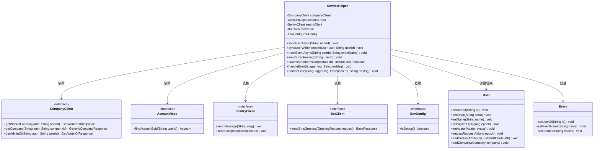

# 基础信息

|      |      |
|------|------|
| 名称 | ServiceHelper |
| 编码语言 | .java |
| 代码路径 | staffjoy/account-svc/src/main/java/xyz/staffjoy/account/service/helper/ServiceHelper.java |
| 包名 | xyz.staffjoy.account.service.helper |
| 依赖项 | ['com.github.structlog4j.ILogger', 'com.github.structlog4j.SLoggerFactory', 'com.google.common.collect.Maps', 'io.intercom.api.Avatar', 'io.intercom.api.CustomAttribute', 'io.intercom.api.Event', 'io.intercom.api.User', 'io.sentry.SentryClient', 'lombok.RequiredArgsConstructor', 'org.springframework.scheduling.annotation.Async', 'org.springframework.stereotype.Component', 'org.springframework.util.StringUtils', 'xyz.staffjoy.account.config.AppConfig', 'xyz.staffjoy.account.model.Account', 'xyz.staffjoy.account.repo.AccountRepo', 'xyz.staffjoy.bot.client.BotClient', 'xyz.staffjoy.bot.dto.GreetingRequest', 'xyz.staffjoy.common.api.BaseResponse', 'xyz.staffjoy.common.api.ResultCode', 'xyz.staffjoy.common.auth.AuthConstant', 'xyz.staffjoy.common.env.EnvConfig', 'xyz.staffjoy.common.error.ServiceException', 'xyz.staffjoy.company.client.CompanyClient', 'xyz.staffjoy.company.dto', 'java.time.Instant', 'java.util.HashMap', 'java.util.Map', 'java.util.concurrent.TimeUnit'] |
| 概述说明 | ServiceHelper类包含用户同步、事件跟踪和短信问候功能，处理异常和错误。 |

# 说明

ServiceHelper是一个Spring组件类，主要用于用户数据同步和事件跟踪。它通过异步方法syncUserAsync将用户信息同步到Intercom平台，包括用户基本信息、所属公司（通过companyClient获取）、管理员状态等。若环境为调试模式则跳过同步。trackEventAsync方法用于跟踪用户事件。sendSmsGreeting方法发送短信问候。类中还包含异常处理、时间比较等辅助方法，并通过Sentry上报错误。所有操作均依赖注入的companyClient、accountRepo等组件，并在非调试环境下执行。

# 类列表 Class Summary

| 名称   | 类型  | 说明 |
|-------|------|-------------|
| ServiceHelper | class | ServiceHelper类提供用户同步、事件跟踪和短信问候功能，处理异常和错误日志。 |

## 类 ServiceHelper

|      |      |
|------|------|
| 访问范围 | @RequiredArgsConstructor;@Component;public |
| 类型 | class |
| 名称 | ServiceHelper |
| 说明 | ServiceHelper类提供用户同步、事件跟踪和短信问候功能，处理异常和错误日志。 |

### UML类图

这段类图展示了ServiceHelper类及其依赖关系。ServiceHelper是一个Spring组件，通过构造函数注入多个客户端接口(CompanyClient、AccountRepo等)，提供异步用户同步(syncUserAsync)、事件跟踪(trackEventAsync)和短信发送(sendSmsGreeting)等功能。它主要与用户管理系统交互，处理用户数据同步到Intercom平台的过程，包含错误处理和日志记录能力。类图清晰地呈现了ServiceHelper与各个接口的依赖关系，以及它与User、Event等数据模型的操作关系。

### 内部方法调用关系图

这段代码是ServiceHelper类的实现，主要用于处理用户同步、事件跟踪和短信问候等业务逻辑。流程图展示了类的结构，包含6个依赖注入属性和7个核心方法。时序图详细描述了syncUserAsync方法的执行流程，包括环境检查、账户验证、公司信息获取和用户数据同步等步骤，涉及多个外部服务调用和异常处理机制。该服务在非调试环境下会通过Sentry上报错误，实现了完善的日志记录和错误监控功能。

### 字段列表 Field List

| 名称  | 类型  | 说明 |
|-------|-------|------|
| envConfig | EnvConfig | 私有环境配置对象 |
| sentryClient | SentryClient | 私有SentryClient实例 |
| botClient | BotClient | 私有BotClient实例 |
| companyClient | CompanyClient | 私有公司客户对象 |
| accountRepo | AccountRepo | 私有账户仓库对象。 |
| logger = SLoggerFactory.getLogger(ServiceHelper.class) | ILogger | 静态日志记录器初始化，用于ServiceHelper类。 |

### 方法列表 Method List

| 名称  | 类型  | 说明 |
|-------|-------|------|
| isAlmostSameInstant | boolean | 比较两个时间点是否相差小于1秒。 |
| handleError | void | 处理错误：记录日志，非调试模式下发送至Sentry。 |
| handleException | void | 异常处理：记录错误日志，非调试模式下发送至Sentry。 |
| syncUserWithIntercom | void | 同步用户数据至Intercom，存在则更新，不存在则创建，异常时抛出错误。 |
| syncUserAsync | void | 异步同步用户信息至Intercom，检查账号有效性，处理公司成员及管理员关系，设置用户属性并同步。 |
| trackEventAsync | void | 异步方法trackEventAsync：调试环境跳过，否则创建带v2前缀的事件，失败抛ServiceException。 |
| sendSmsGreeting | void | 发送短信问候方法：处理用户ID，调用接口发送短信，捕获异常并处理错误响应。 |

