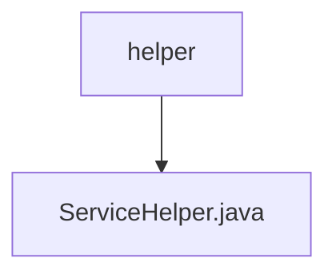

# 基础信息

|      |      |
|------|------|
| 名称 | helper |
| 编码语言 | .java |
| 代码路径 | staffjoy/account-svc/src/main/java/xyz/staffjoy/account/service/helper |
| 包名 | staffjoy.docs.account-svc.src.main.java.xyz.staffjoy.account.service.helper |
| 概述说明 | ServiceHelper类包含用户同步、事件跟踪和短信问候功能，处理异常和错误。 |

# 说明

ServiceHelper是一个Spring组件类，主要用于用户数据同步和事件跟踪。它通过异步方法syncUserAsync将用户信息同步到Intercom平台，包括用户基本信息、所属公司（通过companyClient获取）、管理员状态等。若环境为调试模式则跳过同步。trackEventAsync方法用于跟踪用户事件。sendSmsGreeting方法发送短信问候。类中还包含异常处理、时间比较等辅助方法，并通过Sentry上报错误。所有操作均依赖注入的companyClient、accountRepo等组件，并在非调试环境下执行。

### 包内部结构视图

该流程图展示了account-svc项目中service目录下的helper文件夹结构，其中包含一个ServiceHelper.java文件。helper作为父节点，ServiceHelper.java作为其子节点，清晰地呈现了简单的层级包含关系，符合给定的两条路径信息。

# 文件列表 File List

| 名称   | 类型  | 说明 |
|-------|------|-------------|
| [ServiceHelper.java](ServiceHelper.md) | file | ServiceHelper类包含用户同步、事件跟踪和短信问候功能，处理异常和错误。 |

