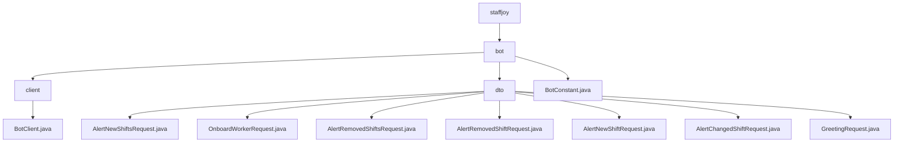

# 基础信息

|      |      |
|------|------|
| 名称 | staffjoy |
| 编码语言 | .java |
| 代码路径 | staffjoy/bot-api/src/main/java/xyz/staffjoy |
| 包名 | staffjoy.docs.bot-api.src.main.java.xyz.staffjoy |
| 概述说明 | BotClient接口用于与Bot服务通信，包含7个POST方法处理短信、入职和班次提醒等功能。DTO类简化请求数据封装，涉及班次、入职和问候场景。BotConstant类管理服务配置和消息模板。 |

# 说明

## 概述
该代码模块是`staffjoy/bot-api`模块的核心组件，主要实现与机器人服务（Bot Service）的交互功能。模块包含以下三部分核心内容：

1. **Feign客户端接口**（`BotClient`）：  
   通过Feign声明式HTTP客户端与Bot服务进行通信，配置了服务发现名称和基础路径，提供7个标准化POST方法覆盖全部业务场景。

2. **数据传输对象**（DTO包）：  
   使用Lombok注解简化代码，包含8个请求体类，分别处理班次提醒、员工入职、问候等业务场景的数据封装，所有字段均实现非空校验。

3. **配置常量类**（`BotConstant`）：  
   集中管理服务名称、消息模板代码（含3种短信模板和2种邮件模板）、时间格式、班次显示规范等全局参数，维护10天的班次提醒窗口配置。

## 主要业务场景
### 1. 员工入职流程
- **触发场景**：新员工加入公司时
- **实现方式**：
  - 通过`OnboardWorkerRequest` DTO传递公司ID和用户ID
  - 调用`BotClient.onboardWorker()`方法
  - 使用`BotConstant.ONBOARDING_SMS_*`模板代码发送入职短信
  - 可选发送`WELCOME_EMAIL`模板的欢迎邮件

### 2. 班次管理提醒
- **新增班次提醒**：
  - 单班次：`AlertNewShiftRequest` + `alertNewShift()`
  - 批量班次：`AlertNewShiftsRequest` + `alertNewShifts()`
  - 使用`NEW_SHIFT_SMS_TEMPLATE`模板
  - 按`BotConstant.SHIFT_DISPLAY_FORMAT`格式化班次信息

- **移除班次提醒**：
  - 单班次：`AlertRemovedShiftRequest` + `alertRemovedShift()`
  - 批量班次：`AlertRemovedShiftsRequest` + `alertRemovedShifts()`
  - 使用`REMOVED_SHIFT_SMS_TEMPLATE`模板

- **班次变更提醒**：
  - 通过`AlertChangedShiftRequest`传递新旧班次对比
  - 调用`alertChangedShift()`方法
  - 使用`CHANGED_SHIFT_SMS_TEMPLATE`模板

### 3. 问候消息
- 通过`GreetingRequest`指定目标用户
- 调用`sendGreeting()`方法发送基础问候
- 可扩展使用`GREETING_SMS_TEMPLATE`模板

所有通信均返回标准化`BaseResponse`，时间相关处理均遵循`BotConstant.DATETIME_FORMAT`规范，提醒功能默认覆盖未来10天内的班次（通过`DAY_ON_BOARDING_WINDOW`控制）。

### 包内部结构视图

该流程图展示了staffjoy项目中bot-api模块的Java代码结构。根节点为staffjoy，其下包含bot目录，bot目录又分为client、dto两个子目录和BotConstant.java文件。client目录包含BotClient.java实现类，dto目录则包含8个不同功能的请求数据传输对象文件，涉及班次提醒、员工入职问候等功能。整个结构清晰地反映了微服务中客户端与DTO层的典型组织方式。

# 文件列表 File List

| 名称   | 类型  | 说明 |
|-------|------|-------------|
| [bot](bot/_module.md) | package | BotClient接口用于与Bot服务通信，包含7个POST方法处理短信、入职和班次提醒等功能。DTO类简化请求数据封装，涉及班次、入职和问候场景。BotConstant类管理服务配置和消息模板。 |

