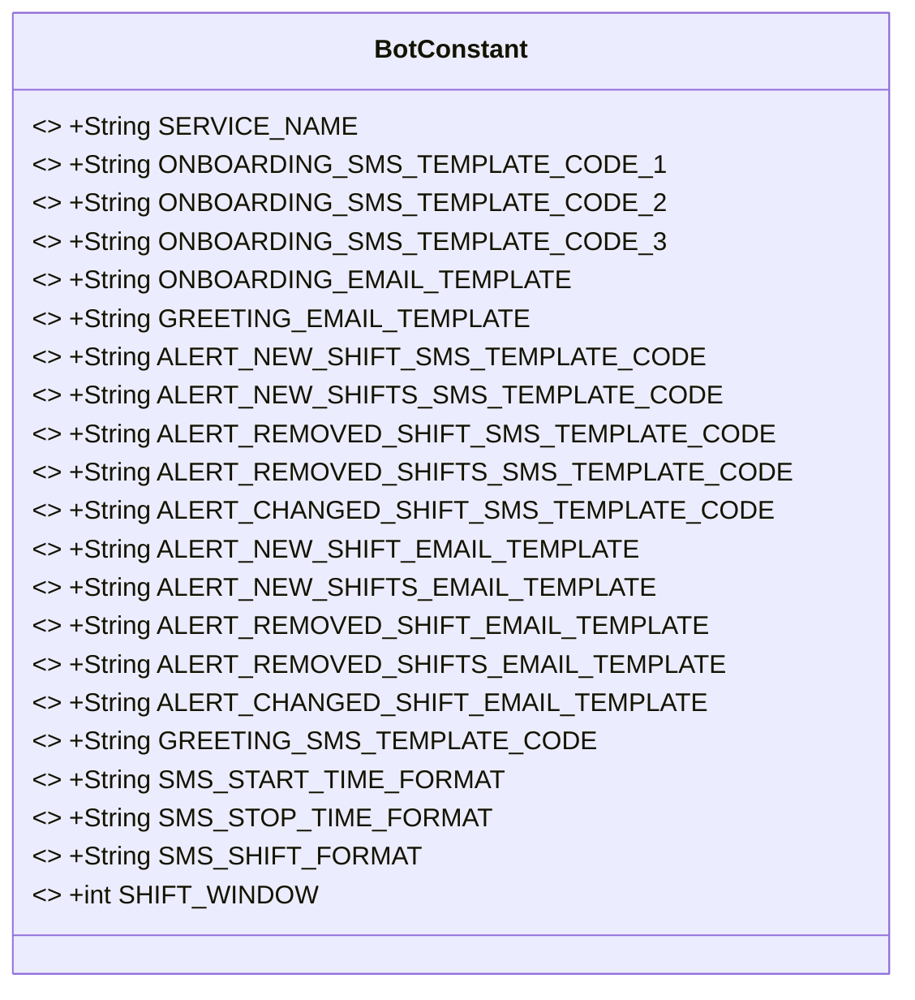

# 基础信息

|      |      |
|------|------|
| 名称 | BotConstant |
| 编码语言 | .java |
| 代码路径 | staffjoy/bot-api/src/main/java/xyz/staffjoy/bot/BotConstant.java |
| 包名 | xyz.staffjoy.bot |
| 依赖项 | [] |
| 概述说明 | 机器人服务常量类，包含短信和邮件模板代码及内容，用于员工排班通知。 |

# 说明

该代码定义了一个名为BotConstant的公共类，包含多个静态常量用于配置机器人服务。主要包含服务名称、入职短信模板代码（3种）、入职邮件模板、欢迎邮件模板、各类提醒短信模板代码（新增、删除、变更班次等）、对应的邮件模板、短信时间格式、班次显示格式以及班次提醒窗口天数（10天）。这些常量用于统一管理机器人服务的消息模板和配置参数。

# 类列表 Class Summary

| 名称   | 类型  | 说明 |
|-------|------|-------------|
| BotConstant | class | 定义机器人服务常量，包括短信邮件模板及时间格式。 |

## 类 BotConstant

|      |      |
|------|------|
| 访问范围 | public |
| 类型 | class |
| 名称 | BotConstant |
| 说明 | 定义机器人服务常量，包括短信邮件模板及时间格式。 |

### UML类图

类图描述：BotConstant是一个包含静态常量的工具类，主要用于存储机器人服务的各类模板代码和配置参数。包括短信模板代码（如ONBOARDING_SMS_TEMPLATE_CODE_1）、邮件模板（如ONBOARDING_EMAIL_TEMPLATE）、时间格式（SMS_START_TIME_FORMAT）以及业务参数（SHIFT_WINDOW）。所有字段均为public static final，表明这是一个不可变的配置类，为系统提供统一的常量管理。

### 内部方法调用关系图

```mermaid
graph TD
    A["类BotConstant"]
    B["常量: SERVICE_NAME = 'bot-service'"]
    C["短信模板组: ONBOARDING_SMS_TEMPLATE_CODE_[1-3]"]
    D["邮件模板: ONBOARDING_EMAIL_TEMPLATE"]
    E["邮件模板: GREETING_EMAIL_TEMPLATE"]
    F["告警短信模板组: ALERT_[NEW|REMOVED|CHANGED]_SHIFT[S]_SMS_TEMPLATE_CODE"]
    G["告警邮件模板组: ALERT_[NEW|REMOVED|CHANGED]_SHIFT[S]_EMAIL_TEMPLATE"]
    H["短信模板: GREETING_SMS_TEMPLATE_CODE"]
    I["时间格式: SMS_[START|STOP]_TIME_FORMAT"]
    J["排班格式: SMS_SHIFT_FORMAT"]
    K["调度窗口: SHIFT_WINDOW = 10"]

    A --> B
    A --> C
    A --> D
    A --> E
    A --> F
    A --> G
    A --> H
    A --> I
    A --> J
    A --> K
```

该流程图展示了BotConstant类的静态常量结构，包含服务名称定义、5类短信模板代码、6种邮件模板内容、时间格式化规则和10天的排班通知窗口期。所有常量按功能分组，用于统一管理机器人服务的消息模板和业务参数，确保系统消息格式一致性和可配置性。

### 字段列表 Field List

| 名称  | 类型  | 说明 |
|-------|-------|------|
| ALERT_NEW_SHIFT_EMAIL_TEMPLATE = "
%s Your %s manager just published a new%s shift for you:   %s
" | String | 新班次邮件模板：告知员工经理发布了新班次。 |
| ALERT_REMOVED_SHIFT_EMAIL_TEMPLATE = "
%s Your %s manager just removed you from a shift, so you are no longer working on it. Here is your new schedule:   %s
" | String | 邮件模板：通知员工被移除班次并附上新排班表。 |
| GREETING_EMAIL_TEMPLATE = "
Welcome to Staffjoy!
" | String | 静态常量GREETING_EMAIL_TEMPLATE定义欢迎邮件模板。 |
| ONBOARDING_SMS_TEMPLATE_CODE_1 = "SMS_153055065" | String | 静态常量ONBOARDING_SMS_TEMPLATE_CODE_1值为"SMS_153055065"。 |
| ALERT_REMOVED_SHIFTS_SMS_TEMPLATE_CODE = "SMS_153055071" | String | 静态常量ALERT_REMOVED_SHIFTS_SMS_TEMPLATE_CODE值为SMS_153055071 |
| SMS_START_TIME_FORMAT = "EEE dd/MM hh:mm a" | String | 定义短信起始时间格式为"周几 日/月 时:分 上午/下午"。 |
| ALERT_CHANGED_SHIFT_EMAIL_TEMPLATE = "
%s Your %s manager just changed your shift:   Old: %s  New:%s
" | String | 经理更改了你的班次：旧班次%s，新班次%s。 |
| ALERT_NEW_SHIFTS_EMAIL_TEMPLATE = "
%s Your %s manager just published %d new shifts that you are working:   %s
" | String | 静态字符串定义邮件模板，用于通知员工新排班信息。 |
| ALERT_NEW_SHIFTS_SMS_TEMPLATE_CODE = "SMS_153055069" | String | 静态常量ALERT_NEW_SHIFTS_SMS_TEMPLATE_CODE值为SMS_153055069 |
| GREETING_SMS_TEMPLATE_CODE = "SMS_153055080" | String | 静态字符串常量，短信模板代码SMS_153055080。 |
| ALERT_CHANGED_SHIFT_SMS_TEMPLATE_CODE = "SMS_153055072" | String | 静态常量ALERT_CHANGED_SHIFT_SMS_TEMPLATE_CODE值为SMS_153055072 |
| SMS_STOP_TIME_FORMAT = "EEE dd/MM hh:mm a" | String | 定义短信停止时间格式为"星期 日/月 时:分 上午/下午"。 |
| SMS_SHIFT_FORMAT = "%s - %s" | String | 定义静态常量SMS_SHIFT_FORMAT，格式为"%s - %s"。 |
| SERVICE_NAME = "bot-service" | String | 定义常量SERVICE_NAME值为"bot-service"。 |
| ALERT_REMOVED_SHIFT_SMS_TEMPLATE_CODE = "SMS_153055070" | String | 静态常量ALERT_REMOVED_SHIFT_SMS_TEMPLATE_CODE值为"SMS_153055070"。 |
| ALERT_NEW_SHIFT_SMS_TEMPLATE_CODE = "SMS_153055068" | String | 静态常量ALERT_NEW_SHIFT_SMS_TEMPLATE_CODE值为"SMS_153055068"。 |
| ONBOARDING_SMS_TEMPLATE_CODE_2 = "SMS_153055066" | String | 静态常量ONBOARDING_SMS_TEMPLATE_CODE_2值为"SMS_153055066"。 |
| ONBOARDING_SMS_TEMPLATE_CODE_3 = "SMS_153055067" | String | 短信模板代码3为SMS_153055067 |
| ONBOARDING_EMAIL_TEMPLATE = "
%s Your manager just added you to %s on Staffjoy to share your work schedule.
  
When your manager publishes your shifts, we'll send them to you here. (To disable Staffjoy messages, reply STOP at any time)
  
Click <a href=\"%s\">this link</a> to sync your shifts to your phone's calendar app.
" | String | 员工入职邮件模板：通知被添加至团队，包含日程同步链接和退订说明。 |
| ALERT_REMOVED_SHIFTS_EMAIL_TEMPLATE = "
%s Your %s manager just removed %d of your shifts so you are no longer working on it.    Your new shifts are:   %s
" | String | 邮件模板：通知员工班次被移除及新班次信息。 |
| SHIFT_WINDOW = 10 | int | 静态常量SHIFT_WINDOW值为10 |

### 方法列表 Method List

| 名称  | 类型  | 说明 |
|-------|-------|------|

