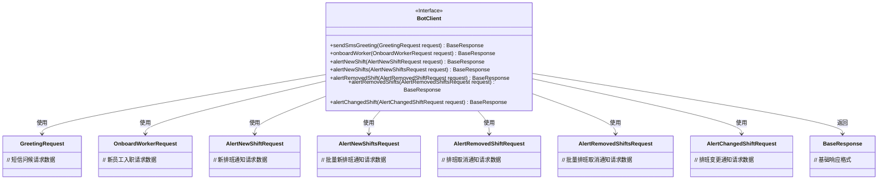
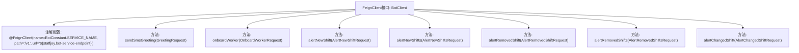

# 基础信息

|      |      |
|------|------|
| 名称 | BotClient |
| 编码语言 | .java |
| 代码路径 | staffjoy/bot-api/src/main/java/xyz/staffjoy/bot/client/BotClient.java |
| 包名 | xyz.staffjoy.bot.client |
| 依赖项 | ['org.springframework.cloud.openfeign.FeignClient', 'org.springframework.validation.annotation.Validated', 'org.springframework.web.bind.annotation.PostMapping', 'org.springframework.web.bind.annotation.RequestBody', 'xyz.staffjoy.bot.BotConstant', 'xyz.staffjoy.bot.dto', 'xyz.staffjoy.common.api.BaseResponse'] |
| 概述说明 | Feign客户端接口，提供短信问候、员工入职、班次变动提醒等功能。 |

# 说明

该内容定义了一个名为BotClient的Feign客户端接口，用于与Bot服务进行HTTP通信。接口配置了服务名称为BotConstant.SERVICE_NAME，基础路径为/v1，并通过staffjoy.bot-service-endpoint属性指定服务端点。接口包含七个POST方法，分别处理发送短信问候、新员工入职通知、新班次提醒、多个新班次提醒、移除班次提醒、多个移除班次提醒以及班次变更提醒等功能。每个方法都接收对应的请求体对象，并返回BaseResponse类型响应。请求体对象均经过验证。

# 类列表 Class Summary

| 名称   | 类型  | 说明 |
|-------|------|-------------|
| BotClient | interface | Feign客户端接口，提供短信问候、员工入职、班次变动提醒等功能。 |

## 类 BotClient

|      |      |
|------|------|
| 访问范围 | @FeignClient(name = BotConstant.SERVICE_NAME, path = "/v1", url = "${staffjoy.bot-service-endpoint}");public |
| 类型 | interface |
| 名称 | BotClient |
| 说明 | Feign客户端接口，提供短信问候、员工入职、班次变动提醒等功能。 |

### UML类图

该类图展示了一个基于Spring Cloud Feign的REST客户端接口BotClient，它定义了7个与机器人服务交互的API方法，每个方法接收不同的请求对象并返回统一的基础响应。接口通过@FeignClient注解配置了服务名称、基础路径和端点地址，所有方法均采用POST请求并支持请求体验证。图中清晰地显示了接口与各请求/响应DTO之间的依赖关系，体现了微服务间通信的典型设计模式。

### 内部方法调用关系图

该流程图展示了Spring Cloud Feign客户端接口BotClient的结构。顶部是主接口声明及其FeignClient注解配置，包含服务名、路径和URL参数。下方七个节点分别对应不同的HTTP POST方法，每个方法都接收特定类型的请求体参数并返回BaseResponse。这些方法实现了与bot-service的通信功能，涵盖短信问候、员工入职、班次变动提醒等业务场景。所有方法均使用@PostMapping注解定义子路径，并通过@Validated进行参数校验。

### 字段列表 Field List

| 名称  | 类型  | 说明 |
|-------|-------|------|

### 方法列表 Method List

| 名称  | 类型  | 说明 |
|-------|-------|------|
| alertNewShift | BaseResponse | 接口路径alert_new_shift，接收AlertNewShiftRequest参数，返回BaseResponse。 |
| onboardWorker | BaseResponse | 接口onboardWorker用于注册工人，接收请求体参数并返回基础响应。 |
| alertRemovedShift | BaseResponse | 接口定义：处理移除班次提醒的POST请求，接收验证请求体并返回基础响应。 |
| alertNewShifts | BaseResponse | 后端接口：接收并验证新班次提醒请求，返回基础响应。 |
| sendSmsGreeting | BaseResponse | 接口定义：发送短信问候，接收验证请求体，返回基础响应。 |
| alertRemovedShifts | BaseResponse | 后端接口：POST请求路径alert_removed_shifts，接收验证请求体返回基础响应。 |
| alertChangedShift | BaseResponse | 接口：处理班次变更通知，接收验证请求并返回基础响应。 |

