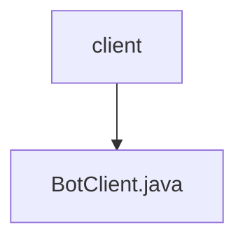

# 基础信息

|      |      |
|------|------|
| 名称 | client |
| 编码语言 | .java |
| 代码路径 | staffjoy/bot-api/src/main/java/xyz/staffjoy/bot/client |
| 包名 | staffjoy.docs.bot-api.src.main.java.xyz.staffjoy.bot.client |
| 概述说明 | Feign客户端接口，提供短信问候、员工入职、班次变动提醒等功能。 |

# 说明

该内容定义了一个名为BotClient的Feign客户端接口，用于与Bot服务进行HTTP通信。接口配置了服务名称为BotConstant.SERVICE_NAME，基础路径为/v1，并通过staffjoy.bot-service-endpoint属性指定服务端点。接口包含七个POST方法，分别处理发送短信问候、新员工入职通知、新班次提醒、多个新班次提醒、移除班次提醒、多个移除班次提醒以及班次变更提醒等功能。每个方法都接收对应的请求体对象，并返回BaseResponse类型响应。请求体对象均经过验证。

### 包内部结构视图

该流程图展示了bot-api项目中client目录与BotClient.java文件的层级关系。client作为父目录，包含一个子文件BotClient.java，这是典型的Java项目结构，其中客户端接口类存放在专门的client包下。这种结构清晰地区分了代码功能模块，符合标准Maven项目布局规范。

# 文件列表 File List

| 名称   | 类型  | 说明 |
|-------|------|-------------|
| [BotClient.java](BotClient.md) | file | Feign客户端接口，提供短信问候、员工入职、班次变动提醒等功能。 |

