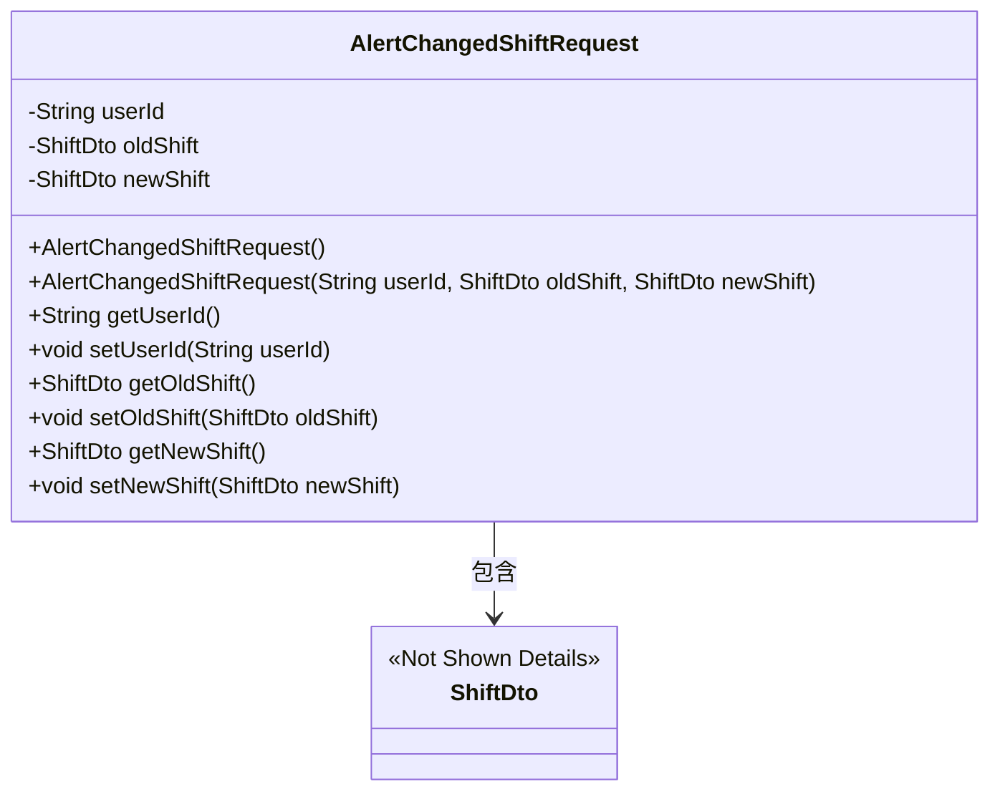
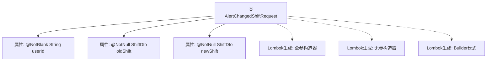

# 基础信息

|      |      |
|------|------|
| 名称 | AlertChangedShiftRequest |
| 编码语言 | .java |
| 代码路径 | staffjoy/bot-api/src/main/java/xyz/staffjoy/bot/dto/AlertChangedShiftRequest.java |
| 包名 | xyz.staffjoy.bot.dto |
| 依赖项 | ['lombok.AllArgsConstructor', 'lombok.Builder', 'lombok.Data', 'lombok.NoArgsConstructor', 'xyz.staffjoy.company.dto.ShiftDto', 'javax.validation.constraints.NotBlank', 'javax.validation.constraints.NotEmpty', 'javax.validation.constraints.NotNull'] |
| 概述说明 | Java类AlertChangedShiftRequest，包含userId、oldShift、newShift字段，使用Lombok注解简化代码。 |

# 说明

这是一个名为AlertChangedShiftRequest的Java类定义，使用了Lombok注解简化代码。类中包含三个字段：userId（字符串类型，不能为空）、oldShift（ShiftDto类型，不能为null）和newShift（ShiftDto类型，不能为null）。通过注解提供了全参数构造函数、无参构造函数和建造者模式支持。该类用于表示用户换班请求的变更信息。

# 类列表 Class Summary

| 名称   | 类型  | 说明 |
|-------|------|-------------|
| AlertChangedShiftRequest | class | Java类AlertChangedShiftRequest，包含用户ID和新旧班次信息，使用Lombok注解简化代码。 |

## 类 AlertChangedShiftRequest

|      |      |
|------|------|
| 访问范围 | @Data;@AllArgsConstructor;@NoArgsConstructor;@Builder;public |
| 类型 | class |
| 名称 | AlertChangedShiftRequest |
| 说明 | Java类AlertChangedShiftRequest，包含用户ID和新旧班次信息，使用Lombok注解简化代码。 |

### UML类图

该类图展示了AlertChangedShiftRequest类的结构，它是一个使用Lombok注解生成的POJO类，包含userId、oldShift和newShift三个私有字段，并通过注解自动生成了无参构造器、全参构造器、getter/setter方法以及builder模式支持。该类与ShiftDto存在组合关系，通过两个ShiftDto类型的字段分别存储新旧班次信息。类设计符合数据封装原则，适合用于班次变更通知的场景。

### 内部方法调用关系图

该流程图展示了AlertChangedShiftRequest类的结构，包含三个核心属性（userId、oldShift、newShift）及其校验注解，以及通过Lombok自动生成的全参构造器、无参构造器和Builder模式。类通过注解简化了样板代码，其中userId字段强制非空字符串校验，两个ShiftDto类型字段强制非空校验，整体设计用于处理班次变更通知场景的数据封装需求。

### 字段列表 Field List

| 名称  | 类型  | 说明 |
|-------|-------|------|
| oldShift | ShiftDto | 非空私有变量oldShift，类型ShiftDto。 |
| userId | String | 私有字符串类型变量userId，非空约束。 |
| newShift | ShiftDto | 非空私有变量newShift，类型为ShiftDto。 |

### 方法列表 Method List

| 名称  | 类型  | 说明 |
|-------|-------|------|

