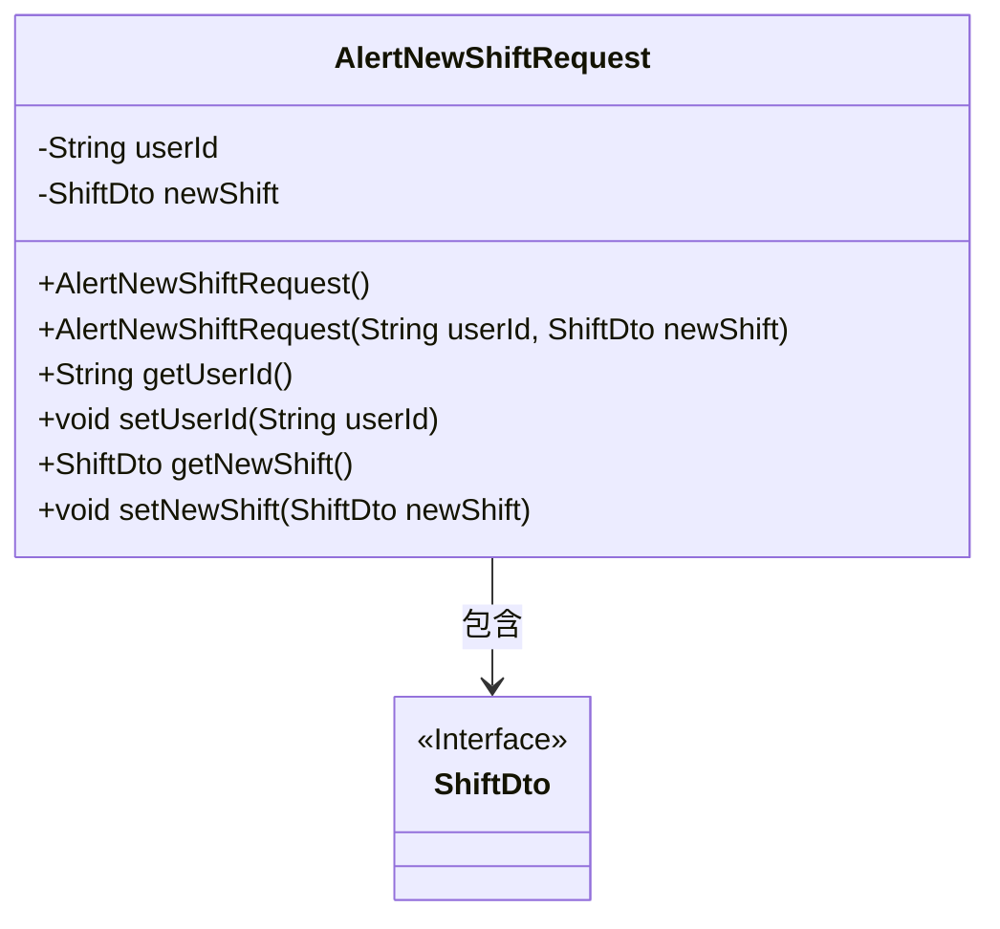
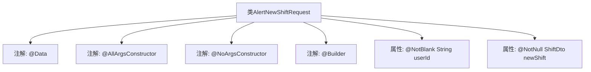

# 基础信息

|      |      |
|------|------|
| 名称 | AlertNewShiftRequest |
| 编码语言 | .java |
| 代码路径 | staffjoy/bot-api/src/main/java/xyz/staffjoy/bot/dto/AlertNewShiftRequest.java |
| 包名 | xyz.staffjoy.bot.dto |
| 依赖项 | ['lombok.AllArgsConstructor', 'lombok.Builder', 'lombok.Data', 'lombok.NoArgsConstructor', 'xyz.staffjoy.company.dto.ShiftDto', 'javax.validation.constraints.NotBlank', 'javax.validation.constraints.NotEmpty', 'javax.validation.constraints.NotNull'] |
| 概述说明 | Java类AlertNewShiftRequest，含userId和newShift字段，支持全参、无参构造和建造器模式。 |

# 说明

这是一个名为AlertNewShiftRequest的Java类，使用了Lombok注解简化代码。类中包含两个字段：userId（字符串类型，使用@NotBlank注解确保非空）和newShift（ShiftDto类型，使用@NotNull注解确保非空）。类上标注了@AllArgsConstructor（全参构造方法）、@NoArgsConstructor（无参构造方法）和@Builder（构建器模式）注解，便于对象创建和初始化。

# 类列表 Class Summary

| 名称   | 类型  | 说明 |
|-------|------|-------------|
| AlertNewShiftRequest | class | Java类AlertNewShiftRequest，含userId和newShift字段，支持全参、无参构造和Builder模式。 |

## 类 AlertNewShiftRequest

|      |      |
|------|------|
| 访问范围 | @Data;@AllArgsConstructor;@NoArgsConstructor;@Builder;public |
| 类型 | class |
| 名称 | AlertNewShiftRequest |
| 说明 | Java类AlertNewShiftRequest，含userId和newShift字段，支持全参、无参构造和Builder模式。 |

### UML类图

这段类图描述了一个用于警报新班次请求的类AlertNewShiftRequest，它包含两个主要私有字段：userId（字符串类型）和newShift（ShiftDto接口类型）。该类提供了完整的构造器支持（包括无参构造器和全参构造器），以及标准的getter/setter方法。通过Lombok注解实现了简洁的代码结构，其中@Builder支持建造者模式，@Data自动生成常用方法。该类与ShiftDto接口存在组合关系，表明每个警报请求必须包含一个班次数据传输对象。整体设计符合Java Bean规范，便于序列化和反序列化操作。

### 内部方法调用关系图

这段代码定义了一个名为AlertNewShiftRequest的Java类，使用了Lombok库的@Data、@AllArgsConstructor、@NoArgsConstructor和@Builder注解来自动生成getter/setter、全参构造器、无参构造器和建造者模式。类包含两个属性：userId（非空字符串）和newShift（非空的ShiftDto对象）。流程图清晰地展示了类结构与注解、属性之间的层级关系，体现了Lombok简化代码的特点。

### 字段列表 Field List

| 名称  | 类型  | 说明 |
|-------|-------|------|
| newShift | ShiftDto | 非空私有变量newShift，类型为ShiftDto。 |
| userId | String | 私有字符串类型用户ID。 |

### 方法列表 Method List

| 名称  | 类型  | 说明 |
|-------|-------|------|

