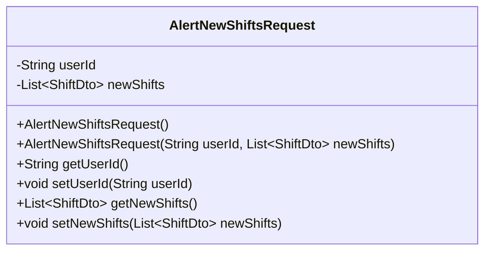
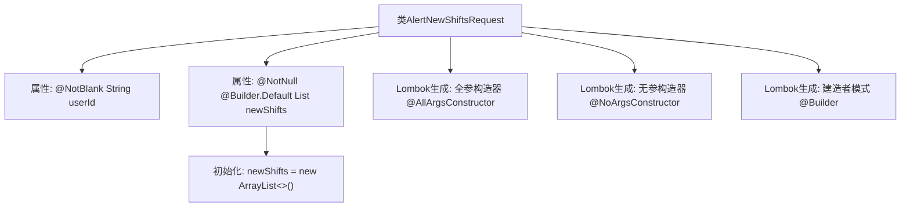

# 基础信息

|      |      |
|------|------|
| 名称 | AlertNewShiftsRequest |
| 编码语言 | .java |
| 代码路径 | staffjoy/bot-api/src/main/java/xyz/staffjoy/bot/dto/AlertNewShiftsRequest.java |
| 包名 | xyz.staffjoy.bot.dto |
| 依赖项 | ['lombok.AllArgsConstructor', 'lombok.Builder', 'lombok.Data', 'lombok.NoArgsConstructor', 'xyz.staffjoy.company.dto.ShiftDto', 'javax.validation.constraints.NotBlank', 'javax.validation.constraints.NotEmpty', 'javax.validation.constraints.NotNull', 'java.util.ArrayList', 'java.util.List'] |
| 概述说明 | 请求类，含用户ID和新班次列表，支持构造和默认值。 |

# 说明

该内容定义了一个名为AlertNewShiftsRequest的Java类，用于表示新班次提醒请求。类中包含两个主要字段：userId和newShifts。userId字段使用@NotBlank注解确保非空字符串，newShifts字段使用@NotNull注解确保非空，并通过@Builder.Default指定默认值为空ArrayList。类上标注了Lombok注解@Data、@AllArgsConstructor、@NoArgsConstructor和@Builder，分别实现自动生成getter/setter、全参构造器、无参构造器以及建造者模式功能。整个类结构简洁，适用于构建新班次提醒请求对象。

# 类列表 Class Summary

| 名称   | 类型  | 说明 |
|-------|------|-------------|
| AlertNewShiftsRequest | class | 请求类，含用户ID和新班次列表，支持构造和默认值。 |

## 类 AlertNewShiftsRequest

|      |      |
|------|------|
| 访问范围 | @Data;@AllArgsConstructor;@NoArgsConstructor;@Builder;public |
| 类型 | class |
| 名称 | AlertNewShiftsRequest |
| 说明 | 请求类，含用户ID和新班次列表，支持构造和默认值。 |

### UML类图

该代码定义了一个名为AlertNewShiftsRequest的类，用于封装用户ID和新班次列表的数据传输对象。类中包含两个私有字段：userId（字符串类型）和newShifts（ShiftDto泛型列表），通过Lombok注解自动生成了全参构造器、无参构造器、getter/setter方法以及建造者模式支持。其中userId字段有@NotBlank验证约束，newShifts字段默认初始化为空ArrayList并有@NotNull约束。

### 内部方法调用关系图

该流程图展示了AlertNewShiftsRequest类的结构，包含两个主要属性：带有@NotBlank注解的userId和带有@NotNull与@Builder.Default注解的newShifts列表。类通过Lombok注解自动生成全参构造器、无参构造器和建造者模式，其中newShifts属性在声明时被初始化为空ArrayList。整个设计体现了通过注解简化代码的现代Java开发风格。

### 字段列表 Field List

| 名称  | 类型  | 说明 |
|-------|-------|------|
| newShifts = new ArrayList<>() | List<ShiftDto> | 非空默认新建ShiftDto列表 |
| userId | String | 私有字符串类型变量userId，非空约束。 |

### 方法列表 Method List

| 名称  | 类型  | 说明 |
|-------|-------|------|

