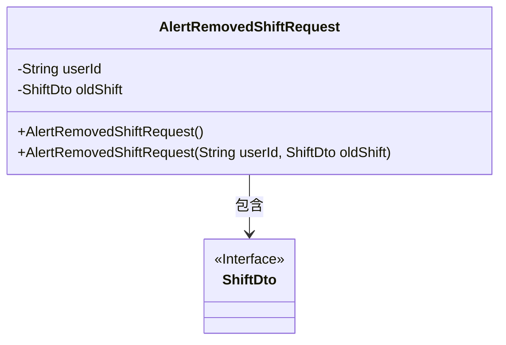
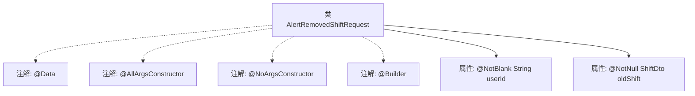

# 基础信息

|      |      |
|------|------|
| 名称 | AlertRemovedShiftRequest |
| 编码语言 | .java |
| 代码路径 | staffjoy/bot-api/src/main/java/xyz/staffjoy/bot/dto/AlertRemovedShiftRequest.java |
| 包名 | xyz.staffjoy.bot.dto |
| 依赖项 | ['lombok.AllArgsConstructor', 'lombok.Builder', 'lombok.Data', 'lombok.NoArgsConstructor', 'xyz.staffjoy.company.dto.ShiftDto', 'javax.validation.constraints.NotBlank', 'javax.validation.constraints.NotEmpty', 'javax.validation.constraints.NotNull'] |
| 概述说明 | AlertRemovedShiftRequest类：包含userId和oldShift字段，支持全参、无参构造和Builder模式。 |

# 说明

这是一个名为AlertRemovedShiftRequest的Java类定义，使用Lombok注解简化代码。类中包含两个字段：userId（字符串类型，使用@NotBlank注解确保非空）和oldShift（ShiftDto类型，使用@NotNull注解确保非空）。类上标注了@Data（自动生成getter/setter等方法）、@AllArgsConstructor（全参构造器）、@NoArgsConstructor（无参构造器）和@Builder（支持建造者模式）注解。

# 类列表 Class Summary

| 名称   | 类型  | 说明 |
|-------|------|-------------|
| AlertRemovedShiftRequest | class | AlertRemovedShiftRequest类：用户ID和旧班次信息，支持全参无参构造和建造者模式。 |

## 类 AlertRemovedShiftRequest

|      |      |
|------|------|
| 访问范围 | @Data;@AllArgsConstructor;@NoArgsConstructor;@Builder;public |
| 类型 | class |
| 名称 | AlertRemovedShiftRequest |
| 说明 | AlertRemovedShiftRequest类：用户ID和旧班次信息，支持全参无参构造和建造者模式。 |

### UML类图

这段类图展示了AlertRemovedShiftRequest类的结构，它是一个使用Lombok注解的数据类，包含userId和oldShift两个私有字段，并自动生成了无参构造器和全参构造器。该类依赖于ShiftDto接口，表示被移除的班次数据。ShiftDto作为接口通过<<Interface>>标注，体现了面向对象设计中接口与实现分离的原则。整个设计简洁明了，符合Java Bean规范，便于序列化和反序列化操作。

### 内部方法调用关系图

该流程图展示了AlertRemovedShiftRequest类的结构，包含Lombok注解（@Data生成getter/setter，@AllArgsConstructor/@NoArgsConstructor生成构造方法，@Builder支持建造者模式）和两个核心属性：带@NotBlank校验的userId字符串和带@NotNull校验的oldShift对象。注解与类之间用虚线连接表示元数据关系，属性与类之间用实线表示组成关系。

### 字段列表 Field List

| 名称  | 类型  | 说明 |
|-------|-------|------|
| oldShift | ShiftDto | 非空私有变量oldShift，类型为ShiftDto。 |
| userId | String | 私有字符串类型变量userId，非空。 |

### 方法列表 Method List

| 名称  | 类型  | 说明 |
|-------|-------|------|

