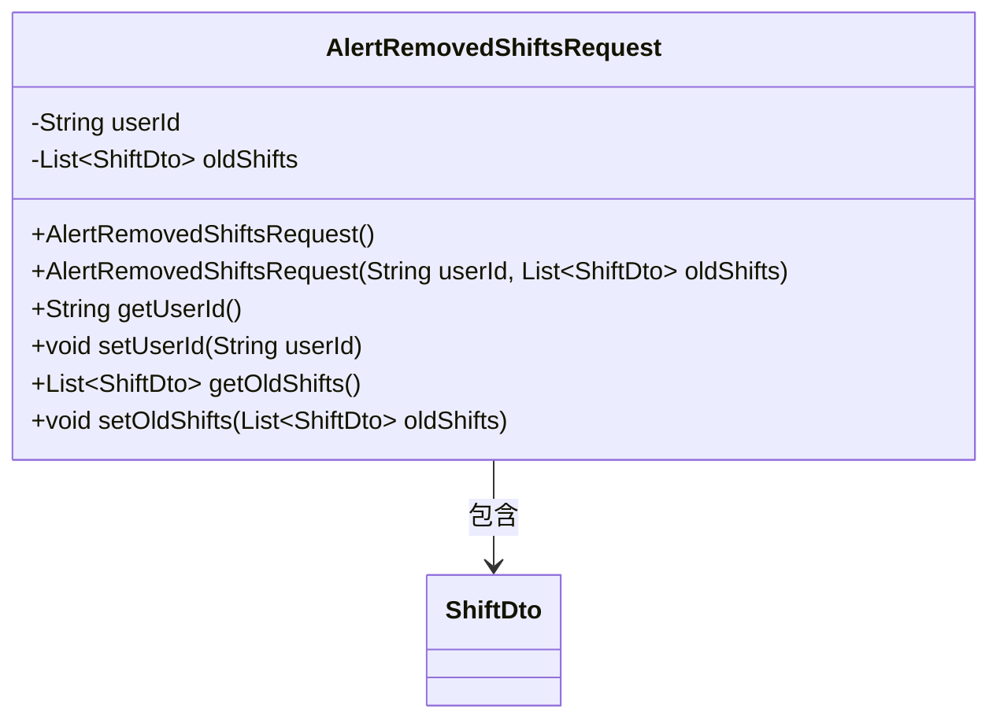
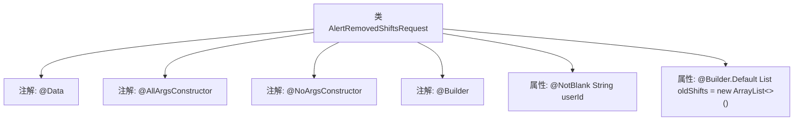

# 基础信息

|      |      |
|------|------|
| 名称 | AlertRemovedShiftsRequest |
| 编码语言 | .java |
| 代码路径 | staffjoy/bot-api/src/main/java/xyz/staffjoy/bot/dto/AlertRemovedShiftsRequest.java |
| 包名 | xyz.staffjoy.bot.dto |
| 依赖项 | ['lombok.AllArgsConstructor', 'lombok.Builder', 'lombok.Data', 'lombok.NoArgsConstructor', 'xyz.staffjoy.company.dto.ShiftDto', 'javax.validation.constraints.NotBlank', 'java.util.ArrayList', 'java.util.List'] |
| 概述说明 | Java类AlertRemovedShiftsRequest，含userId和oldShifts字段，支持全参无参构造和Builder模式。 |

# 说明

这是一个名为AlertRemovedShiftsRequest的Java类定义，使用了Lombok注解简化代码。类中包含两个主要字段：userId（非空字符串类型）和oldShifts（ShiftDto列表类型，默认初始化为空ArrayList）。类通过注解实现了全参数构造函数、无参构造函数以及建造者模式。整体结构用于处理被移除班次的相关请求数据。

# 类列表 Class Summary

| 名称   | 类型  | 说明 |
|-------|------|-------------|
| AlertRemovedShiftsRequest | class | Java类定义：用户ID必填，包含旧班次列表的请求类。 |

## 类 AlertRemovedShiftsRequest

|      |      |
|------|------|
| 访问范围 | @Data;@AllArgsConstructor;@NoArgsConstructor;@Builder;public |
| 类型 | class |
| 名称 | AlertRemovedShiftsRequest |
| 说明 | Java类定义：用户ID必填，包含旧班次列表的请求类。 |

### UML类图

这段类图描述了一个用于处理被移除班次提醒的请求类AlertRemovedShiftsRequest。该类包含两个主要字段：userId表示用户ID字符串，oldShifts是一个ShiftDto类型的列表，存储被移除的班次信息。类通过Lombok注解自动生成了全参构造器、无参构造器、getter/setter方法以及建造者模式支持。该类与ShiftDto存在组合关系，表明请求中包含多个班次数据传输对象。整体设计符合Java Bean规范，便于序列化和反序列化操作。

### 内部方法调用关系图

这段代码定义了一个使用Lombok注解的Java类AlertRemovedShiftsRequest，包含用户ID和旧班次列表两个核心属性。通过@Data自动生成getter/setter等方法，@Builder支持链式构造，@AllArgsConstructor/@NoArgsConstructor提供全参和无参构造。其中userId字段有非空校验，oldShifts默认初始化为空ArrayList。流程图清晰展示了类结构与注解、属性的从属关系，体现了Lombok简化POJO开发的典型模式。

### 字段列表 Field List

| 名称  | 类型  | 说明 |
|-------|-------|------|
| userId | String | 非空字符串字段userId |
| oldShifts = new ArrayList<>() | List<ShiftDto> | 定义私有列表oldShifts，初始化为空ArrayList。 |

### 方法列表 Method List

| 名称  | 类型  | 说明 |
|-------|-------|------|

