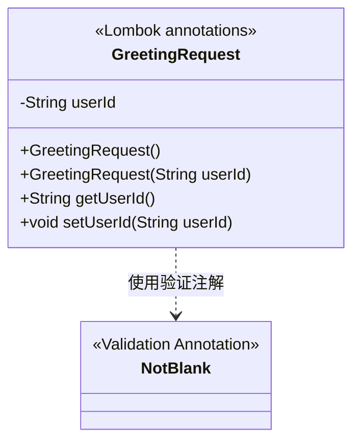
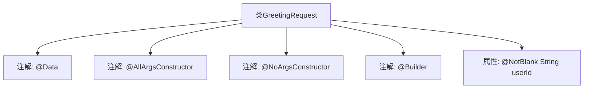

# 基础信息

|      |      |
|------|------|
| 名称 | GreetingRequest |
| 编码语言 | .java |
| 代码路径 | staffjoy/bot-api/src/main/java/xyz/staffjoy/bot/dto/GreetingRequest.java |
| 包名 | xyz.staffjoy.bot.dto |
| 依赖项 | ['lombok.AllArgsConstructor', 'lombok.Builder', 'lombok.Data', 'lombok.NoArgsConstructor', 'javax.validation.constraints.NotBlank'] |
| 概述说明 | Java类GreetingRequest，含userId字段，使用Lombok注解生成构造器和建造器，字段非空校验。 |

# 说明

这是一个名为GreetingRequest的Java类，使用Lombok注解简化代码。类中包含一个非空字符串字段userId，并提供了全参构造器、无参构造器和建造者模式支持。

# 类列表 Class Summary

| 名称   | 类型  | 说明 |
|-------|------|-------------|
| GreetingRequest | class | Java类GreetingRequest，含userId字段，使用Lombok注解生成构造器和建造器，要求userId非空。 |

## 类 GreetingRequest

|      |      |
|------|------|
| 访问范围 | @Data;@AllArgsConstructor;@NoArgsConstructor;@Builder;public |
| 类型 | class |
| 名称 | GreetingRequest |
| 说明 | Java类GreetingRequest，含userId字段，使用Lombok注解生成构造器和建造器，要求userId非空。 |

### UML类图

这段类图展示了GreetingRequest类的结构，它是一个使用Lombok注解的简单POJO类。该类包含一个私有字段userId，通过@Data注解自动生成getter/setter方法，@AllArgsConstructor和@NoArgsConstructor分别生成全参和无参构造器，@Builder提供建造者模式支持。此外，userId字段使用@NotBlank注解进行非空验证，体现了数据验证的需求。整个设计简洁高效，适合作为DTO或请求参数对象使用。

### 内部方法调用关系图

这段流程图展示了GreetingRequest类的结构，它是一个使用Lombok注解的POJO类。@Data注解自动生成getter/setter方法，@AllArgsConstructor和@NoArgsConstructor分别生成全参和无参构造方法，@Builder提供建造者模式支持。类中包含一个用@NotBlank注解标记的userId字符串属性，用于验证非空值。该设计简化了Java实体类的样板代码，适用于DTO或请求参数封装场景。

### 字段列表 Field List

| 名称  | 类型  | 说明 |
|-------|-------|------|
| userId | String | 非空用户ID字符串 |

### 方法列表 Method List

| 名称  | 类型  | 说明 |
|-------|-------|------|

