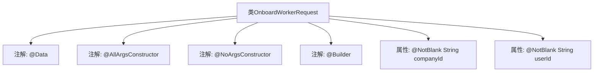

# 基础信息

|      |      |
|------|------|
| 名称 | OnboardWorkerRequest |
| 编码语言 | .java |
| 代码路径 | staffjoy/bot-api/src/main/java/xyz/staffjoy/bot/dto/OnboardWorkerRequest.java |
| 包名 | xyz.staffjoy.bot.dto |
| 依赖项 | ['lombok.AllArgsConstructor', 'lombok.Builder', 'lombok.Data', 'lombok.NoArgsConstructor', 'javax.validation.constraints.NotBlank', 'javax.validation.constraints.NotEmpty'] |
| 概述说明 | Java类定义，包含公司ID和用户ID字段，支持全参、无参构造和建造器模式。 |

# 说明

该内容定义了一个名为OnboardWorkerRequest的Java类，用于表示入职员工请求。类中包含两个非空字符串字段：companyId（公司ID）和userId（用户ID）。类使用了Lombok注解自动生成全参构造函数、无参构造函数和建造器模式构建方法。整体结构简洁，明确了请求必需的核心参数。

# 类列表 Class Summary

| 名称   | 类型  | 说明 |
|-------|------|-------------|
| OnboardWorkerRequest | class | Java类定义工人入职请求，含公司ID和用户ID字段，支持构造器和验证。 |


## 类 OnboardWorkerRequest

|      |      |
|------|------|
| 访问范围 | @Data;@AllArgsConstructor;@NoArgsConstructor;@Builder;public |
| 类型 | class |
| 名称 | OnboardWorkerRequest |
| 说明 | Java类定义工人入职请求，含公司ID和用户ID字段，支持构造器和验证。 |


### UML类图

```mermaid
classDiagram
    class OnboardWorkerRequest {
        -String companyId
        -String userId
        +OnboardWorkerRequest()
        +OnboardWorkerRequest(String companyId, String userId)
        +String getCompanyId()
        +void setCompanyId(String companyId)
        +String getUserId()
        +void setUserId(String userId)
        +OnboardWorkerRequestBuilder builder()
    }
    // Lombok注解自动生成全参构造器、无参构造器、builder模式方法
    // @NotBlank注解表示字段不能为空或空白字符串
```

该类图展示了一个使用Lombok注解的请求实体类，包含两个必填字符串字段companyId和userId。通过@Data自动生成getter/setter，@AllArgsConstructor/@NoArgsConstructor生成构造器，@Builder提供建造者模式。类结构简洁但完整，适合作为API请求的DTO对象，能有效校验非空字段并支持多种实例化方式。


### 内部方法调用关系图



该流程图展示了OnboardWorkerRequest类的结构，这是一个使用Lombok注解的POJO类。顶部标注了类名，下方连接了@Data（自动生成getter/setter）、@AllArgsConstructor（全参构造器）、@NoArgsConstructor（无参构造器）和@Builder（建造者模式）四个核心注解，最后关联了两个被@NotBlank约束的字符串属性companyId和userId。整个结构清晰地反映了Lombok简化后的类定义方式，省略了传统Java类需要显式编写的样板代码。

### 字段列表 Field List

| 名称  | 类型  | 说明 |
|-------|-------|------|
| companyId | String | 私有字符串类型变量companyId，非空。 |
| userId | String | 私有字符串类型用户ID |

### 方法列表 Method List

| 名称  | 类型  | 说明 |
|-------|-------|------|


