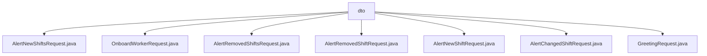

# 基础信息

|      |      |
|------|------|
| 名称 | dto |
| 编码语言 | .java |
| 代码路径 | staffjoy/bot-api/src/main/java/xyz/staffjoy/bot/dto |
| 包名 | staffjoy.docs.bot-api.src.main.java.xyz.staffjoy.bot.dto |
| 概述说明 | 定义多个Java类，用于处理班次提醒、员工入职等请求，使用Lombok简化代码，包含非空字段验证。 |

# 说明

## 概述
该代码模块是`staffjoy/bot-api`模块中的数据传输对象（DTO）部分，主要用于处理与机器人（bot）相关的各种请求。这些DTO类均使用Lombok注解简化代码，实现了自动生成getter/setter、全参构造器、无参构造器以及建造者模式功能。主要涉及班次提醒、员工入职、问候等业务场景的请求数据封装。

## 主要业务场景
1. **班次提醒相关请求**：
   - `AlertNewShiftsRequest`：处理新班次提醒请求，包含用户ID和新班次列表。
   - `AlertNewShiftRequest`：处理单个新班次提醒请求，包含用户ID和单个新班次。
   - `AlertRemovedShiftsRequest`：处理被移除的班次列表提醒请求，包含用户ID和被移除的班次列表。
   - `AlertRemovedShiftRequest`：处理单个被移除班次提醒请求，包含用户ID和单个被移除班次。
   - `AlertChangedShiftRequest`：处理班次变更提醒请求，包含用户ID、旧班次和新班次。

2. **员工入职相关请求**：
   - `OnboardWorkerRequest`：处理员工入职请求，包含公司ID和用户ID。

3. **问候相关请求**：
   - `GreetingRequest`：处理问候请求，包含用户ID。

这些DTO类结构简洁，明确了请求必需的核心参数，并通过注解确保了字段的非空校验，适用于构建各种请求对象。

### 包内部结构视图

该流程图展示了bot-api项目中dto目录下的7个请求类文件结构。所有Java文件都直接隶属于dto目录，没有更深层级的嵌套关系。这些请求类包括各种提醒请求（如新班次提醒、班次变更提醒等）和入职请求，构成了该模块的数据传输对象基础结构。

# 文件列表 File List

| 名称   | 类型  | 说明 |
|-------|------|-------------|
| [GreetingRequest.java](GreetingRequest.md) | file | Java类GreetingRequest，含userId字段，使用Lombok注解生成构造器和建造器，字段非空校验。 |
| [AlertChangedShiftRequest.java](AlertChangedShiftRequest.md) | file | Java类AlertChangedShiftRequest，包含userId、oldShift、newShift字段，使用Lombok注解简化代码。 |
| [AlertNewShiftRequest.java](AlertNewShiftRequest.md) | file | Java类AlertNewShiftRequest，含userId和newShift字段，支持全参、无参构造和建造器模式。 |
| [AlertRemovedShiftRequest.java](AlertRemovedShiftRequest.md) | file | AlertRemovedShiftRequest类：包含userId和oldShift字段，支持全参、无参构造和Builder模式。 |
| [AlertRemovedShiftsRequest.java](AlertRemovedShiftsRequest.md) | file | Java类AlertRemovedShiftsRequest，含userId和oldShifts字段，支持全参无参构造和Builder模式。 |
| [OnboardWorkerRequest.java](OnboardWorkerRequest.md) | file | Java类定义，包含公司ID和用户ID字段，支持全参、无参构造和建造器模式。 |
| [AlertNewShiftsRequest.java](AlertNewShiftsRequest.md) | file | 请求类，含用户ID和新班次列表，支持构造和默认值。 |

